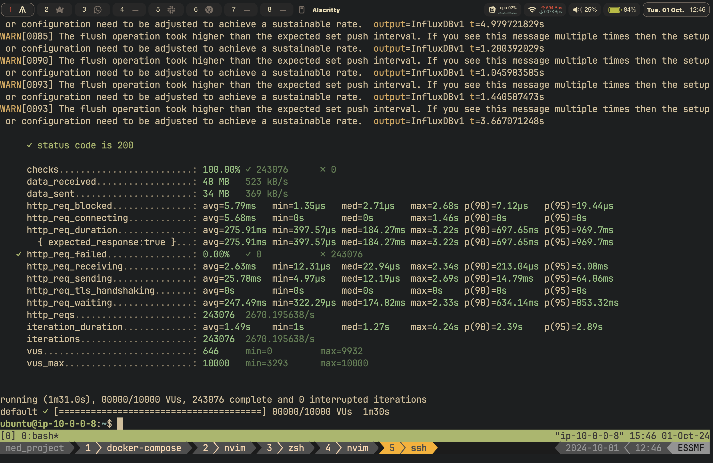
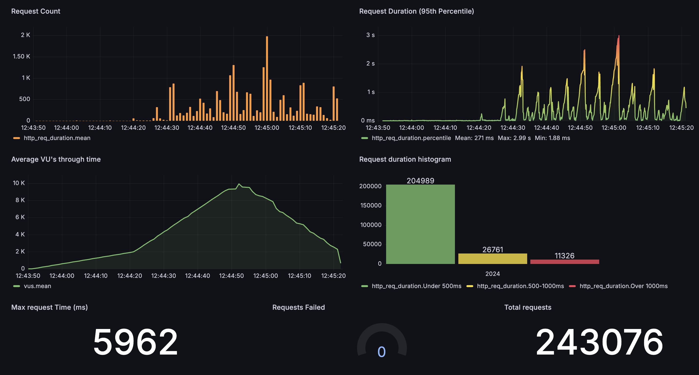

# Aprimoramento de testes

#### 1. **Introdução**
&emsp;Este relatório apresenta os resultados de um teste de carga realizado no sistema após a implementação de melhorias na arquitetura como o uso de Auto Scaling Groups na instância EC2. O objetivo deste teste foi avaliar o desempenho aprimorado do sistema quando submetido a uma alta carga de usuários simultâneos, comparando os resultados com o teste de carga anterior realizado na Sprint 3. Utilizamos o K6 para executar o teste e o Grafana para monitorar e visualizar os resultados. A análise foca nas melhorias observadas em métricas como tempo de resposta, taxa de sucesso e comportamento sob diferentes condições de carga, visando validar a eficácia das otimizações implementadas.

#### 2. ** Melhorias Implementadas**
- **Auto Scaling Groups**: A principal melhoria implementada foi a utilização de Auto Scaling Groups para gerenciar a instância EC2 do sistema. Com o Auto Scaling, o sistema pode ajustar automaticamente a capacidade de computação com base na demanda, escalando horizontalmente para adicionar ou remover instâncias conforme necessário. Isso permite que o sistema mantenha um desempenho consistente mesmo sob cargas variáveis, garantindo que os usuários tenham uma experiência estável e sem interrupções.
- **Balanceamento de Carga**: Além disso, foi implementado um balanceador de carga (Load Balancer) para distribuir o tráfego entre as instâncias EC2, garantindo que a carga seja distribuída de forma equilibrada e que cada instância receba uma quantidade justa de requisições. Isso ajuda a evitar sobrecargas em instâncias individuais e melhora a escalabilidade e a disponibilidade do sistema.
- **Instância EC2**: A instância EC2 foi configurada como uma m5.large, oferecendo uma CPU mais potente, maior capacidade de memória e armazenamento mais rápido. Durante a Sprint 3, a instância utilizada para o teste de carga era uma t2.micro, que apresentava limitações de memória e processamento. Essas melhorias proporcionam uma redução no tempo de resposta e aumentam a capacidade de processamento do sistema, permitindo que ele lide de forma eficiente com um maior volume de requisições.

#### 3. **Configuração do Teste**
- **Ferramenta Utilizada**: A ferramenta escolhida para o teste de carga foi o K6, um software de testes de performance orientado a scripts, conhecido por sua facilidade de uso e capacidade de simular grandes volumes de usuários. O K6 permite escrever scripts em JavaScript para testar diferentes cenários e monitorar a resposta do sistema sob diversas condições. 
- **Visualização**: O Grafana foi utilizado para visualizar e analisar as métricas coletadas durante o teste. Com sua interface gráfica, o Grafana possibilita a geração de gráficos e painéis dinâmicos que ajudam na interpretação dos resultados, oferecendo insights importantes sobre o desempenho do sistema.
- **Estratégia de Carga**:
  - **Duração Total**: O teste foi configurado para ser executado por um período total de 1 minuto e 30 segundos, permitindo uma avaliação da resposta do sistema em um curto intervalo de tempo, mas suficiente para observar o comportamento durante picos e quedas na carga.
  - **Estágios**:
    - **Ramp-up**: Nos primeiros 30 segundos, o número de usuários virtuais (VUs) foi gradualmente aumentado para 10.000. Esta fase é crucial para avaliar como o sistema lida com um aumento repentino na demanda, identificando possíveis gargalos ou limitações em momentos de pico.
    - **Pico**: Após a fase de ramp-up, o sistema manteve 10.000 VUs ativos por 30 segundos, representando uma situação de carga máxima que simula um cenário real de alta demanda. Esta etapa foi projetada para testar a estabilidade e a capacidade do sistema de operar em condições extremas.
    - **Ramp-down**: Nos últimos 30 segundos, o número de VUs foi reduzido para 2.000, permitindo observar a resposta do sistema ao alívio da carga e verificar se ele consegue retornar ao estado estável rapidamente.
  - **Critério de Falha**: O teste foi configurado para falhar se a taxa de requisições com erro ultrapassasse 1% do total (`rate < 0.01`). Este critério é um indicador-chave da saúde do sistema, garantindo que, mesmo sob condições de carga extrema, a maioria das requisições seja processada corretamente.
  - **Melhorias em relação à Sprint 3**: 
    - Teste Mais Robusto: Na Sprint 3, o teste realizado envolveu 2.000 VUs por apenas 3 segundos, o que limitou a avaliação do sistema a um curto período e uma carga menor. Essa abordagem não permitiu uma análise aprofundada do comportamento do sistema sob cargas sustentadas ou a identificação de possíveis gargalos durante aumentos ou reduções graduais de usuários.
    - Avaliação Mais Abrangente: Com o novo teste, a estratégia foi aprimorada para ser mais robusta e realista. Aumentamos significativamente o número de VUs para 10.000 e estendemos a duração total para 1 minuto e 30 segundos. Isso possibilitou uma análise mais detalhada do desempenho do sistema em situações de pico e durante transições de carga, oferecendo insights mais precisos para otimização.
  
#### 4. **Resultados do Teste (K6)**

   <b>Figura 1 -</b>  Resultados do Teste de Carga no K6

   

   Fonte: Material desenvolvido pelos autores (2024)

- **Total de Requisições**: O teste executou um total de 243.076 requisições, um volume significativamente maior em comparação com o teste da Sprint 3 que foi de 2.841, evidenciando um aumento de 855,6% e a capacidade ampliada do sistema em lidar com tráfego intenso.
- **Taxa de Sucesso**: Todas as 243.076 requisições foram completadas com sucesso, retornando o código de status 200. Uma taxa de sucesso de 100% indica que, sob as condições do teste, o sistema conseguiu processar todas as requisições sem falhas, demonstrando estabilidade e eficiência operacional.
- **Dados Recebidos**: Durante o teste, um total de 48 MB de dados foi recebido, com uma taxa média de transferência de 523 kB/s. Estes valores são úteis para avaliar a eficiência na transferência de dados, indicando se o sistema é capaz de gerenciar adequadamente o tráfego de dados sem causar congestionamentos ou atrasos.
- **Tempo de Resposta**:
  - O **tempo médio de duração das requisições** foi de 275.91 ms, com o máximo observado sendo de 3.22 segundos. Tempos de resposta baixos sugerem um bom desempenho do sistema, embora o valor máximo acima de 3 segundos possa indicar possíveis pontos de melhoria.
  - **Percentis**: A análise dos percentis oferece uma visão detalhada do comportamento do tempo de resposta. No percentil 90 (p90), o tempo foi de 697.65 ms, enquanto no percentil 95 (p95), atingiu 969.7 ms. Estes percentis são indicadores importantes, pois mostram o tempo de resposta da grande maioria das requisições, ajudando a identificar os outliers que podem afetar a experiência do usuário. Esses resultados demonstram um grande melhora em relação ao teste anterior, onde o tempo médio de resposta no p90 foi de 5,33 segundos e no p95 7,28 segundos, evidenciando uma melhora de 86,91% e 86,68% respectivamente.
- **Latência**:
  - O **tempo médio de recebimento** foi de 2.63 ms, e o **tempo médio de espera** (o tempo que a requisição leva para ser processada antes de receber a resposta) foi de 247.49 ms. Estas métricas são essenciais para avaliar a eficiência do processamento do servidor e sua capacidade de resposta.
- **Requisições Falhas**: A taxa de falha foi de 0.00%, o que significa que todas as requisições foram processadas corretamente, cumprindo o critério de sucesso do teste e indicando a robustez do sistema sob a carga aplicada.

#### 5. **Visualização no Grafana**

   <b>Figura 2 -</b>  Gráficos de Monitoramento no Grafana

   

   Fonte: Material desenvolvido pelos autores (2024)

- **Contagem de Requisições**: O gráfico mostra flutuações na contagem de requisições ao longo do tempo, com picos atingindo cerca de 2.000 requisições por segundo. Estas flutuações refletem as variações na carga durante o teste, evidenciando como o sistema lida com a chegada de novos usuários e as solicitações simultâneas.
- **Duração das Requisições (Percentil 95)**: O gráfico da duração das requisições no percentil 95 revela que a maioria das requisições foi completada em menos de 1 segundo, apesar de alguns picos se aproximarem de 3 segundos. Essa informação é valiosa para identificar se existem momentos específicos em que o sistema encontra dificuldades para processar as requisições.
- **Distribuição de VUs ao Longo do Tempo**: Este gráfico representa a estratégia de carga aplicada no teste, com a curva mostrando o aumento gradual de usuários até o pico de 10.000 e a subsequente redução. Essa representação visual ajuda a verificar se o sistema reagiu conforme o esperado à mudança no número de usuários.    
- **Histograma da Duração das Requisições**:
  - A maioria das requisições (204.989) foi concluída em menos de 500 ms, indicando um desempenho satisfatório para a maioria dos casos de uso.
  - Uma quantidade menor de requisições (26.761) teve duração entre 500 ms e 1.000 ms, enquanto 11.326 requisições excederam 1 segundo. Esta distribuição sugere que, embora o sistema tenha um bom desempenho geral, existem situações em que o tempo de resposta é maior do que o desejado, e essas situações precisam ser investigadas.

#### 6. **Análise dos Resultados**
Os resultados mostram melhorias significativas no desempenho do sistema após as otimizações implementadas:
- **Desempenho Aprimorado:** O aumento da carga de 2.000 VUs por 3 segundos (Sprint 3) para 10.000 VUs por 1 minuto e 30 segundos permitiu uma avaliação mais realista do sistema, que respondeu positivamente às condições mais desafiadoras.
- **Tempo de Resposta Reduzido**: Houve uma redução notável nos tempos médios e máximos de resposta, indicando que o sistema está mais eficiente em processar requisições sob carga pesada.
- **Estabilidade Aumentada:** A infraestrutura aprimorada com balanceamento de carga e auto scaling mostrou-se eficaz na distribuição do tráfego, reduzindo flutuações e garantindo um desempenho consistente.
- **Capacidade de Escalonamento:** O sistema demonstrou maior capacidade de escalonamento, lidando com um número de usuários cinco vezes maior do que no teste anterior, sem comprometer a taxa de sucesso das requisições.

#### 7. **Conclusão**
Os testes realizados demonstraram que o sistema atual evoluiu significativamente em termos de desempenho e estabilidade. Isso indica que, sob as condições de teste, o sistema é eficiente e estável, conseguindo gerenciar cargas pesadas sem apresentar falhas. Entretanto, foram identificadas algumas áreas que podem ser otimizadas. Os tempos de resposta, em geral, foram baixos, mas houve momentos em que os tempos máximos ultrapassaram 3 segundos, especialmente nos percentis p90 e p95. Isso indica que, embora o desempenho seja bom para a maioria das situações, ainda existem momentos de sobrecarga que afetam a performance do sistema. 
