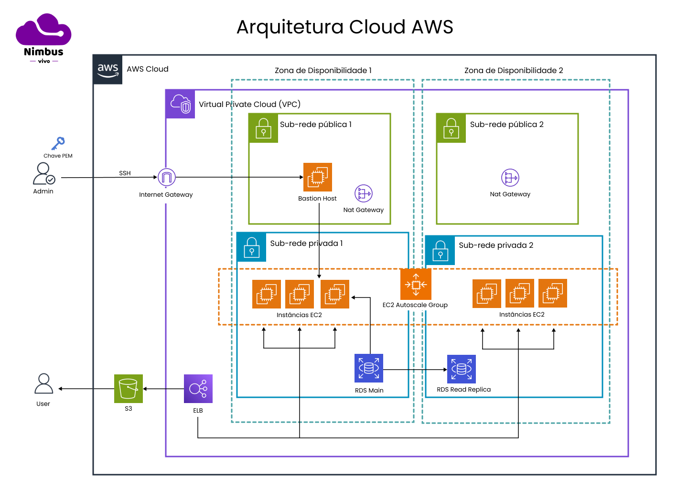

# Arquitetura Corporativa Completa

   <b>Figura 1 -</b> Arquitetura Corporativa 

   

   Fonte: Material desenvolvido pelos autores (2024)

#### 1.1) Balanceamento de Carga
&emsp;A arquitetura utiliza um Elastic Load Balancer (ELB), que distribui automaticamente o tráfego de entrada entre as instâncias EC2 disponíveis, garantindo alta disponibilidade e escalabilidade sem degradação de desempenho. As instâncias estão configuradas em um Auto Scaling Group que ajusta sua capacidade entre 2 e 6 instâncias conforme a demanda.

#### 1.2) Acesso e Segurança
&emsp;O acesso seguro aos recursos da rede é feito através de um bastion host, acessado por SSH com uma chave PEM, localizado na subnet pública. Este acesso ultrapassa o Internet Gateway, permitindo um controle seguro sobre as instâncias. O NAT Gateway é usado para o acesso controlado da Internet às instâncias EC2 na subnet privada, essencial para atualizações e configurações seguras.

#### 1.3) Elasticidade
&emsp;O Auto Scaling Group é configurado para escalar automaticamente as instâncias EC2 de acordo com a carga de trabalho, permitindo um ajuste dinâmico que melhora a eficiência operacional e a resposta à variação de demanda, substituindo o provisionamento manual anteriormente descrito.

#### 1.4) Avaliação e Monitoramento de Desempenho
&emsp;Utilização do AWS CloudWatch para monitorar e avaliar a performance, incluindo a latência e a vazão do ELB, EC2, e RDS. Testes de carga podem ser aplicados para avaliar a robustez da infraestrutura sob diferentes condições de uso.

### Requisitos da Arquitetura do Banco de Dados

#### 2.1) Alta Disponibilidade e Failover
&emsp;O Amazon RDS está configurado com uma réplica de leitura para garantir a disponibilidade e a segurança dos dados. Em caso de falhas, o sistema automaticamente acessar a réplica, garantindo a continuidade dos serviços.

#### 2.2) Tolerância a Falhas e Recuperação de Dados
&emsp;Os recursos do RDS incluem backups automáticos e a capacidade de realizar snapshots do banco de dados. Esses são complementados pela replicação de dados, aumentando a robustez do sistema contra falhas.

#### 2.3) Escalabilidade de Desempenho
&emsp;Além da escalabilidade vertical mencionada, a arquitetura agora inclui escalabilidade horizontal do RDS através da utilização de read replicas, proporcionando um aumento eficaz na capacidade de processamento de consultas e gestão de tráfego de dados.

## Jornada do Usuário na Arquitetura AWS

&emsp;A jornada do usuário na aplicação hospedada na AWS é um componente crucial para entender como os serviços interagem para fornecer uma experiência otimizada. Abaixo, está a descrição detalhada de cada etapa da jornada do usuário, desde o acesso inicial até o processamento de requisições no backend.

### 1. **Acesso Inicial via S3**

- **Descrição**: O usuário começa sua interação com a aplicação acessando o conteúdo estático hospedado em um bucket S3. Esta é a entrada inicial para carregar a aplicação no navegador do usuário.
- **Fluxo**: Quando o usuário solicita a URL da aplicação, ele é direcionado ao bucket S3 onde arquivos estáticos como HTML, CSS e JavaScript são entregues ao navegador para renderizar a interface do usuário.

### 2. **Processamento de Requisições via ELB**

- **Descrição**: Após o carregamento inicial da aplicação, todas as requisições dinâmicas feitas pelo usuário são roteadas através do Elastic Load Balancer (ELB).
- **Fluxo**: O ELB distribui as requisições entre várias instâncias EC2 disponíveis nas sub-redes privadas, garantindo que nenhuma instância individual receba carga excessiva. Este passo é fundamental para manter a performance e escalabilidade da aplicação.

### 3. **Operações no Backend**

- **Descrição**: As instâncias EC2 processam a lógica de negócios e interagem com o Amazon RDS para realizar operações de banco de dados.
- **Fluxo**: As requisições processadas pelas instâncias EC2 podem envolver consulta ou atualização de dados no RDS. A presença de uma réplica de leitura do RDS permite distribuir as consultas de leitura para melhorar a performance e reduzir a carga na instância principal do RDS.

### 4. **Resposta ao Usuário**

- **Descrição**: Após o processamento, os resultados são enviados de volta ao usuário através do mesmo caminho, passando pelo ELB, que pode realizar um balanceamento adicional de carga se necessário.
- **Fluxo**: A resposta segue o caminho inverso ao da solicitação inicial, garantindo que os dados sejam entregues de forma eficiente e segura ao usuário final.

### Aspectos Técnicos Cruciais da Arquitetura

- **Segurança**:
  - Uso estratégico de sub-redes públicas e privadas para a proteção dos recursos.
  - Bastion Host com acesso seguro via SSH para gerenciamento da infraestrutura.

- **Elasticidade e Escalabilidade**:
  - Auto Scaling para ajuste automático de capacidade de EC2, além da escalabilidade vertical e horizontal do RDS.

- **Balanceamento de Carga e Alta Disponibilidade**:
  - ELB assegura uma distribuição equilibrada de carga e a alta disponibilidade do sistema.
A arquitetura apresentada nesta documentação proporciona uma solução robusta e escalável, adequada para organizações que visam otimizar seus recursos de TI enquanto mantêm alta disponibilidade e segurança. A integração de serviços AWS como ELB, EC2, RDS, e S3, juntamente com práticas de segurança, como o uso de bastion host e conexões SSH seguras, estabelece um ambiente resiliente e adaptável às variações de demanda.

&emsp;Em síntese, o uso de Auto Scaling Groups nas instâncias EC2 garante uma adaptação automática da capacidade de processamento, reduzindo custos operacionais e evitando sobrecargas durante picos de demanda. A inclusão de read replicas no RDS aprimora ainda mais a performance do banco de dados e assegura a continuidade dos serviços mesmo em cenários de falha.

&emsp;Essa arquitetura atende aos requisitos técnicos modernos para aplicações de grande escala e oferece flexibilidade para futuras expansões ou ajustes. Assim, a infraestrutura de TI pode evoluir juntamente com as necessidades da organização, proporcionando uma base sólida para o enfrentamento de desafios futuros e aproveitamento de novas oportunidades com eficiência e eficácia. A abordagem estratégica para a arquitetura de sistemas é fundamental para qualquer organização que busca crescimento sustentável e operação eficiente em um ambiente digital complexo.

