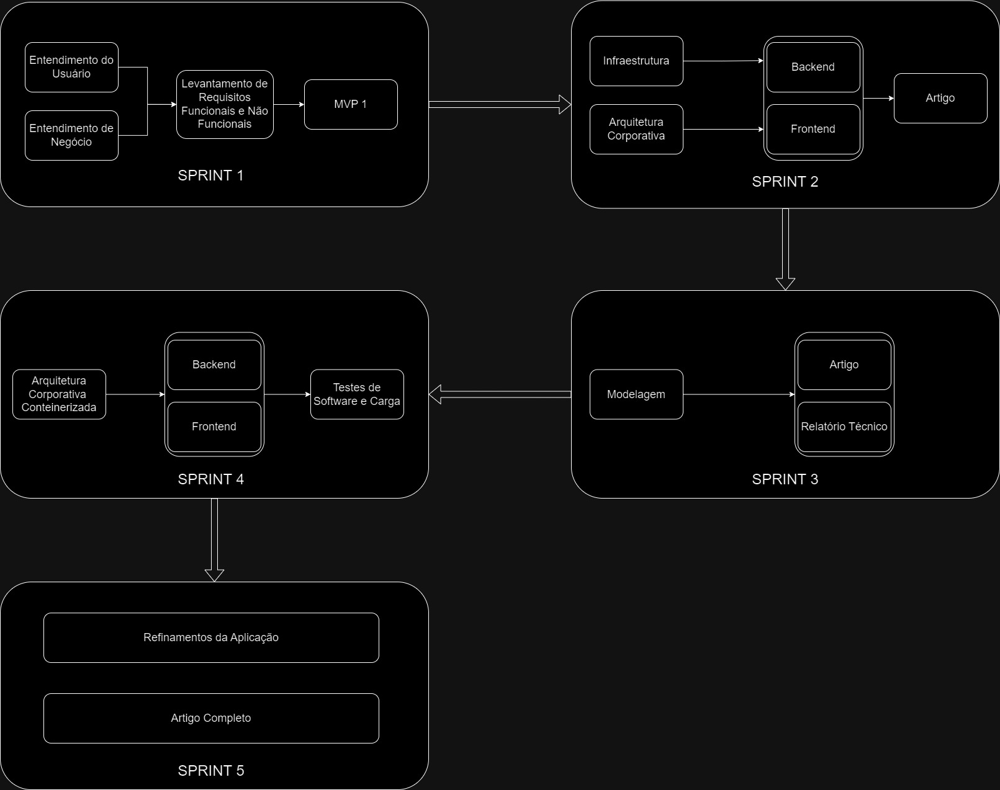

# Aplicação em sistemas distribuídos para gerência de estoques e cargas massivas de dados

## Autores:
Beatriz Amorim Monsanto; Eduardo Ferrari;  Filipe Kanazawa Calabro; Gabriel de Macedo Santos; Pedro Morita Bannwart; Tommy Ken Ishimatsu Goto

## Resumo
&emsp;&emsp;O artigo apresenta uma solução para melhorar o gerenciamento de estoque da Vivo1, uma grande operadora de telecomunicações no Brasil, por meio de sistemas distribuídos. O foco está em criar um sistema que seja confiável, escalável e que funcione em tempo real, permitindo que os centros de distribuição da empresa mantenham os dados de inventário sempre atualizados. Para isso, usamos tecnologias de computação em nuvem da Amazon (AWS) como o Amazon RDS e Auto Scaling, que ajudaram a reduzir a demora nas atualizações e aumentaram a precisão das informações de estoque. O projeto foi desenvolvido seguindo a metodologia ágil Scrum (Date, Roberta Naia, et al. "Aplicação do método ágil SCRUM em uma fundação educacional do setor público." Gestão e Projetos: GeP 7.2 (2016): 75-94.), dividido em cinco etapas chamadas "sprints", que foram desde a compreensão das necessidades dos usuários até a implementação de uma arquitetura moderna e eficiente com o uso de containers. Os resultados mostraram que o sistema melhorou a experiência dos usuários, trouxe mais eficiência para as operações e se mostrou robusto durante os testes. Por fim, o projeto gerou impacto financeiro positivo ao otimizar o uso dos recursos de TI. O estudo também aponta futuras melhorias, como o uso de inteligência artificial para prever a demanda de produtos e aprimorar ainda mais a gestão de estoque.

## Introdução

&emsp;&emsp;No ambiente digital atual, a gestão eficaz do estoque emerge como um dos maiores desafios enfrentados pelas plataformas de e-commerce (Hübner, et. al, 2016). A sincronização de inventário entre múltiplos centros de distribuição tradicionalmente implica elevados custos operacionais e demanda intensiva de processamento. Este cenário afeta diretamente a experiência do usuário, prolongando o tempo de navegação e, por vezes, comprometendo a precisão das informações de disponibilidade de produtos.

&emsp;&emsp;Segundo Ran (2021), a integração de sistemas de gerenciamento de inventário com tecnologias avançadas, como computação em nuvem e Internet das Coisas (IoT), tem sido explorada para mitigar esses desafios. Contudo, muitas dessas soluções não abordam completamente a necessidade de escalabilidade, alta disponibilidade e, principalmente, a confiabilidade dos dados em tempo real.

&emsp;&emsp;Nesse contexto, a Vivo, uma das maiores operadoras de telecomunicações do Brasil, enfrenta desafios semelhantes na gestão de seu inventário de aparelhos celulares e acessórios. A empresa busca otimizar a sincronização de estoques entre múltiplos centros de distribuição para melhorar a experiência do cliente e aprimorar a eficiência operacional. A confiabilidade dos dados é crucial para a Vivo, pois informações imprecisas podem levar a perdas financeiras e insatisfação do cliente.

&emsp;&emsp;Diante dessa problemática, o presente artigo propõe o desenvolvimento de uma solução de inventário distribuído confiável, capaz de integrar e sincronizar o estoque de maneira eficiente e próxima do tempo real. O objetivo é oferecer uma ferramenta robusta que não apenas reduza a carga de processamento imposta às plataformas de e-commerce da Vivo, mas também aprimore a visibilidade das operações logísticas e assegure a confiabilidade dos dados.

&emsp;&emsp;Espera-se que, com a implementação desta solução, o parceiro possa experimentar uma série de benefícios tangíveis, incluindo a otimização dos recursos de TI, melhoria na precisão e confiabilidade dos dados de estoque e uma experiência de usuário mais fluida e satisfatória. Este artigo detalhará a estrutura proposta para esta solução, explorará as tecnologias envolvidas e discutirá os impactos positivos esperados para a Vivo, seus parceiros e clientes finais.

## Trabalhos Relacionados

&emsp;&emsp;O estudo de caso realizado por Sharma e Pawankumar (2023) investiga o uso de computação em nuvem, especificamente o Azure Cloud, para a gestão da cadeia de suprimentos e automação de armazéns. A pesquisa demonstra como a computação em nuvem pode ser utilizada para consolidar dados de múltiplos centros de distribuição, permitindo uma melhor visibilidade e controle sobre o inventário. A aplicação de serviços de nuvem, como o Azure ou AWS, pode reduzir custos operacionais e melhorar a precisão dos dados, alinhando-se com o objetivo deste artigo de aprimorar a gestão de estoque em plataformas de e-commerce.

&emsp;&emsp;Muyumba e Phiri (2017) apresentam a implementação de um sistema de controle de inventário baseado na web para a Força Aérea da Zâmbia, utilizando uma combinação de arquitetura em nuvem e tecnologia de código de barras. Embora o contexto do estudo seja o setor militar, as tecnologias discutidas têm aplicações diretas em ambientes comerciais, especialmente em plataformas de e-commerce que precisam sincronizar o inventário entre múltiplos centros de distribuição. Dessa forma, o estudo oferece insights valiosos sobre o uso de tecnologias em nuvem que podem ser adaptadas para melhorar a precisão e a eficiência da gestão de inventário.

&emsp;&emsp;Ran (2021) explora a construção e otimização de sistemas de gerenciamento de inventário utilizando computação colaborativa em *cloud-edge*, no contexto da cadeia de suprimentos na era da Internet das Coisas (IoT). O estudo propõe um sistema que integra o processamento de dados em tempo real na borda da rede com o armazenamento e análise de dados na nuvem, permitindo uma resposta mais ágil e eficiente às variações de estoque. A combinação de computação em *cloud-edge* oferece otimização da gestão de inventário, reduzindo a latência e melhorando a sincronização de dados, aspectos cruciais para uma solução de inventário distribuído no setor de e-commerce.

&emsp;&emsp;Apesar de todos os avanços discutidos nesses trabalhos, ainda existem lacunas a serem preenchidas, principalmente no que diz respeito à aplicação de soluções que conciliem a escalabilidade, a alta disponibilidade e a otimização do inventário em tempo real com o mínimo de impacto nas operações de TI. Além disso, os estudos anteriores não abordam de forma detalhada como otimizar a experiência do usuário final ao navegar por plataformas de e-commerce com alta demanda de sincronização de inventário. O projeto proposto visa superar essas limitações, oferecendo uma solução mais robusta, com maior foco em otimização de recursos e experiência de usuário.

## Materiais e Métodos

&emsp;&emsp;Para o desenvolvimento deste projeto, adotamos a metodologia Scrum (DATE, Roberta Naia et al. Aplicação do método ágil SCRUM em uma fundação educacional do setor público. Gestão e Projetos: GeP, v. 7, n. 2, p. 75-94, 2016.), que é amplamente utilizada em projetos de tecnologia por sua capacidade de promover a colaboração e a flexibilidade. A equipe, composta por 6 pessoas, trabalha em ciclos de desenvolvimento chamados sprints, cada um com a duração de duas semanas. No total, serão realizadas 5 sprints. No início de cada sprint, ocorre uma sessão de planejamento (planning) para definir e dividir as tarefas entre os membros do grupo. Ao final de cada ciclo, são feitas uma revisão (review) dos resultados alcançados e uma retrospectiva (retro) para identificar melhorias e adaptar o processo conforme necessário.

&emsp;&emsp;A seção de Materiais e Métodos4 em um artigo científico desempenha um papel crucial ao descrever de forma detalhada os procedimentos, ferramentas e condições utilizadas durante a pesquisa5. Ela garante que o estudo possa ser replicado por outros pesquisadores, validando os resultados e contribuindo para a integridade científica. Nessa seção, são abordados os recursos materiais, as técnicas adotadas, e as metodologias empregadas para alcançar os objetivos propostos. Essa descrição detalhada é essencial para que outros possam entender e reproduzir o trabalho, assegurando sua confiabilidade e precisão.

&emsp;&emsp;Dentro desse contexto, a ampla adoção da infraestrutura em nuvem tem impulsionado diversas indústrias a buscar atributos tangíveis em seus produtos. Este estudo se alinha com as tendências emergentes no mercado de software, refletindo a constante evolução desse cenário.

Figura 1 - Materiais e Métodos

Fonte: Autoria Própria

### Sprint 1
&emsp;&emsp;A primeira sprint tem como foco o entendimento do usuário e do negócio, seguido pelo levantamento de requisitos funcionais e não funcionais necessários para o sistema, como é demonstrado na Figura 1. Essa fase também conta com a entrega do primeiro Produto Mínimo Viável (MVP), que serve como base inicial para sprints futuras. O MVP consiste em uma aplicação backend integrada com um banco de dados SQL, além de uma aplicação frontend estática. O objetivo principal da sprint é compreender melhor os benefícios da solução para, futuramente, entregar um sistema que seja benéfico para o cotidiano da empresa.

**Entendimento do Usuário**

&emsp;&emsp;Para compreender o usuário, a pesquisa foi estruturada em duas etapas principais: imersão preliminar e pesquisa qualiquantitativa. A imersão preliminar consistiu em uma fase inicial de exploração e entendimento do tema a ser abordado, realizada por meio de observação em campo ou durante o primeiro contato com o parceiro, como em uma reunião de Kick-off. Essa etapa teve como objetivo reunir informações essenciais sobre o contexto do usuário e suas necessidades.

&emsp;&emsp;Com base nos dados coletados na imersão preliminar, a segunda etapa, a pesquisa qualiquantitativa, foi desenvolvida para aprofundar o entendimento do perfil do usuário. O grupo elaborou um formulário que combinava métodos qualitativos e quantitativos, direcionado a perfis de usuários representativos, previamente identificados. A técnica de amostragem “bola de neve” foi utilizada para coleta de respostas: os participantes iniciais, escolhidos por se encaixarem no perfil desejado, responderam ao formulário e o encaminharam a outras três pessoas com o mesmo perfil, que repetiram o processo, ampliando a amostra de forma gradual.

&emsp;&emsp;As informações coletadas nas duas etapas foram organizadas em uma seção específica no documento do projeto e disponibilizadas em uma apresentação resumida no repositório do GitHub. O material final incluiu uma introdução com os objetivos e justificativa da pesquisa, uma descrição detalhada da imersão preliminar e dos insights obtidos, além de uma seção sobre a elaboração e aplicação da pesquisa qualiquantitativa, acompanhada de uma síntese dos resultados apresentados em gráficos.

**Entendimento de Negócio**

&emsp;&emsp;Durante o desenvolvimento do projeto, foram realizadas diversas atividades para entender melhor o contexto de negócio e assegurar que a solução final atendesse às necessidades específicas dos clientes e se destacasse no mercado:

1. **Matriz de Avaliação de Valor Oceano Azul:** A equipe identificou 8 atributos essenciais que são valorizados pelos clientes e que diferenciam o projeto da concorrência. Essa análise utilizou as ações de reduzir, eliminar, aumentar e criar, com o objetivo de destacar os elementos únicos da solução, garantindo que ela atenda de forma eficaz às expectativas e necessidades dos clientes.

2. **Matriz de Risco:** Foram mapeados pelo menos 10 riscos que poderiam afetar o projeto, incluindo ameaças e oportunidades. Esses riscos consideram fatores relacionados à equipe, ao domínio tecnológico, à complexidade do projeto, entre outros elementos importantes. A matriz de risco foi desenvolvida para antecipar possíveis desafios e planejar ações de mitigação de forma proativa.

3. **Canvas de Proposta de Valor:** A equipe elaborou uma representação gráfica das principais dores dos clientes, dos benefícios oferecidos pela solução e dos ganhos proporcionados por ela. Esse canvas foi utilizado para assegurar que a solução esteja alinhada com as expectativas do mercado e para comunicar claramente como o projeto resolverá problemas e criará valor para os clientes.

4. **Análise Financeira do Projeto:** Foram analisados os investimentos planejados pelo parceiro no projeto, incluindo as estimativas de custos e receitas para um período de um ano. Em casos de projetos internos, onde não há receitas estimadas, foram considerados apenas os custos previstos, seguindo a lógica fornecida pelo parceiro para essas estimativas. Essa análise forneceu uma visão detalhada do investimento necessário e do retorno esperado, auxiliando na tomada de decisões estratégicas.

&emsp;&emsp;Essas atividades foram documentadas e integradas ao planejamento do projeto, assegurando um entendimento abrangente das necessidades de negócio e dos fatores críticos para o sucesso da solução desenvolvida.

**Elicitação de Requisitos Funcionais e Não Funcionais**

&emsp;&emsp;Após a conclusão da etapa anterior e a realização de uma reunião de alinhamento com o cliente, foram definidos os requisitos essenciais para que a aplicação fosse considerada "pronta" ao final das 10 semanas de desenvolvimento. Nesse processo, identificaram-se os requisitos funcionais, que abrangem as funcionalidades diretamente experimentadas pelo usuário, além dos requisitos não funcionais, que se referem a características como desempenho, segurança e escalabilidade — elementos fundamentais em um projeto que utiliza tecnologia de nuvem, embora não sejam diretamente percebidos pelo usuário.

**Prototipação de Uma Solução de Teste**

&emsp;&emsp;Na primeira entrega ao cliente, foi desenvolvida e implementada uma solução web simples e integrada, que exemplificou um sistema CRUD completo, utilizando a arquitetura de nuvem com serviços da AWS. Essa solução serviu como um protótipo funcional, demonstrando a aplicabilidade e eficiência da tecnologia escolhida para o desenvolvimento do projeto.

### Sprint 2
&emsp;&emsp;Na Sprint 2, a atenção se volta para a configuração da infraestrutura cloud da AWS necessária para a distribuição do projeto, como é demonstrado na Figura 1. Com isso, tem como objetivo iniciar a integração do backend e do frontend da solução. Além disso, um artigo inicial é produzido para documentar o progresso até esta fase. A relevância do uso da computação em nuvem para sistemas de gestão de estoques e automação de processos empresariais é abordada por autores como Sharma e Pawankumar (2023), que destacam o papel da Azure Cloud na automação de armazéns, e Ran (2021), que discute a otimização de sistemas de gerenciamento de estoques via computação colaborativa em nuvem.

**Arquitetura Corporativa e Infraestrutura**

&emsp;&emsp;Na implementação da arquitetura corporativa e da infraestrutura na nuvem AWS, foram seguidos os requisitos essenciais para garantir o desempenho, a segurança e a escalabilidade do sistema. A arquitetura foi projetada para atender às necessidades do cliente, garantindo que o sistema fosse robusto, flexível e capaz de suportar altas demandas.

&emsp;&emsp;A arquitetura corporativa do sistema cumpre os seguintes critérios: o balanceamento de carga foi implementado com um Elastic Load Balancer (ELB), que distribui as requisições entre múltiplas instâncias, garantindo a utilização eficiente dos recursos e a continuidade do serviço. Para assegurar a capacidade de failover e a recuperação de desastres, foram configurados backups automáticos e zonas de disponibilidade redundantes. A elasticidade do sistema é garantida através do Auto Scaling, que adiciona ou remove servidores conforme a demanda, permitindo um ajuste dinâmico de capacidade. Além disso, foram realizados testes de desempenho para avaliar a latência e a vazão da aplicação, assegurando que ela atenda aos requisitos esperados.

&emsp;&emsp;A arquitetura do banco de dados foi implementada usando o Amazon RDS com PostgreSQL, que oferece mecanismos de failover e recuperação de desastres, além de escalabilidade de desempenho para suportar variações na carga de trabalho. O RDS está configurado para suportar backups automatizados e recuperação ponto-a-ponto, garantindo alta disponibilidade e tolerância a falhas.

&emsp;&emsp;Na parte de infraestrutura, foi estabelecida uma Virtual Private Cloud (VPC) com duas zonas de disponibilidade, cada uma contendo subnets pública e privada. A subnet pública na zona de disponibilidade principal inclui um Bastion Host para acesso seguro, servidores front-end, um NAT Gateway para acesso seguro à Internet dos hosts em subnets privadas e o ELB para balanceamento de carga. Na subnet privada, o Auto Scaling permite a adição dinâmica de servidores conforme necessário, enquanto o Amazon RDS armazena os dados de forma segura e redundante.

**Front-End e Back-End**

**Front-End**

&emsp;&emsp;A camada visual da aplicação, ou front-end, foi desenvolvida utilizando o **React**, uma biblioteca JavaScript popular para a criação de interfaces de usuário dinâmicas e responsivas. O projeto iniciou com a definição das telas e a estrutura visual no Figma, garantindo um design que atendesse às necessidades e expectativas dos usuários. O desenvolvimento front-end utilizou o React para construir componentes reutilizáveis e interativos, proporcionando uma experiência de usuário fluida e eficiente.

&emsp;&emsp;Para a gestão de pacotes e a construção do projeto, foi utilizado o **Vite**, uma ferramenta moderna para build e desenvolvimento, conhecida por sua rapidez e eficiência. A integração do React com o Vite permitiu uma configuração ágil e uma performance otimizada durante o desenvolvimento. O **TypeScript** foi adotado para adicionar tipagem estática ao código, melhorando a robustez e a manutenção do código front-end.

**Back-End**

&emsp;&emsp;A camada lógica da aplicação, ou back-end, foi implementada utilizando o **Flask**, um microframework para Python que oferece uma base sólida para o desenvolvimento de APIs e lógica de servidor. O Flask foi escolhido pela sua simplicidade e flexibilidade, facilitando a construção de uma aplicação escalável e fácil de manter. Ele foi configurado para lidar com as requisições do front-end, gerenciar a lógica de negócios e interagir com o banco de dados.

&emsp;&emsp;Para o gerenciamento de dados, foi utilizado o **MySQL**, um sistema de gerenciamento de banco de dados relacional robusto e confiável. O MySQL foi configurado para armazenar e manipular os dados da aplicação de forma eficiente, garantindo a integridade e a disponibilidade das informações. A integração entre o Flask e o MySQL foi realizada através de uma camada de abstração que simplifica as operações de leitura e escrita no banco de dados.

&emsp;&emsp;A infraestrutura do projeto foi hospedada na **AWS**, utilizando serviços como o Amazon EC2 para o gerenciamento das instâncias de servidor e o Amazon RDS para a gestão do banco de dados MySQL. A AWS garantiu escalabilidade, alta disponibilidade e segurança para a aplicação, suportando tanto o front-end quanto o back-end com eficiência.

&emsp;&emsp;Essa combinação de tecnologias permitiu a criação de uma aplicação web robusta e eficiente, com um front-end interativo e um back-end flexível, capaz de atender às necessidades dos usuários e oferecer uma experiência de uso de alta qualidade.

### Sprint 3
&emsp;&emsp;Na Sprint 3, o foco é dedicado à modelagem do sistema, onde tem como objetivo realizar refinamentos com base nos aprendizados das sprints anteriores, como é demonstrado na Figura 1. Durante essa fase, o artigo continua sendo escrito e aprofundado, além da redação de um relatório técnico, que documenta o estado atual do sistema e os desenvolvimentos realizados.

**MVP Versão 2**

&emsp;&emsp;Na segunda versão do MVP, foram incorporadas várias melhorias e novas funcionalidades para aprimorar a experiência do usuário e atender melhor às necessidades identificadas. 

**Modelagem e Implementação (Diagramas)**

&emsp;&emsp;Na fase de modelagem e implementação, foram desenvolvidos quatro tipos de diagramas para fornecer uma visão abrangente e detalhada do software:

- **Diagrama de Casos de Uso:** Este diagrama ilustra as interações entre os usuários e o sistema, destacando os casos de uso principais e suas funcionalidades.
- **Diagrama de Sequência UML:** Representa a sequência de interações entre os componentes do sistema para realizar processos específicos, detalhando o fluxo de mensagens.
- **Diagrama de Classes UML:** Mostra as classes do sistema, seus atributos, métodos e relacionamentos, fornecendo uma visão estrutural detalhada do software.
- **Diagrama de Implantação UML:** Descreve a arquitetura física do sistema, incluindo a disposição dos componentes de hardware e software, e suas conexões.

**Testes com Usuários**

&emsp;&emsp;Os testes realizados com usuários ocorreram nas sprints 3 e 4, e foram focados em avaliar tanto a **usabilidade** quanto o **desempenho** da aplicação, conforme os requisitos não funcionais estabelecidos no projeto.

1. **Testes de Usabilidade:**
   - **Quando foram realizados:** Os testes de usabilidade foram conduzidos ao longo da Sprint 3.
   - **Número de participantes:** 3 usuários-chave participaram dos testes.
   - **Perfil dos participantes:**
     - **Taciana Kogawa**, gestora de estoque, que testou a funcionalidade de sincronização de estoque.
     - **Carlos Oliveira**, lojista, que avaliou a facilidade de uso para adição de itens ao estoque e busca de produtos.
     - **Fabio Monsanto**, administrador de sistemas, que validou a documentação para implementação do sistema sem assistência.
   - **O que foi testado:** Foram avaliadas funcionalidades relacionadas à sincronização de estoque (RNF01), usabilidade para realizar tarefas de gerenciamento em até 3 cliques (RNF03), e a clareza da documentação para uso da plataforma (RNF04).
   - **Coleta de dados:** Os dados foram coletados por meio de observação direta durante o uso do sistema e feedback qualitativo ao final dos testes. Os principais critérios analisados foram a eficiência nas tarefas e a satisfação com a interface, com foco em garantir que os usuários completassem suas atividades sem dificuldades significativas.

2. **Testes de Desempenho e Carga:**
   - **Quando foram realizados:** Os testes de carga foram executados durante a Sprint 4.
   - **Ferramentas utilizadas:** Foram realizados testes com a ferramenta K6 para simular cargas de usuários e o monitoramento foi feito utilizando o Grafana.
   - **Participantes:** **Beatriz Monsanto** e **Tommy Goto** lideraram os testes de carga simulando diferentes cenários com 200 até 2000 usuários simultâneos.
   - **O que foi testado:** O objetivo principal foi avaliar a capacidade do sistema de lidar com cargas pesadas, especialmente:
     - A sincronização de 2000 lojas (RNF02);
     - A resposta sob diferentes níveis de carga, com foco em manter a latência abaixo de 2 segundos para 95% das requisições (RNF07).
   - **Coleta de dados:** As métricas coletadas incluem tempo médio de resposta, latência, taxa de erro e uso de CPU e memória. Os relatórios gerados pelo Grafana foram analisados para identificar possíveis gargalos e sugerir ajustes na infraestrutura.

&emsp;&emsp;Esses diagramas e testes foram criados para documentar o software de forma minuciosa, servindo como uma base sólida para futuras atualizações, expansões e testes, alinhando-se com a arquitetura de software implementada, e de melhorias de usabilidade

### Sprint 4
&emsp;&emsp;Na Sprint 4, a arquitetura do sistema é adaptada para uma solução conteinerizada através do software Docker, que tem como objetivo permitir maior escalabilidade, isolamento e reprodutibilidade, como é demonstrado na Figura 1. O desenvolvimento do backend e frontend continua, agora ajustado à nova arquitetura conteinerizada. Nessa fase, também são realizados testes de software e de carga para garantir que o sistema funcione corretamente e suporte a demanda esperada. A adoção de tecnologias de conteinerização, como Docker, para gerenciar e distribuir aplicações em ambientes de nuvem é amplamente discutida por Hübner et al. (2016), que destacam a eficiência de sistemas distribuídos. Além disso, estudos como o de Ran (2021) reforçam a importância da realização de testes de carga em sistemas de gerenciamento de estoques baseados em nuvem para garantir a escalabilidade e resiliência.

**Arquitetura de Software Conteinerizada**

&emsp;&emsp;A arquitetura conteinerizada será desenvolvida para garantir maior flexibilidade, escalabilidade e eficiência na gestão dos recursos do sistema. Utilizaremos **containers** para isolar e executar as diferentes partes do software, facilitando o desenvolvimento, a implantação e a manutenção. A abordagem conteinerizada oferece os seguintes benefícios:

- **Portabilidade:** Containers permitem que o software seja executado de forma consistente em diferentes ambientes, desde desenvolvimento até produção.
- **Escalabilidade:** A arquitetura conteinerizada facilita o dimensionamento horizontal, permitindo adicionar ou remover containers conforme a demanda.
- **Eficiência:** A utilização de containers reduz a sobrecarga de recursos e melhora o desempenho, proporcionando um ambiente mais ágil e responsivo.

Para gerenciar os containers, utilizaremos ferramentas como **Docker** para a criação e execução dos containers e **Kubernetes** para orquestração e gerenciamento de clusters de containers, se necessário. A configuração será realizada de forma a garantir a integração eficiente dos componentes do sistema e a comunicação entre eles.

**Testes no Sistema**

&emsp;&emsp;Os testes serão conduzidos para validar o funcionamento do sistema e assegurar que ele atende aos requisitos estabelecidos. Serão realizadas as seguintes categorias de testes:

- **Testes Unitários:** Verificarão a funcionalidade de componentes individuais do sistema para garantir que cada unidade de código opere conforme o esperado.
- **Testes de Integração:** Avaliarão a interação entre os diferentes componentes do sistema e garantirão que eles funcionem corretamente quando integrados.
- **Testes Funcionais:** Confirmarão se o sistema atende aos requisitos funcionais especificados e se as funcionalidades estão implementadas corretamente.
- **Testes de Performance:** Medirão o desempenho do sistema, avaliando aspectos como tempo de resposta e capacidade de carga, para garantir que ele suporte a demanda esperada.

Esses testes serão executados tanto no ambiente de desenvolvimento quanto no ambiente conteinerizado, garantindo que todas as partes do sistema estejam funcionando corretamente antes do lançamento.

### Sprint 5
&emsp;&emsp;Na Sprint 5, tem como objetivo realizar refinamentos finais na aplicação com base no feedback dado pelo parceiro. A fase é concluída com a finalização do artigo, que documenta todo o processo de desenvolvimento e os resultados obtidos ao longo do projeto.

**Refinamentos**

- **Ajustes de Funcionalidade:** Realização de modificações e melhorias nas funcionalidades existentes para atender melhor aos requisitos do usuário e corrigir quaisquer problemas identificados.
- **Otimização de Desempenho:** Análise e otimização de aspectos do sistema que possam impactar sua eficiência, como tempo de resposta e utilização de recursos.
- **Refinamento da Interface:** Melhoria da experiência do usuário com ajustes na interface, garantindo que a usabilidade e a estética estejam alinhadas com as melhores práticas e expectativas dos usuários.
- **Correção de Bugs:** Resolução de quaisquer erros ou falhas detectados durante os testes, assegurando que o sistema funcione de maneira estável e confiável.
- **Documentação e Preparação para Lançamento:** Atualização da documentação do sistema para refletir as mudanças feitas e preparar o sistema para a fase de lançamento.

## Resultados 

&emsp;&emsp;Após a implementação da solução proposta, diversos resultados foram observados ao longo das sprints. As entregas de cada fase permitiram uma avaliação contínua da performance do sistema, seu desenvolvimento e os benefícios obtidos pela integração das tecnologias de nuvem, infraestrutura distribuída e arquitetura conteinerizada.

1. **Redução da Latência e Melhorias na Sincronização de Inventário**

&emsp;&emsp;A implementação de uma arquitetura em nuvem, utilizando serviços como Amazon RDS, Elastic Load Balancer (ELB) e Auto Scaling, proporcionou uma redução significativa na latência de atualização de estoques após múltiplos acessos à plataforma digital e o cadastramento massivo de informações. A sincronização dos dados de estoque, que antes sofria com inconsistências devido à descentralização dos centros de distribuição, foi aprimorada com a adoção da computação colaborativa em cloud-edge, reduzindo o tempo de atualização do inventário para um nível quase instantâneo. Essa melhoria foi mensurada durante os testes de desempenho realizados nas sprints 3 e 4. Também foi possível observar uma redução na latência de consulta de tempo de entrega para, no máximo, 3 segundos, mesmo em situações com múltiplos produtos — um requisito de negócios essencial para o parceiro.

2. **Escalabilidade e Capacidade de Carga**

&emsp;&emsp;Com a adoção de uma arquitetura conteinerizada, foi possível realizar testes de carga que demonstraram a escalabilidade da solução. Durante esses testes, o sistema foi capaz de suportar picos de até 2000 requisições em um intervalo de 3 segundos sem queda no desempenho. O Auto Scaling configurado na infraestrutura garantiu a alocação dinâmica de recursos durante picos de demanda, mantendo a estabilidade e a alta disponibilidade do serviço, com instâncias EC2 e processamento suficiente para atender a essa demanda.

3. **Melhoria na Experiência do Usuário**

&emsp;&emsp;Com base nos resultados da pesquisa quali-quantitativa realizada nas sprints iniciais, o desenvolvimento de uma interface de usuário amigável, construída em React, proporcionou uma experiência mais fluida e intuitiva, tanto para administradores quanto para usuários comuns. A implementação de um CRUD completo e a integração eficiente entre front-end e back-end atenderam aos requisitos funcionais e não funcionais especificados para o projeto, com validação de funcionamento e testes realizados nas sprints 3 e 4.

4. **Eficiência na Gestão de Estoque**

&emsp;&emsp;A sincronização precisa dos dados de estoque entre os múltiplos centros de distribuição e lojas minimizou erros de disponibilidade de produtos, conforme mensurado pelas métricas de acurácia durante os testes de integração.

5. **Robustez e Segurança**

&emsp;&emsp;A infraestrutura baseada na Virtual Private Cloud (VPC) da AWS, combinada com a configuração de subnets públicas e privadas e o uso de um Bastion Host para acesso seguro, garantiu a segurança dos dados e do sistema. Além disso, a solução demonstrou robustez, com backups automáticos, instâncias secundárias para segurança de failover e recuperação ponto-a-ponto, minimizando o risco de perda de dados e interrupção do sistema.

6. **Impacto Financeiro Positivo**

&emsp;&emsp;A análise financeira realizada ao longo do projeto indicou uma redução nos custos operacionais e a otimização dos recursos computacionais, com uma diminuição nos custos gerais de envio de produtos devido ao cálculo otimizado de entrega. Além disso, o uso de sistemas on-premise, onde os recursos computacionais são cobrados apenas quando utilizados, flexibilizou a operação de acordo com sua escala.

&emsp;&emsp;De forma geral, os resultados obtidos validam a eficácia da solução proposta, demonstrando melhorias tangíveis tanto na experiência do usuário quanto na eficiência operacional do sistema de e-commerce. A implementação de uma arquitetura distribuída, segura e escalável atendeu aos objetivos iniciais do projeto, proporcionando um impacto positivo tanto para os parceiros comerciais quanto para os clientes finais.

## Conclusão

&emsp;&emsp;Com base nos resultados obtidos e nos objetivos delineados, pode-se afirmar que a solução proposta para gerenciar estoques e grandes cargas de dados em sistemas distribuídos trouxe melhorias significativas. A arquitetura em nuvem, utilizando tecnologias como Amazon RDS, ELB e Auto Scaling, reduziu a latência na atualização de estoques e aprimorou a sincronização de dados quase em tempo real, resultando em maior precisão e eficiência no gerenciamento de inventário. A escalabilidade da solução também foi validada por testes de carga, demonstrando que a infraestrutura é capaz de suportar grandes volumes de requisições e carregamentos massivos de dados sem comprometer o desempenho do sistema.

&emsp;&emsp;Além disso, a implementação de uma interface amigável melhorou substancialmente a experiência do usuário, tanto para administradores quanto para consumidores, o que é um avanço em relação aos estudos analisados. Ao comparar com trabalhos anteriores, o uso de uma arquitetura distribuída e conteinerizada mostrou-se mais eficiente no tratamento de grandes volumes de dados, superando as limitações em termos de escalabilidade e alta disponibilidade vistas nos estudos de Sharma e Pawankumar (2023) e Muyumba e Phiri (2017).

&emsp;&emsp;Para futuros trabalhos, sugere-se explorar ainda mais a integração de soluções baseadas em inteligência artificial para prever a demanda de produtos a fim de otimizar e abastecer o inventário com base em predições. Além disso, a investigação de novas tecnologias de banco de dados distribuídos e melhorias no tratamento de falhas no contexto de cloud-edge computing podem oferecer novas oportunidades de evolução e refinamento da solução apresentada. Isso permitirá que o sistema se torne ainda mais robusto e apto a atender às crescentes demandas do e-commerce moderno.

# Referências

1. Disponível em: <https://vivo.com.br/para-voce>. Acesso em: 7 out. 2024b.

2. Disponível em: <https://dialnet.unirioja.es/servlet/articulo?codigo=5694376>. Acesso em: 7 out. 2024.

3. Hübner, A. H., Holzapfel, A., & Kuhn, H. (2016). Distribution systems in omni-channel retailing. Business Research, 9(2), 255–296. Disponível em: [Distribution systems in omni-channel retailing (PDF)](https://ideas.repec.org/a/spr/busres/v9y2016i2d10.1007_s40685-016-0034-7.html). Acesso em: 24 set. 2024.

   
4. Guia Materiais e Métodos para Artigo com Exemplos. Disponível em: <https://artigocientifico.com.br/metodologia-cientifica/materiais-e-metodos-artigo-cientifico-exemplos/>. Acesso em: 29 ago. 2024.

5. MACHADO, L. 12 dicas de como escrever a seção de Materiais e Métodos do seu artigo científico. Disponível em: <https://proficienciaconsultoria.com.br/12-dicas-de-como-escrever-a-secao-de-materiais-e-metodos-do-seu-artigo-cientifico/>. Acesso em: 29 ago. 2024.

6. Sharma e Pawankumar (2023), "Cloud Computing for Supply Chain Management and Warehouse Automation: A Case Study of Azure Cloud," International Journal of Smart Sensor and Adhoc Network. Disponível em: [Cloud Computing for Supply Chain Management and Warehouse Automation (PDF)](https://www.researchgate.net/profile/Smrutirekha-Panda/publication/367299233_Cloud_Computing_for_Supply_Chain_Management_and_Warehouse_Automation_A_Case_Study_of_Azure_Cloud/links/63cb1d286fe15d6a5734506c/Cloud-Computing-for-Supply-Chain-Management-and-Warehouse-Automation-A-Case-Study-of-Azure-Cloud.pdf). Acesso em: 30 ago. 2024

7. Thomas Muyumba e Jackson Phiri (2017), "A Web-based Inventory Control System using Cloud Architecture and Barcode Technology for Zambia Air Force". Disponível em: [link para o PDF](https://pdfs.semanticscholar.org/5f66/5fd000b32def9190a47263c7209899b00e37.pdf). Acesso em: 30 ago. 2024.

7. Ran H (2021), "Construction and optimization of inventory management system via cloud-edge collaborative computing in supply chain environment in the Internet of Things era". Disponível em: [link para o PDF](https://journals.plos.org/plosone/article?id=10.1371/journal.pone.0259284). Acesso em: 30 ago. 2024.
