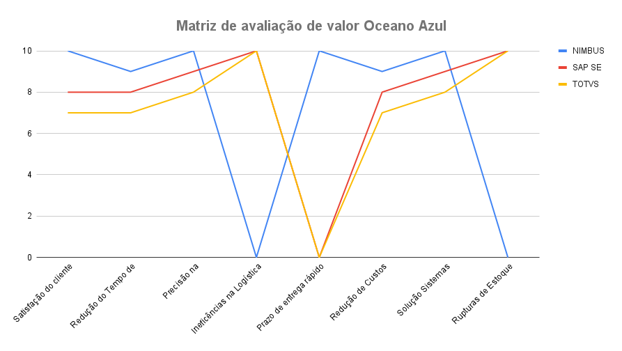
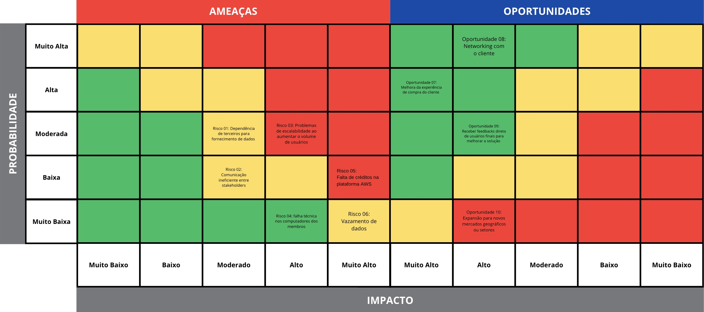
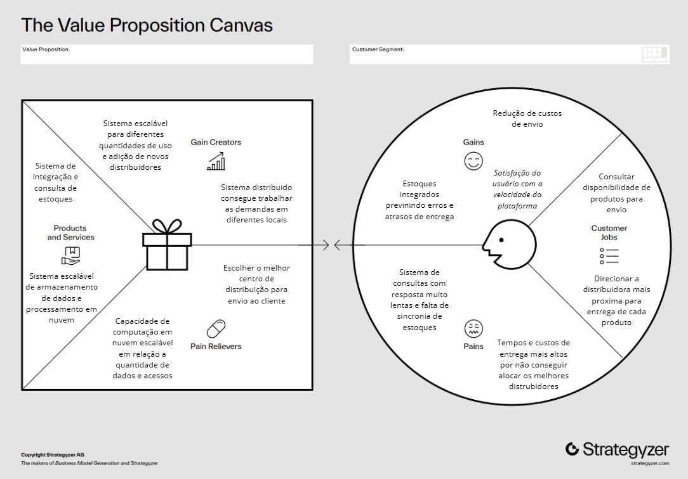

# Entendimento de Negócio

&nbsp;&nbsp;No contexto atual do mercado de telecomunicações, onde a rapidez e eficiência logística são cruciais para a satisfação do cliente, a Vivo1se destaca como líder no setor, buscando constantemente inovar e aprimorar suas operações. O projeto de Sistema de Inventário Distribuído é uma iniciativa estratégica que visa transformar o gerenciamento de estoque da Vivo, integrando todos os centros de distribuição e lojas de aparelhos de celular e acessórios. Com este sistema, pretendemos eliminar as ineficiências na sincronização de estoque que atualmente elevam os custos e prolongam os prazos de entrega, elementos críticos na jornada do cliente.

&nbsp;&nbsp;Para solucionar tais desafios, a solução Nimbus é projetada para enfrentar os desafios logísticos atuais, removendo ineficiências e reduzindo custos associados à sincronização de estoque que afetam a experiência do cliente. Através da integração de tecnologias avançadas e práticas de desenvolvimento sistemas distribuídos, Nimbus oferecerá uma visão precisa e atualizada dos estoques, melhorando a precisão dos prazos de entrega e a disponibilidade de produtos.

## Análise Financeira

### Introdução

&emsp;&emsp;A análise financeira de um projeto consiste em uma avaliação detalhada dos aspectos monetários envolvidos. Inicialmente, é necessário identificar os investimentos necessários para dar início e manter o projeto. Isso abrange custos como aquisição de equipamentos, contratação de pessoal e despesas operacionais, elementos cruciais para um planejamento financeiro adequado.

&emsp;&emsp;Em seguida, a projeção dos custos operacionais ao longo do período de análise é fundamental. Esses custos incluem despesas recorrentes como salários, aluguel, matéria-prima e marketing. Compreender esses valores é essencial para estimar o ponto de equilíbrio e determinar se o projeto será lucrativo.

&emsp;&emsp;Além dos custos, é importante examinar as projeções de receitas do projeto. Isso envolve estimar vendas esperadas, levando em consideração fatores como demanda de mercado, preços de venda e sazonalidade. A receita projetada é vital para calcular o retorno sobre o investimento e avaliar a lucratividade do projeto.

&emsp;&emsp;Portanto, a análise financeira do projeto oferece uma visão completa dos aspectos monetários, desde os investimentos iniciais até as receitas esperadas. Sua importância reside em fornecer informações críticas para a tomada de decisões, permitindo que os parceiros avaliem o risco e a rentabilidade antes da implementação do projeto.

### Projeções de Custo

&emsp;&emsp;As projeções de custo são estimativas ou previsões dos gastos que uma empresa ou projeto pode incorrer ao longo de um período específico. Essas projeções abrangem diversas áreas, como custos operacionais, de produção, de pessoal, de marketing e administrativos. Baseadas em análises detalhadas das despesas passadas e considerações sobre mudanças futuras no ambiente econômico e de mercado, essas projeções são fundamentais para o planejamento financeiro, a definição de metas realistas e a tomada de decisões estratégicas.

1. **Custos de Produção**

&emsp;&emsp;Para as projeções de custos de produção, vamos considerar que a hora de trabalho de cada membro do grupo é R$ 80 e cada membro se dedicará 4 horas por dia, 5 dias por semana. Sabendo que o grupo é composto por 6 membros, o cálculo do custo de produção do grupo é:

$$ \text{Custo de Produção} = \text{Horas } \times \text{Preço por Hora } \times \text{Dias de Trabalho (Semana) }\times \text{Número de Semanas } \times \text{Número de Desenvolvedores}$$

Aplicando essa lógica de cálculo com os dados de custos ditos, fica:

$$\text{Custo de Produção} = 4 \times 80 \times 5 \times 10 \times 6 = 96.000$$

2. **Custos Operacionais**

&emsp;&emsp;Para as projeções de custos operacionais, adotaremos os custos referentes aos serviços da Amazon Web Services (AWS), uma vez que a plataforma criada será implementada nos serviços de cloud da AWS.

&emsp;&emsp;Diante do que foi solicitado pela Vivo, os serviços da AWS que mais se encaixam na demanda são:
- EC2
    - Nome da Instância: t4g.small
    - Preço do Armazenamento de backup: 2
    - Memória: 2GiB
    - Preço por Hora sob Demanda: 0.0168
- RDS
    - Nome da Instância: db.m6i.12xlarge
    - Utilização valor: 20
    - Modelo de Preço: OnDemand
    - Quantidade de Armazenamento: 20GB
- Lambda
    - Número de Requisições/dia: 50

&emsp;&emsp;Levando isso em consideração, e sabendo que cada serviço da AWS possui uma forma de cobrança, os custos operacionais podem ser calculados a partir de:

$$\text{Custos Operacionais} = \sum{\text{ Custos Aproximados de Utilização dos Serviços}}$$

&emsp;&emsp;Portanto, os custos operacionais serão:

$$\text{Custos Operacionais} \approx 1,252.02 + 6.13 + 0 $$
$$\text{Custos Operacionais} = 1.258,15 \text{ USD (mês)} $$

&emsp;&emsp;A partir desses cálculos, podemos afirmar que os custos totais de produção podem ser determinados a partir da soma dos custos de produção e dos custos operacionais.

$$\text{Custos Totais} = \text{Custos de Produção } + \text{ (Custos Operacionais} \times \text{ Preço do Dólar no dia)}$$

$$\text{Custos Totais do Primeiro Ano} = \text{Custos de Produção} + \text{((Custos Operacionais} \times 12) \times \text{ Preço do Dólar)}$$

$$\text{Custos Totais do Primeiro Ano} = 96.000 + (15.097,8 \times \text{ Preço do Dólar)}$$

### Projeções de Receitas

&emsp;&emsp;As projeções de receita envolvem estimar as entradas financeiras que uma empresa ou projeto pode obter ao longo de um período específico. Baseando-se no histórico de vendas, nas tendências de mercado e nas estratégias de marketing, essas projeções fornecem uma visão clara do potencial de receita. Elas ajudam na elaboração de orçamentos e na definição de metas de vendas, sendo fundamentais para o planejamento financeiro e o desenvolvimento de estratégias de crescimento.

&emsp;&emsp;Embora uma pesquisa realizada em 2021 tenha mostrado que 62% dos consumidores desistem de realizar uma compra devido a experiências não agradáveis3 4 5, iremos considerar um cenário conservador, onde essa taxa de desistência é reduzida em 20%. Isso resulta em uma nova taxa de desistência de 42%, o que implica que 58% das compras são efetivamente realizadas.

&emsp;&emsp;Este ajuste conservador tem como objetivo criar uma projeção mais realista e prudente para a análise financeira. No entanto, é importante destacar que esses números são médias do mercado e podem não refletir com precisão a realidade específica da Vivo. A experiência do consumidor pode variar significativamente com base em diversos fatores, como qualidade do atendimento ao cliente, facilidade de uso da plataforma de compra, e reputação da marca.

&emsp;&emsp;Sabendo disso, podemos afirmar que, diminuindo a taxa de desistência em 20%, a quantidade de produtos vendidos aumentará proporcionalmente. Assim, a fórmula ficaria:

$$\text{Quantidade de Produtos Vendidos} = \text{ Quantidade de Produtos Vendidos Antes da Implementação } \times 1.20$$

&emsp;&emsp;Apenas com a quantidade de produtos vendidos, não podemos determinar precisamente o aumento na receita da Vivo, devido à grande variedade de preços praticados na plataforma da Vivo. No entanto, é possível afirmar que um aumento na quantidade de produtos vendidos resultará em um aumento na receita da Vivo. Podemos demonstrar isso da seguinte forma:

$$\text{Aumento na Receita} = \sum_{i=0}^{n}{\text{Novo Produto Vendido}_i \times \text{Preço do Novo Produto Vendido}_i}$$

&emsp;&emsp;E a receita total, após a implementação da solução, seria:

$$\text{Receita Total} = \text{Receita sem o Impacto da Solução } + \text{ Aumento na Receita}$$

## Matriz de avaliação de valor Oceano Azul

&nbsp;&nbsp;A **Matriz de Oceano Azul**2 é uma ferramenta estratégica usada para identificar e desenvolver mercados inexplorados e não contestados, conhecidos como "Oceanos Azuis". Ela se opõe ao conceito de "Oceano Vermelho", que representa mercados saturados onde a competição é intensa. A aplicação desta matriz ajuda as empresas a explorar novas áreas onde a competição é reduzida, possibilitando maior crescimento e rentabilidade.

&nbsp;&nbsp;No contexto do projeto de Sistema de Inventário Distribuído da Vivo, a matriz de Oceano Azul é utilizada para identificar métricas que destacam a inovação e a eficiência operacional. Ao focar em métricas que medem eficiência, satisfação do cliente e gestão de estoque, a Vivo pode se diferenciar significativamente no setor de telecomunicações, criando um "Oceano Azul" onde minimiza a competição direta e maximiza a entrega de valor.

### Métricas do Projeto de Inventário Distribuído

#### 1. Satisfação do cliente
- **Descrição**: Mede a capacidade da visualizar o estoque de múltiplos centros de distribuição e lojas em tempo real.
- **Importância**: Essencial para garantir a precisão dos dados de estoque e a eficiência na gestão de inventário.
- **Método de Medição**: Monitoramento contínuo através de APIs integradas ao sistema e quantidade de sku por centro de distribuição ou loja.

#### 2. Redução do Tempo de Processamento do Pedido
- **Descrição**: Avalia a redução no tempo necessário para processar um pedido desde a sua criação até a confirmação de estoque.
- **Importância**: Indicador de eficiência operacional e satisfação do cliente.
- **Método de Medição**: Comparação do tempo médio de processamento antes e após a implementação do novo sistema.

#### 3. Precisão na Disponibilidade do Estoque 
- **Descrição**: Percentual de pedidos processados corretamente com base na disponibilidade real de estoque.
- **Importância**: Fundamental para evitar rupturas de estoque e melhorar a confiança do cliente.
- **Método de Medição**: Comparação entre a disponibilidade de estoque registrada e a quantidade efetivamente disponível no momento do processamento do pedido.

#### 4. Logística
- **Descrição**: Mede a eficiência das rotas de entrega baseadas na proximidade dos centros de distribuição e lojas.
- **Importância**: Alta eficiência logística contribui para a redução de custos e tempos de entrega.
- **Método de Medição**: Análise de tempo e custo das rotas de entrega antes e após a implementação do sistema de inventário distribuído.

#### 5. Prazo de entrega rápido
- **Descrição**: Avalia a percepção geral dos clientes sobre a rapidez e confiabilidade do processo de entrega.
- **Importância**: Impacta diretamente na lealdade do cliente e na imagem da empresa no mercado.
- **Método de Medição**: Pesquisas de satisfação do cliente e monitoramento de feedbacks através de plataformas de atendimento.

#### 6. Redução de Custos Operacionais
- **Descrição**: Mede a economia gerada pela melhoria na gestão de estoque e otimização das rotas de entrega.
- **Importância**: Reduz custos diretos, aumentando a lucratividade da operação.
- **Método de Medição**: Comparação dos custos operacionais antes e após a implementação do sistema.

#### 7. Solução Sistemas Distribuídos
- **Descrição**: Avalia o impacto da adoção de novas tecnologias na gestão de inventário e processamento de pedidos, principalmente no pico de uma alta demanada.
- **Importância**: Um alto índice indica efetiva utilização de tecnologia para melhorar a eficiência e precisão operacional, sem prejuízos ao escalar.
- **Método de Medição**: Análise do desempenho das tecnologias adotadas e seu impacto na gestão de inventário.

#### 8. Rupturas de Estoque
- **Descrição**: Mede a capacidade do sistema em realocar estoque entre diferentes centros de distribuição e lojas conforme a demanda.
- **Importância**: Essencial para atender a variações na demanda e minimizar rupturas de estoque.
- **Método de Medição**: Frequência e eficácia das realocações de estoque realizadas para atender à demanda.

&nbsp;&nbsp;Estas métricas ajudam a Vivo a monitorar e aprimorar continuamente o seu sistema de inventário distribuído, destacando-se no setor de telecomunicações por sua inovação e compromisso com a eficiência e a satisfação do cliente.

### Matriz de Oceano Azul

Figura 1 - Matriz de Oceano Azul

Fonte: Elaboração G2

### Matriz EREC:
&nbsp;&nbsp;A Matriz EREC é uma ferramenta estratégica amplamente reconhecida e utilizada em projetos de otimização e melhoria de processos. Seu nome deriva das quatro ações fundamentais que propõe: Eliminar, Reduzir, Elevar e Criar. Essa abordagem sistemática permite uma análise abrangente das operações existentes e uma estratégia clara para aprimorar a eficiência operacional, a satisfação do cliente e a competitividade da empresa. No contexto específico do Sistema de Inventário Distribuído da Vivo, a Matriz EREC será aplicada para identificar áreas de oportunidade e implementar melhorias significativas nas operações de gestão de inventário e processamento de pedidos, visando não apenas reduzir custos e tempo, mas também elevar a qualidade dos serviços prestados e criar diferenciais competitivos que agreguem valor ao negócio.

### Reduzir:
- **Redução de Tempo de Processamento do Pedido**: Reduzir o tempo gasto desde a criação até a confirmação do pedido.
- **Redução de Custos Operacionais**: Otimizar os investimentos em tecnologia e logística para evitar gastos desnecessários.

### Eliminar:
- **Rupturas de Estoque**: Eliminar flutuações para oferecer um serviço mais confiável.
- **Ineficências na Logística**: Remover práticas que não contribuem significativamente para a otimização das rotas de entrega.

### Elevar:
- **Satisfação do cliente**: Aumentar a capacidade de monitoramento contínuo de estoque.
- **Precisão na Disponibilidade do Estoque**: Assegurar que um maior percentual de pedidos seja processado corretamente com base na disponibilidade real.

### Criar:
- **Prazo de entrega rápido**: Desenvolver aspectos que melhorem a experiência direta do usuário, como entregas mais rápidas e precisas.
- **Solução Sistemas Distribuídos**: Criar estratégias para melhorar a utilização de tecnologias na gestão de inventário e processamento para melhorar a alocação de produtos, contribuíndo para entrega mais rápida.

&nbsp;&nbsp;A aplicação da Matriz EREC no Sistema de Inventário Distribuído da Vivo representa um compromisso sério com a excelência operacional e a entrega de serviços de alta qualidade aos clientes. Ao eliminar ineficiências, reduzir custos, elevar a precisão e criar novas abordagens, a Vivo estará não apenas otimizando suas operações atuais, mas também preparando o terreno para um futuro sustentável e competitivo. A integração dessas ações em um plano estratégico coeso permitirá à Vivo se posicionar como líder no setor de telecomunicações, oferecendo soluções inovadoras e eficientes que atendam às demandas do mercado e superem as expectativas dos clientes.

## Conclusão

&nbsp;&nbsp;O desenvolvimento de Nimbus envolverá a superação de desafios técnicos significativos, incluindo a integração com a infraestrutura do SAP para o novo sistema. A implementação bem-sucedida da Nimbus otimizará as operações logísticas e também aprimorará a autonomia dos clientes ao proporcionar uma experiência de compra personalizada e em tempo real.

## 2. Matriz de Riscos

&emsp;&emsp;A matriz de riscos e oportunidades6 é uma ferramenta essencial para a gestão de riscos, que utiliza análises probabilísticas para prever possíveis desafios e oportunidades que uma empresa pode enfrentar. Visualmente, ela é composta por quadrantes que relacionam duas dimensões principais: "Impacto" e "Probabilidade". Essas dimensões são classificadas em uma escala que vai de "muito baixo" a "muito alto". 

&emsp;&emsp;Esta matriz desempenha um papel crucial na gestão de projetos e na tomada de decisões estratégicas. Como uma ferramenta analítica, ela proporciona uma visão clara e quantitativa dos possíveis desafios e vantagens que um projeto ou iniciativa pode encontrar. Dessa forma, o uso da matriz no projeto Nimbus, facilita a identificação e a mitigação proativa de riscos, ao mesmo tempo em que maximiza as oportunidades. 3

&emsp;&emsp;Ao visualizar os riscos e oportunidades em um plano cartesiano com essas duas dimensões, os integrantes podem priorizar e alocar recursos de forma mais eficaz, antecipando desafios e alavancando possíveis vantagens.

#### Ameaças e Oportunidades

&emsp;&emsp;Os tópicos a seguir oferecem uma visão detalhada das questões previamente abordadas, além das justificativas para suas avaliações em termos de impacto e probabilidade. Recomenda-se a leitura dos pontos de cima para baixo e da esquerda para a direita para uma compreensão completa.

<figure>
  <figcaption style="text-align: center;"><b>Figura 02 -</b> Matriz de risco</figcaption>
  
  <figcaption style="text-align: center;">Fonte: Material desenvolvido pelos autores (2024)</figcaption>
</figure>

##### Ameaças

| Ameaça       | Descrição                                                  | Plano de Ação                                                                      | Justificativa                                                                      |
| ------------ | ---------------------------------------------------------- | ---------------------------------------------------------------------------------- | ---------------------------------------------------------------------------------- |
| **Risco 01** | Dependência de terceiros para fornecimento de dados ou APIs | Estabelecer contratos claros com prazos definidos e buscar alternativas de fornecimento de dados, se necessário. | Probabilidade moderada e impacto moderado, pois envios de dados fora do praso estabelecido, pode acabar prejudicando atrasos na testagem do software e na estruturação do banco de dados, partes essenciais do projeto.|
| **Risco 02** | Comunicação ineficiente entre stakeholders | Estabelecer comunicação assertiva juntamente com feedbacks constantes para assegurar que todas as partes interessadas estejam sempre informadas e alinhadas. | Uma comunicação ineficiente pode causar lacunas no entendimento da solução  o resultado finalProbabilidade baixa e impacto moderado, pois a equipe já tem experiência em projetos e pratica uma comunicação clara e objetiva; a falta de suporte dos stakeholders pode afetar negativamente a execução do projeto. |
| **Risco 03** | Problemas de escalabilidade ao aumentar o volume de usuários | Realizar testes de carga e desenvolver uma arquitetura escalável desde o início. | À medida que a base de usuários cresce, a solução pode enfrentar desafios de desempenho, como tempos de resposta mais lentos, quedas de serviço ou falhas na infraestrutura. Dessa forma, a probabilidade moderada e impacto alto, pois a falta de escalabilidade pode afetar a performance da solução à medida que a base de usuários cresce.|
| **Risco 04** | Falhas técnicas nos computadores dos membros | Usar o Git adequadamente e manter atualizações no repositório central. | Probabilidade baixa e impacto alto, pois a perda de versões atuais sem serem salvas acarretaria em mais trabalho e possíveis atrasos no desenvolvimento do projeto. |
| **Risco 05** | Falta de créditos na plataforma _AWS_| O uso dos recursos da plataforma AWS deve ser rigorosamente controlado e limitado às tarefas estritamente necessárias para o projeto, evitando o consumo desnecessário dos créditos disponíveis| Cada grupo possui 100 dólares de crédito na plataforma, com isso, a ausência de créditos acaba impossibilitando a utilização de um recurso essencial para o funcionamento do projeto. A probabilidade de ocorrência é baixa devido a quantidade mais que necessária de crédito disponível para execução da solução, no entanto, o impacto seria muito alto|
| **Risco 06** | Vazamento de dados | Implementar políticas rígidas de segurança da informação e se atentar ao local onde está sendo armazenada as informações| Probabilidade baixa e impacto alto, devido às boas práticas de segurança adotada e o uso de plataformas seguras como a AWS; o vazamento de informações confidenciais pode comprometer a reputação da empresa e a confiança dos clientes, além de ter sérias implicações legais. |

##### Oportunidades

| Oportunidade | Descrição                                                                 | Plano de Ação                                                                               | Justificativa                                                                      |
| ------------ | ------------------------------------------------------------------------- | ------------------------------------------------------------------------------------------- | ---------------------------------------------------------------------------------- |
| **Oportunidade 07** | Melhora na experiência de gerenciamente de estoque pelos colaboradores de E-commerce B2C | Plataforma intuitiva integrada na nuvem realizada pensando nas dores e feedbacks do parceiro | Uma solução de gestão de inventário com fácil usabilidade e integrado na nuvem facilita o gerenciamento e melhora a experiência final do usuário, tendo um impacto muito alto. Como a solução é validada diversas vezes com o parceiro e guiada por requisitos, a probabilidade é alta. 
| **Oportunidade 08** |  Networking com o parceiro | Buscar oportunidades de interação com o cliente através dos encontros de sprint e no linkedin | Probabilidade alta e impacto muito alto, pois o projeto tem duração de 10 semanas com o contato direto com o parceiro quinzenalmente levando a possíveis futuras contratações de trabalho|
| **Oportunidade 09** |Receber feedback direto de usuários finais para melhorar a solução | Realizar reviews constatantes estimulando sempre o fornecimento de feedbacks para refinar a aplicação| Probabilidade alta e impacto alto, pois serão realizados cinco encontros para mostrar o que foi desenvolvido e conversar com o parceiro, assim, o feedback direto permite ajustes rápidos e alinhamento contínuo com as necessidades do mercado, aumentando a relevância e a qualidade da solução.|
| **Oportunidade 10** | Expansão para novos mercados geográficos ou setores | Analisar a viabilidade de expandir o projeto para novos mercados geográficos ou setores, aproveitando a escalabilidade da solução. | Probabilidade moderada e impacto muito alto, a utilização da solução por parte do parceiro pode resultar na expansão para novos setores da empresa aumentando significativamente o alcance do projeto e gerar novas fontes de receita. |

#### Conclusão

&emsp;&emsp; A matriz de riscos desenvolvida para o projeto Nimbus fornece uma estrutura robusta para identificar, avaliar e mitigar os desafios potenciais, bem como para maximizar as oportunidades ao longo do desenvolvimento. Essa abordagem permite que a equipe antecipe problemas e alinhe esforços para assegurar que as metas sejam alcançadas de maneira eficiente. Através da priorização de ameaças e oportunidades com base em sua probabilidade e impacto, a matriz se torna uma ferramenta essencial na gestão estratégica do projeto, orientando decisões informadas que contribuem para o sucesso do empreendimento e para a satisfação do parceiro envolvido.

## Value Proposition Canvas

&emsp; O Value Proposition Canvas é uma ferramenta estratégica que ajuda empresas a alinhar seus produtos ou serviços às necessidades e desejos dos clientes. Sua estrutura permite identificar as principais tarefas que os clientes precisam realizar, os problemas que enfrentam e os benefícios que esperam, comparando essas informações com as características do que a empresa oferece.

&emsp; Dividido em Perfil do Cliente, que aborda suas dores, os serviçoes que ele e os ganhos que ele tem com a solução, e Mapa de Valor, dividido em produtos e serviços oferecidos pela solução, criadores de ganhos e aliviadores de dores. Essa abordagem permite que as empresas desenvolvam soluções mais eficazes e direcionadas, garantindo que suas ofertas realmente resolvam os problemas dos clientes e entreguem valor. O resultado é uma maior probabilidade de sucesso no mercado, através de um entendimento mais profundo das expectativas dos clientes e de um alinhamento claro entre essas expectativas e as ofertas da empresa.[7]

 

   <b>Figura 3 -</b> Value Proposition Canvas 

   

      </a>
   

   Fonte: Material desenvolvido pelos autores (2024)

 

### Perfil do Cliente:

- **Serviços**: 
    *Consultar disponibilidade de produtos para envio*: O usuário deve verificar se um produto está em estoque na loja para que possa ser adquirido pelo cliente ou enviado a ele;   

    *Direcionar a distribuidora mais próxima para a entrega de cada produto*: O usuário deve escolher a distribuidora mais próxima para enviar o produto ao cliente, garantindo uma entrega mais rápida.
- **Dores**:

    *Sistema de consultas com resposta muito lentas e falta de sincronia de estoques*: Um sistema com respostas lentas atrasa o processo de compra e pode resultar em desistências, já o estoque não estar sincronizado faz com que, em algumas situações, o produto seja enviado de um centro de distribuição mais distante do cliente pois não se tinha a informação da existência do produto em um centro mais próximo;

    *Tempos e custos de entrega mais altos por não conseguir alocar os melhores distrubidores*: Com a auxência de sincronia de estoques, muitas vezes os produtos serão enviados de localizações distântes do endereço do cliente, gerando altos tempos de entrega e gastos extras para o parceiro, visto que o frete do produto é gratuito para o cliente porém pago pela empresa.

- **Ganhos**:

    *Redução de custos de envio*: Com os estoques sincronizados, é possível descobrir o centro de distribuição que possuí o produto mais próximo ao cliente, encurtando distâncias e reduzindo assim custos de frete;

    *Estoques integrados prevenindo erros e atrasos na entrega*: Com a sincronização e a atualização rápida do sistema, é possível garantir tempos de entrega mais precisos, assegurar que o produto está realmente disponível e facilitar o processo de entrega;

    *Satisfação do usuário com a velocidade da plataforma*: Uma plataforma com respostas rápida facilita a vida do usuário, que não necessita de esperar muito tempo para conseguir consultar a disponibilidade de um produto para realizar sua venda.

### Mapa de Valor:

- **Produtos e serviços**:

    *Sistema de integração e consulta de estoques*: Sistema que integra todas as lojas e seus estoques de produtos em um lugar só, para que sejam consultados rapidamnte e todas as informações estejam centralizadas em apenas um local;

    *Sistema escalável de armazenamento de dados e processamento em nuvem*: O sistema utiliza processamento e armazenamento de dados na nuvem AWS, oferecendo alta velocidade e capacidade de escalabilidade. Isso reduz os custos operacionais e a necessidade de máquinas físicas e manutenção.

- **Criadores de Ganho**:
  
    *Sistema escalável para diferentes quantidades de uso e adição de novos distribuidores*: Com um sistema AWS, é possível alcançar alta escalabilidade de serviços devido à disponibilidade de armazenamento e poder de processamento. Isso permite que expansões ou reduções no uso dos serviços sejam feitas de forma rápida e, até mesmo, automatizada;

    *Sistema distribuído consegue atender demandas em diferentes locais*: Com um sistema de computação em nuvem distribuído, é possível lidar com demandas de acesso de diversos locais sem travamentos ou lentidão, pois as requisições são processadas por vários computadores diferentes na nuvem, que adaptam sua capacidade de computação de acordo com a demanda.

- **Aliviadores de dor**:

    *Escolher o melhor centro de distribuição para envio ao cliente*: Com os estoques integrados, é possível verificar a disponibilidade de um produto em todos os centros de distribuição e escolher a opção mais eficiente para realizar a entrega, reduzindo o tempo e os custos associados;

    *Capacidade de computação em nuvem escalável em relação à quantidade de dados e acessos*: Com a computação em nuvem, não há preocupações quanto à capacidade de processamento do sistema frente a altos volumes de dados. O sistema permite ajustes rápidos no fluxo e na quantidade de dados, adaptando-se às demandas ao alocar mais poder computacional e capacidade de armazenamento conforme necessário.

## Referências

1. Vivo. Vivo Para Você. Disponível em: https://vivo.com.br/para-voce. Acesso em: 13 ago. 2024.

2. DEGRAU 10. Estratégia do oceano azul. Disponível em: https://degrau10.com.br/estrategia-do-oceano-azul/. Acesso em: 18 abr. 2024.

3.  Nascimento, T. (2022, março 14). Pesquisa aponta que dois em cada três consumidores desistem de compra online por experiência ruim. Terra. https://www.terra.com.br/economia/pesquisa-aponta-que-dois-em-cada-tres-consumidores-desistem-de-compra-online-por-experiencia-ruim,8613f1bad4517fccfe9c96367252c5baegaod8jk.html

4. Dois em cada três consumidores desistem de compra online por experiência ruim. (2022, março 14). IstoÉ Dinheiro. https://istoedinheiro.com.br/dois-em-cada-tres-consumidores-desistem-de-compra-online-por-experiencia-ruim-2/

5. Sobral, P. H. (2024, janeiro 19). Cinco motivos que levam o consumidor a desistir da compra online e como contorná-los. E-Commerce Brasil - Artigos e Dicas sobre comércio eletrônico. https://www.ecommercebrasil.com.br/artigos/cinco-motivos-que-levam-o-consumidor-a-desistir-da-compra-online-e-como-contorna-los

6. EsferaEnergia. Matriz de risco: o que é, quando usar e como montar uma tabela. Disponível em: https://blog.esferaenergia.com.br/gestao-empresarial/matriz-de-risco. Acesso em: 15 ago. 2024.

7. CANAL SONHO GRANDE. Value Proposition Canvas: O que é, como fazer e como aplicar na prática. Disponível em: https://www.canalsonhogrande.com.br/post/value-proposition-canvas. Acesso em: 15 ago. 2024.
