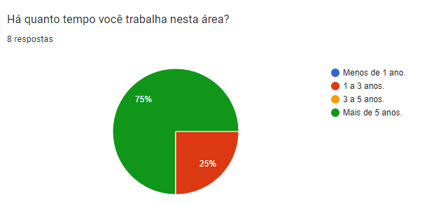
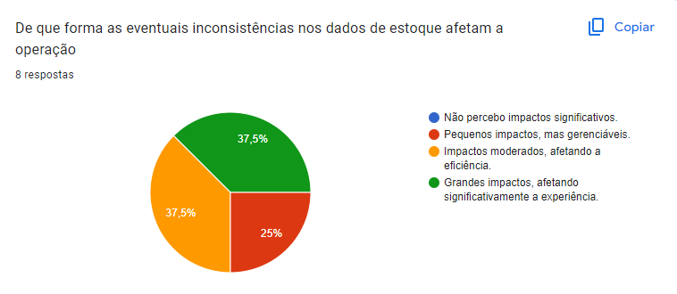
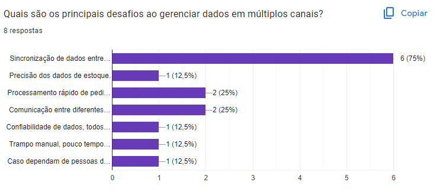
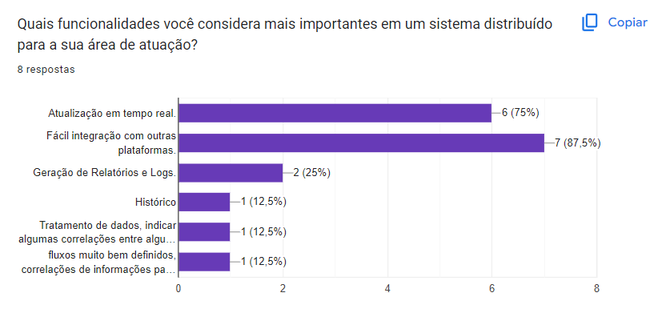
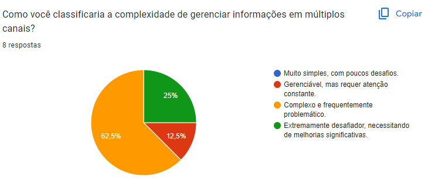

# Introdução

&emsp;&emsp; Esse documeno tem como objetivo conduzir uma pesquisa qualiquantitativa para auxiliar na compreensão do projeto desenvolvido, facilitando a identificação das necessidades dos usuários identificados nas personas desenvolvidas. Esse processo tem início com uma Imersão Preliminar, uma etapa exploratória onde são coletadas informações essenciais sobre o projeto a ser desenvolvido, nesse caso, através de uma etapa de kick-off. Essa fase é importante para fornecer as bases de conhecimento para o desenvolvimento das próximas etapas da pesquisa.

&emsp;&emsp; Tendo como base os dados obtidos durante a imersão, é elaborado um formulário de pesquisa qualiquantitativa que seja direcionado as personas alvo do projeto (no caso, o Ecommerce B2C). A pesquisa é de suma importância pois com ela, é possível conseguir insights que podem auxiliar no direcionamento do desenvolvimento do projeto, pois facilita que o tal se adapte as reais necessidades demonstradas pelos usuários nas respostas dos formulários.

## Imersão Preliminar

&emsp;&emsp; Para a imersão preliminar, foi realizado um kick-off junto ao parceiro, com o objetivo de ter insights iniciais sobre o problema presente e a solução a ser desenvolvida.

&emsp;&emsp; O processo consistia de uma apresentação realizada pela equipe, trazendo a contextualização de um ou mais problemas dos usuários da plataforma atual, junto a algumas propostas de como solucionar esse(s) problema(s). Após isso, foi realizada uma rodada de perguntas e respostas com os parceiros para esclarecer dúvidas pontuais sobre experiência do usuário, especificidades técnicas e detalhes de negócios. Também foi feita pelo parceiro uma apresentação com mais detalhes acerca do projeto, trazendo dados úteis para as áreas de UX e negócios.

&emsp;&emsp; Entre os resultados obtidos, vale ressaltar as informações de que:

- A aplicação deve ter um tempo de resposta de até 3 segundos para as requisições;
- Os tempos de entrega do produto para o cliente devem ser exibidos na resposta;
- Os maiores problemas são a falta de sincronia de estoques e suas consequencias, de gerar longas distâncias de entrega do produto ao cliente pois não pode ser enviado de um centro de distribuição mais próximo a ele;
- Junto ao tempo alto de entrega, o problema do custo dessa entrega, pois o parceiro é quem cobre esses custos e quanto maior a distância de entrega maiores são esses valores a serem pagos pelo parceiro;
- O sistema deve ser escalável, pois o objetivo do parceiro é de conseguir integrar os estoques atravéz das mais de 1800 lojas que eles possuem.

&emsp;&emsp; Com as anotações sobre os pontos trazidos pelo parceiro e os resultados obtidos com a apresntação do problema e da possível solução, é mais fácil direcionar a construção do formulário qualiquantitativo da próxima etapa.

## Pesquisa Qualiquantitativa

&emsp;&emsp;Com base nos dados e insights obtidos durante a imersão preliminar, foi desenvolvida uma pesquisa qualiquantitativa com o objetivo de aprofundar o entendimento das necessidades e comportamentos do público-alvo do projeto. Esta etapa da pesquisa combina métodos qualitativos e quantitativos para proporcionar uma visão mais abrangente e precisa sobre o tema em estudo. A abordagem qualiquantitativa permite coletar dados numéricos que podem ser analisados estatisticamente, ao mesmo tempo que captura percepções e opiniões detalhadas dos respondentes.

&emsp;&emsp;O formulário de pesquisa foi elaborado com base nas informações obtidas durante a imersão preliminar e nas personas desenvolvidas para o projeto. Além disso, foi realizada uma sessão de _brainstorm_ para gerar hipóteses sobre as personas e sua interação com a plataforma que utilizam atualmente. O questionário foi, então, cuidadosamente estruturado para garantir que todas as hipóteses relevantes fossem testadas, proporcionando uma análise abrangente e coerente sobre o comportamento e as expectativas dos usuários em relação à plataforma.

&emsp;&emsp;A estrutura do questionário buscou explorar tanto as motivações quanto as barreiras enfrentadas pelos usuários, bem como as suas preferências e comportamentos ao utilizar a plataforma. As questões foram formuladas de maneira a capturar tanto dados objetivos, como funcionalidades mais valorizadas, quanto dados subjetivos, como percepções sobre a experiência do usuário e informações do usuário.

&emsp;&emsp;Embora o ideal fosse que o questionário fosse realizado de forma totalmente isenta de viés, a utilização de personas e hipóteses introduz, inevitavelmente, um certo grau de viés no processo. A definição prévia de perfis de usuário e a formulação de perguntas com base em hipóteses criadas a partir desses perfis podem direcionar as respostas de maneira sutil, o que deve ser considerado na análise dos resultados. Esse viés é uma limitação inerente à metodologia, mas foi minimizado através da estruturação cuidadosa das perguntas e da atenção ao equilíbrio entre os dados qualitativos e quantitativos coletados.

&emsp;&emsp; Por mais que o objetivo da pesquisa fossem as personas da Vivo, foram utilizadas pessoas do Intei com perfis semelhantes para dar apoio e obter-se mais dados para a validação da pesquisa.

&emsp;&emsp;Em suma, a pesquisa qualiquantitativa foi essencial para validar as hipóteses levantadas na fase de imersão preliminar, bem como para refinar o entendimento das necessidades do público-alvo. Os resultados obtidos nesta etapa são fundamentais para o desenvolvimento de estratégias e soluções mais alinhadas às expectativas dos usuários e às demandas do parceiro.

&emsp;&emsp; Nessa pesquisa os termos "gestão de estoque" e "gestão de recursos" serão utilizados com significado semelhante, pois parte da pesquisa foi desenvolvida junto a pessoas na Vivo como pessoas do Inteli.

### Análise dos Resultados da Pesquisa Qualiquantitativa

&emsp;&emsp;A pesquisa qualiquantitativa realizada proporcionou insights valiosos sobre os desafios enfrentados pelos profissionais que gerenciam estoques em e-commerce B2C, bem como as funcionalidades mais valorizadas em um sistema de inventário distribuído. A pesquisa contou com 8 respostas, o que, embora um tanto limitado, oferece uma visão inicial das preocupações e necessidades de profissionais da área.

#### Perfil dos Respondentes

&emsp;&emsp;Os participantes da pesquisa ocupam cargos relacionados à área de TI, financeiro e de administração e gestão de recursos, especificamente: Coordenador de TI, Desenvolvedor de TI, Analista de Marketing, Novos Produtos, Analista, CEO, Gerente Financeiro e Analista Financeiro Senior. Com uma ampla gama de perfis e um tempo de experiêcnia de, em média, 3 ou mais anos, é possível uma compreensão aprofundada dos desafios técnicos e operacionais enfrentados no dia a dia por essas pessoas.

Figura 1 - Tempo de Experiência

Fonte: Elaboração G2

&emsp;&emsp;A partir da imagem da pesquisa que descreve a distribuição do tempo de experiência dos respondentes, podemos concluir que a maioria significativa, 25%, possui 3 a 5 anos de experiência na área, enquanto 75% têm mais de 5 anos. Esta distribuição indica uma equipe experiente, com um sólido entendimento das demandas técnicas e operacionais de seus respectivos campos. A presença de profissionais experientes pode ser um indicativo da maturidade e da capacidade de gestão estratégica dentro das empresas representadas.

#### Desafios na Gestão de Recursos

&emsp;&emsp;Quando questionados sobre os aspectos mais desafiadores na gestão de estoques e/ou recursos, os respondentes destacaram:

1. **Inconsistências nos dados de estoque:** Apontado como o principal desafio por um dos participantes, isso reflete a importância crítica de manter dados de estoque precisos e atualizados. Se torna o catalizador de diversos problemas, pois está inserido como raíz de muitas outras dificuldades;

Figura 2 - Inconsistências nos dados de estoque 
 
 
 
Fonte: Elaboração G2

  &emsp;&emsp;A pesquisa ilustra como as inconsistências nos dados de estoque impactam as operações dos participantes, assim como:

  - **37,5% dos respondentes relatam grandes impactos, afetando significativamente a experiência:** Este grupo sente que as inconsistências têm um impacto substancial e negativo, potencialmente causando grandes erros de gestão de estoque e afetando a satisfação do cliente;
  - **25% enfrentam impactos moderados, afetando a eficiência:** Estes respondentes percebem impactos que afetam a eficiência operacional, causando atrasos e aumentos nos custos operacionais devido a correções necessárias;
  - **37,5% observam pequenos impactos, mas gerenciáveis:** Esta fração de participantes nota impactos menores que são administráveis sem grandes dificuldades para a operação geral;
  - **Nenhum dos respondentes selecionou a opção de não perceber impactos significativos:** Isso sublinha que qualquer inconsistência nos dados de estoque é vista como problemática, destacando a necessidade de precisão para evitar impactos negativos nas operações.

Outros problemas relacionados:

1. **Gerenciamento de múltiplos canais de venda:** Outro participante destacou a complexidade de gerenciar estoques distribuídos por múltiplos canais, devido a prazos de envio de informaçõs e pedrões de preencimentos de informações que diferentes áreas possuem, reforçando a necessidade de soluções robustas para este problema e a importância de uma forma unificada de se trabalhar com esses estoques / dados.
3. **Sincronização de dados entre estoques:** Apontado como um grande desafio pela maioria dos participantes, onde fica difícil gerenciar recursos uma vez que não se tem a noção do que realmente existe e/ou está disponível em um determinado local, gerando rupturas;
4. **Comunicação entre diferentes plataformas:** Alguns participantes apresentaram a dificuldade de migrar dados entre plataformas, seja por dificuldades de enviar esses dados, quanto padronização de formatos que impediam isso de ocorrer e adaptação a novas plataformas não conhecidas;
5. **Adesão a cultura de dados:** Um problema trazido pela persona do CEO foi o de adaptação das pessoas a cultura de preencimento dos dados, mostrando muitas vezes uma resistência ou dificuldade de adaptação a padrões de input de dados que os usuários não possuiam anteriormente;
6. **Análise dos dados recebido:** Um dos grandes problemas gerados pela inconsistência nos dados, tornando uma análise do que é recebido mais lenta. Isso foi informado pelas pessoas da área de finâncias, onde foi dito que o tempo de retrabalho em processar e padronizar os dados dificultava as análises do que era recebido, deixando pouco tempo para essa tarefa;
7. **Entender quais dados são relevantes para quem:** Foi muito destacado também uma questão sobre granularidade dos dados. Algumas áreas necessitam de dados bem específicos para seu trabalho, já outras, precisam apenas de um panorama geral de uma situação, o que torna um desafio entender como e quais infomações são relevantes para um usuário ou um grupo de pessoas

&emsp;&emsp;A partir da pesquisa, podemos concluir que a sincronização de dados entre diferentes canais é o principal desafio ao gerenciar dados em múltiplos canais, sendo apontado por 75% dos respondentes como um problema significativo. Outros desafios mencionados, como a precisão dos dados de estoque, a confiabilidade dos dados, trabalho manual e dependência de pessoas, cada um foi citado por apenas 12,5% dos respondentes, demonstrando que são de menor preocupação em comparação com a sincronização de dados. O processamento rápido de pedidos foi mencionado por 25% dos respondentes, indicando uma preocupação intermediária. Conforme a imagem abaixo.

Figura 4 - Complexidade de gerenciar informações em múltiplos canais  
 
 
 
Fonte: Elaboração G2

 

&emsp;&emsp; Alguns dos problemas citados não estavam contemplados nas alternativas de resposta, mas foram apresentados pelos usuários, como o entendimento de relevância dos dados.

&emsp;&emsp;Esses resultados sugerem que melhorias nos sistemas de integração e gestão de dados entre diferentes plataformas podem ser uma área crítica para focar a fim de otimizar a gestão de informações em múltiplos canais. A harmonização de dados entre sistemas pode significativamente aumentar a eficiência operacional e reduzir erros e retrabalhos associados à entrada manual de dados.

### Funcionalidades Valorizadas em um Sistema de Inventário Distribuído
&emsp;&emsp;Esta pesquisa investiga as funcionalidades consideradas mais importantes em sistemas distribuídos, conforme avaliado por profissionais em suas respectivas áreas de atuação.

Figura 5 - Funcionalidades mais importantes de um sistema distribuído para área de atuação   
 
 

Fonte: Elaboração G2

 

#### Resultados e Análise
&emsp;&emsp;As funcionalidades destacadas e sua interpretação com base na quantidade de votos recebidos são as seguintes:

- **Atualização em Tempo Real**: Recebeu a maioria dos votos, destacando-se como a funcionalidade mais crucial. A alta votação aqui reflete a necessidade crítica de informações atualizadas em tempo real, que é vital para tomada de decisões rápida e eficiente em ambientes dinâmicos. É valido ressaltar que os entrevistados que não citaram esse fator, afirmaram que os dados com que trabalhavam não necessitavam de respostas tão rápidas a todo o momento, como as de financeiro, que fazem planejamentos com dados a mais longo prazo;

- **Integração com Outras Plataformas**: A relevância desta funcionalidade, embora não especificada nos votos, é implícita pela natureza dos sistemas distribuídos, que frequentemente precisam operar em conjunto com outras plataformas e sistemas para eficácia máxima;

- **Geração de Relatórios e Logs**: Com uma quantidade moderada de votos, esta funcionalidade é valorizada por sua capacidade de fornecer insights operacionais e retrospectivos, essencial para análise de desempenho e conformidade regulatória;

- **Histórico e Tratamento de Dados**: Ambas com menos votos, essas funcionalidades são importantes para análises de longo prazo e para a manipulação de dados complexos. Elas ajudam os usuários a entender o contexto de uma situação e valida se dados futuros são muito distoantes, podendo assim serem incorretos. O tratamento de dados pode ser visto também como uma funcionalidade menos votada pois os usuários, em geral, prefeririam que os dados já viessem padronizados e não houvesse necessidade de retrabalho. A menor votação pode indicar que, embora valiosas, essas funcionalidades podem ser vistas como complementares ou menos críticas em comparação com as necessidades imediatas de atualização em tempo real e integração;

&emsp;&emsp;Os resultados da pesquisa sublinham a alta valorização de atualizações em tempo real em sistemas distribuídos, evidenciando a demanda por sistemas ágeis e adaptativos. Funcionalidades como integração de sistemas e capacidades analíticas, embora menos votadas, também são reconhecidas como essenciais, destacando a importância de um ecossistema tecnológico integrado e analiticamente robusto.

&emsp;&emsp;Assim, a partir da pesquisa, as funcionalidades mais valorizadas pelos respondentes incluem:

- **Atualização em tempo real do estoque:** Considerada essencial para evitar inconsistências e garantir a precisão dos dados.
- **Visibilidade completa do estoque em todos os centros de distribuição e lojas:** Crucial para o gerenciamento de estoque e atender à demanda de forma eficiente.
- **Integração fácil com outras plataformas:** Facilita a comunicação e a sincronização entre sistemas, reduzindo a probabilidade de erros.

#### Complexidade na Gestão de Estoques em Múltiplos Canais de Venda

&emsp;&emsp;A complexidade de gerenciar estoques em múltiplos canais de venda foi classificada como "complexa e frequentemente problemática" e "extremamente desafiadora, necessitando de melhorias significativas". Esse feedback ressalta a necessidade de soluções integradas que possam mitigar os desafios de sincronização e comunicação entre diferentes canais e sistemas.

#### Principais Desafios na Gestão de Recursos em Múltiplos Canais

&emsp;&emsp;Na imagem apresentada, a complexidade de gerenciar informações em múltiplos canais é ilustrada através de um gráfico de pizza, com as seguintes distribuições das respostas dos 8 participantes:

Figura 3 - Complexidade de gerenciar informações em múltiplos canais  
 
 
 
Fonte: Elaboração G2

  

- **62,5%** consideram a gestão de múltiplos canais como **"Complexo e frequentemente problemático"**. Isso indica que a maior parte dos participantes enfrenta desafios significativos no gerenciamento de informações através de vários canais, o que pode incluir dificuldades como inconsistência de dados entre canais, dificuldades na sincronização e na análise integrada de informações.

- **25%** classificaram a gestão como **"Extremamente desafiador, necessitando de melhorias significativas"**. Este grupo parece enfrentar ainda mais dificuldades, possivelmente devido a problemas estruturais ou à falta de ferramentas adequadas para gerenciar a complexidade, sugerindo uma necessidade urgente de inovação e melhoria nas soluções de gerenciamento.

- **12,5%** acreditam que gerenciar múltiplos canais é **"Gerenciável, mas requer atenção constante"**. Embora este seja o grupo menor, indica que com os processos e ferramentas corretos, é possível gerenciar a complexidade de forma eficiente, mesmo que ainda exija vigilância e esforço contínuos.
 

&emsp;&emsp;Esses resultados demonstram que a maioria dos participantes vê significativas barreiras no gerenciamento eficaz de múltiplos canais, com muitos expressando a necessidade de abordagens mais robustas e integradas para lidar com essas complexidades.

&emsp;&emsp;Os principais desafios identificados incluem:

- **Sincronização de dados entre canais:** Essencial para evitar discrepâncias entre as informações de estoque disponíveis em diferentes plataformas.
- **Comunicação entre diferentes sistemas e plataformas:** A integração e comunicação eficazes são fundamentais para minimizar erros e melhorar a eficiência operacional.

#### Impactos na Experiência do Cliente

&emsp;&emsp; Contemplando os clentes Vivo, porém também os afetados pela gerência de recursos do Inteli, é possível observar como esses problemas afetam tanto no desempenho de trabalho como em velocidade e qualidade de entrega de resultados, onde dados não sincronizados, inconsistentes e não contextualizados a situações geram problemas a essas pessoas.

#### Conclusão

&emsp;&emsp; Com essa pesquisa, é possível entender a importância de um sistema não só integrado, porém com padrões bem definídos e de capacidade de se adaptar a situações e dados adversos. Assim, é possível que moldemos a solução as necessidades reais dos usuários, de forma a mitigar os problemas apresentados e trazer soluções reais e aplicáveis ao trabalho que esses usuários fazem na plafatoma
