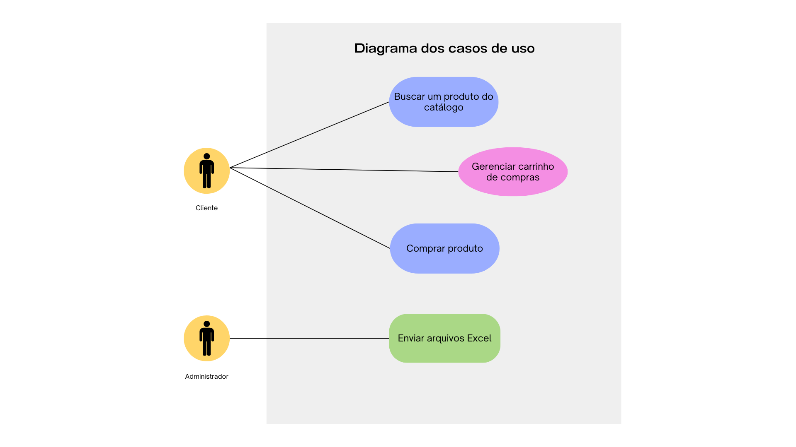
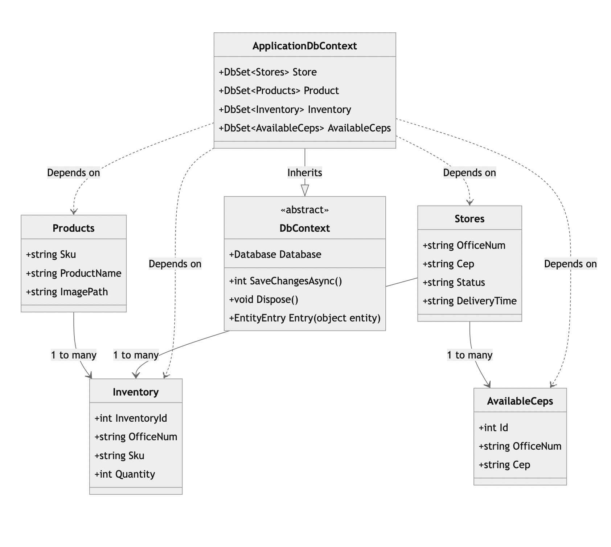
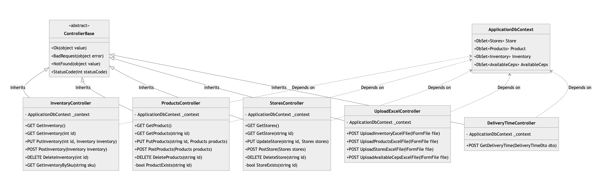
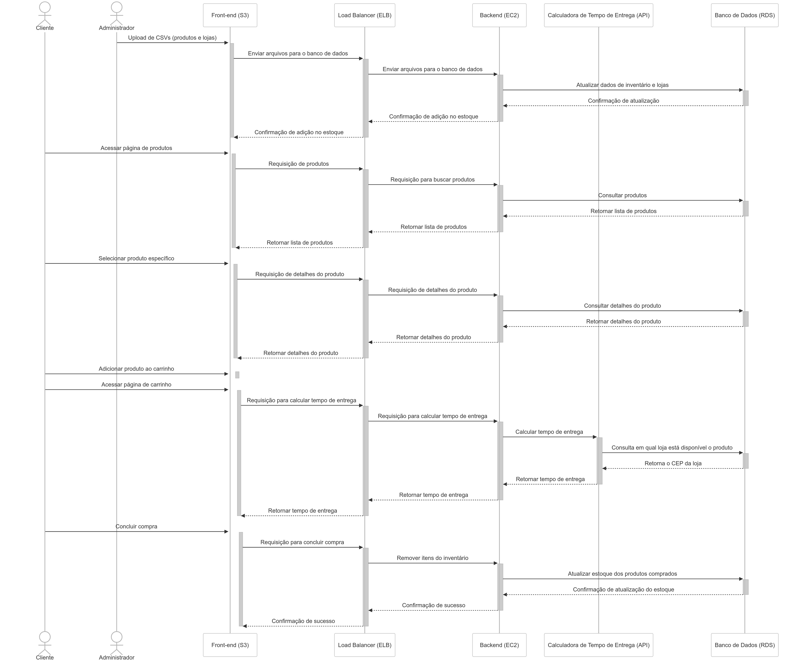
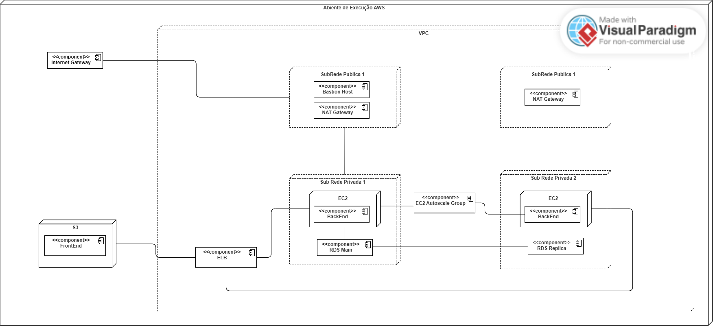

# Modelagem do sistema

## 1.1) Diagrama dos casos de uso

   <b>Figura 1 -</b> Diagrama dos casos de uso 

   

   Fonte: Material desenvolvido pelos autores (2024)

## Explicação dos casos de uso

### Caso de Uso 1: **Enviar Arquivos Excel**

**Escopo**: Sistema de Gerenciamento de Inventário e Lojas.

**Nível**: Primário.

**Atores**:
- **Principal**: Administrador.
- **Secundário**: Frontend (S3), Load Balancer (ELB), Backend (EC2), Banco de Dados (RDS).

**Interessados e interesses**:
- **Administrador**: Precisa garantir que o inventário e as lojas sejam atualizados corretamente com os dados fornecidos via arquivos excel.
- **Sistema**: Deve armazenar corretamente os dados atualizados.

**Pré-condições**:
- O administrador precisa estar autenticado.
- Os arquivos devem estar no formato XLS ou XLSX.
  
**Pós-condições**:
- O inventário e as informações de lojas devem estar atualizados no sistema.
  
**Fluxo básico**:
1. O administrador faz login no sistema.
2. O administrador faz o upload dos arquivos de inventário e lojas no frontend.
3. O frontend envia os arquivos para o Load Balancer (ELB).
4. O Load Balancer (LB) envia os arquivos para o backend.
5. O backend armazena as informações no banco de dados (RDS).
6. O sistema confirma que os dados foram atualizados.

**Fluxos alternativos**:
- **Arquivo inválido**: Se o arquivo estiver em um formato incorreto, o sistema exibe uma mensagem de erro e não realiza a atualização.
  
**Requisitos especiais**:
- O sistema deve validar o formato e o conteúdo dos arquivos.
  
**Lista de variantes**:
- Upload de arquivos em outros formatos poderá ser permitido em futuras atualizações.

**Frequência de ocorrência**:
- Este processo é realizado sempre que houver necessidade de atualização do inventário ou das lojas.

**Problemas em aberto**:
- Como o sistema lida com falhas de conexão no meio do processo de upload?

### Caso de Uso 2: **Buscar um Produto do Catálogo**

**Escopo**: Sistema de E-commerce.

**Nível**: Primário.

**Atores**:
- **Principal**: Cliente.
- **Secundário**: Frontend (S3), Load Balancer (ELB), Backend (EC2), Banco de Dados (RDS).

**Interessados e interesses**:
- **Cliente**: Deseja visualizar e navegar pela lista de produtos disponíveis para compra.
- **Sistema**: Precisa fornecer uma lista atualizada de produtos de forma rápida e eficiente.

**Pré-condições**:
- O cliente precisa entrar na página dos produtos.

**Pós-condições**:
- A lista de produtos é exibida ao cliente.

**Fluxo básico**:
1. O cliente acessa a página de produtos no frontend.
2. O frontend envia uma solicitação de produtos ao Load Balancer (ELB).
3. O ELB encaminha a solicitação ao backend.
4. O backend consulta os dados de produtos no banco de dados (RDS).
5. O backend retorna a lista de produtos ao ELB.
6. O ELB repassa a lista de produtos ao frontend.
7. O frontend exibe a lista de produtos ao cliente.
8. O cliente pode consultar os produtos disponíveis e procurar na barra de pesquisa algum produto específico.

**Fluxos alternativos**:
- **Erro de comunicação com o backend**: Se o sistema não conseguir acessar o banco de dados, uma mensagem de erro será exibida ao cliente.

**Requisitos especiais**:
- A consulta de produtos deve ser feita em tempo real, garantindo que o cliente veja sempre a lista mais recente.

**Lista de variantes**:
- A página pode incluir filtros de pesquisa e ordenação para facilitar a navegação dos produtos.

**Frequência de ocorrência**:
- Sempre que o cliente acessa a página de produtos e pesquisa por algum em específico.

**Problemas em aberto**:
- Como o sistema lida com grandes volumes de produtos e consultas simultâneas?

### Caso de Uso 3: **Gerenciar Carrinho de Compras**

**Escopo**: Sistema de E-commerce.

**Nível**: Primário.

**Atores**:
- **Principal**: Cliente.
- **Secundário**: Frontend (S3).

**Interessados e interesses**:
- **Cliente**: Deseja adicionar ou remover um ou mais produtos do carrinho para finalizar a compra posteriormente.
- **Sistema**: Precisa gerenciar corretamente os produtos no carrinho e garantir que o cliente possa adicionar/remover e visualizar os itens.

**Pré-condições**:
- O cliente deve ter selecionado um produto e adicionado no carrinho.

**Pós-condições**:
- O produto é adicionado ou removido do carrinho e o cliente pode continuar navegando ou acessar a página de carrinho para finalizar a compra.

**Fluxo básico**:
1. O cliente visualiza os detalhes de um produto.
2. O cliente clica em "Adicionar ao carrinho".
3. O frontend processa a solicitação e adiciona o produto ao carrinho.
4. O sistema confirma que o produto foi adicionado com sucesso.
5. Após isso, o cliente pode remover o produto adicionado anteriormente ou adicionar outros produtos.

**Fluxos alternativos**:
- **Produto fora de estoque**: Se o produto estiver fora de estoque, o sistema exibe uma mensagem informando que ele não pode ser adicionado ao carrinho.

**Requisitos especiais**:
- O sistema deve verificar a disponibilidade do produto antes de permitir que ele seja adicionado ao carrinho.

**Lista de variantes**:
- O cliente pode adicionar múltiplos itens ao carrinho de uma vez ou ajustar a quantidade diretamente no carrinho.

**Frequência de ocorrência**:
- Sempre que o cliente desejar visualizar e gerenciar o carrinho.

**Problemas em aberto**:
- Como o sistema lida com produtos que são removidos do estoque enquanto estão no carrinho?

### Caso de Uso 4: **Comprar Produto**

**Escopo**: Sistema de E-commerce.

**Nível**: Primário.

**Atores**:
- **Principal**: Cliente.
- **Secundário**: Frontend (S3), Load Balancer (ELB), Backend (EC2), Banco de Dados (RDS), API de cálculo do tempo de entrega.

**Interessados e interesses**:
- **Cliente**: Quer visualizar os produtos, selecionar os desejados no carrinho, calcular o tempo de entrega e concluir a compra.
- **Sistema**: Deve garantir que o cliente tenha acesso a uma lista atualizada de produtos, possa adicionar itens ao carrinho, calcular o frete e finalizar a compra de maneira segura.

**Pré-condições**:
- O usuário deve acessar a página de compra como cliente.

**Pós-condições**:
- O cliente conclui a compra, e o inventário é atualizado com os produtos adquiridos.

**Fluxo básico**:
1. O cliente acessa a página de produtos.
2. O frontend solicita ao Load Balancer (ELB) e exibe a lista de produtos disponíveis, obtida através do backend.
3. O cliente seleciona um produto para ver seus detalhes.
4. O frontend envia a solicitação de detalhes do produto ao backend via Load Balancer.
5. O backend consulta os detalhes no banco de dados e retorna ao frontend.
6. O frontend exibe as informações detalhadas do produto ao cliente.
7. O cliente adiciona o produto ao carrinho.
8. O cliente acessa o carrinho e revisa os produtos.
9. O cliente fornece o CEP para cálculo do tempo de entrega.
10. O sistema consulta a API de entrega e exibe o tempo estimado.
11. O cliente confirma os produtos no carrinho e finaliza a compra.
13. O backend atualiza o inventário, removendo os produtos comprados do RDS.
14. O sistema confirma a compra, e exibe a confirmação ao cliente.

**Fluxos alternativos**:
- **Produto fora de estoque**: Caso o produto não esteja mais disponível, o sistema exibe uma mensagem informando que ele não pode ser adicionado ao carrinho.
- **Falha no cálculo de entrega**: Se houver erro na API de cálculo de frete, o sistema exibe uma mensagem de erro e permite que o cliente tente novamente.
  
**Requisitos especiais**:
- O sistema deve garantir que as informações de estoque e de produtos estejam sempre atualizadas.
- O cálculo do tempo de entrega deve ser preciso, baseado no CEP informado.
  
**Lista de variantes**:
- O cliente pode optar por remover produtos ou alterar quantidades no carrinho antes de finalizar a compra.

**Frequência de ocorrência**:
- Sempre que o cliente deseja comprar um ou mais produtos.

**Problemas em aberto**:
- Como o sistema lida com falhas na comunicação com a API cálculo de frete?

## 1.2) Diagrama de Classes UML

### Introdução

&emsp;&emsp;Um diagrama de classes UML (Unified Modeling Language) é uma ferramenta visual amplamente utilizada na indústria de desenvolvimento de software para representar a estrutura de um sistema baseado em Orientação a Objetos de forma clara e organizada. Ele descreve as classes que compõem a aplicação, seus atributos, métodos, e os relacionamentos entre elas, facilitando a compreensão do comportamento e da arquitetura do sistema. Utilizado desde as etapas de design até a implementação, o diagrama de classes ajuda os desenvolvedores a visualizar as interações e dependências entre componentes, simplificando a manutenção, a escalabilidade e a comunicação entre equipes.

&emsp;&emsp;O diagrama de classes apresentado descreve a estrutura da aplicação de Sistema de Inventário Distribuído utilizando o framework Entity Framework Core (EF Core) do .NET, que facilita o mapeamento de objetos e a persistência de dados em um banco de dados relacional. A aplicação possui um contexto de banco de dados, vários modelos para representar os dados e controladores para gerenciar as operações CRUD (Create, Read, Update, Delete).

#### Modelos (Classes de Domínio)

&emsp;&emsp;Os modelos da aplicação são responsáveis por representar as tabelas dentro do banco de dados. Ao codificá-los dentro da aplicação .NET utilizando o framework EF Core, que é um ORM (Object-Relational Mapping), as transações com o banco de dados são feitas através de uma camada de abstração, o que simplifica o funcionamento, previne erros lógicos e contribui para a entrega contínua. Quando os modelos são atualizados no ORM, ferramentas como migrations garantem que essas alterações sejam refletidas automaticamente no banco de dados original, permitindo que as modificações na estrutura de dados sejam aplicadas de forma controlada e consistente durante o ciclo de desenvolvimento, sem a necessidade de intervir diretamente no banco. Isso facilita a evolução do sistema e a adaptação às novas necessidades de negócio.

   <b>Figura 2 -</b> Diagrama de Classes UML - Models 

   

   Fonte: Material desenvolvido pelos autores (2024)

 - **ApplicationDbContext**: Esta classe, herdada de `DbContext` do EF Core, gerencia a conexão com o banco de dados e fornece acesso aos conjuntos de dados. Ela contém `DbSet` para cada entidade do sistema, incluindo `Stores`, `Products`, `Inventory` e `AvailableCeps`, necessário para criar e modificar as tabelas no banco de dados. Essa classe centraliza as interações entre o código e o banco de dados, fornecendo métodos como `SaveChangesAsync` e `Entry` para controlar as alterações e a persistência dos dados.

 - **Stores**: Representa as lojas que fazem parte do sistema. Ela possui atributos como `OfficeNum` (código da loja), `Cep`, `Status` e `DeliveryTime`. Cada loja pode estar associada a diversos CEP's (representados pela classe `AvailableCeps`), formando uma relação de um-para-muitos.

 - **Products**: Este modelo define os produtos que são gerenciados no sistema de inventário. Os atributos incluem `Sku` (identificador do produto), `ProductName` (nome do produto) e `ImagePath` (caminho da imagem do produto). Os produtos podem estar vinculados a vários registros de inventário, criando uma relação de um-para-muitos com a classe Inventory.
 
- **Inventory**: Representa o estoque, com campos como `InventoryId`, `OfficeNum` (número da loja associada), `Sku` (identificador do produto) e `Quantity` (quantidade em estoque). Cada item de inventário está associado a um produto e a uma loja específica.
`AvailableCeps`: Esta classe armazena os CEPs disponíveis para entrega, vinculando cada CEP a uma loja específica através do campo `OfficeNum`. Ela mantém uma relação de um-para-muitos com as lojas.

#### Controllers (Controladores)

   <b>Figura 3 -</b> Diagrama de Classes UML - Controllers

   

   Fonte: Material desenvolvido pelos autores (2024)

&emsp;&emsp;Os controladores na aplicação fazem a interface entre o cliente e o banco de dados, gerenciando as operações HTTP. Cada um herda de ControllerBase, uma classe do ASP.NET Core que padroniza respostas como Ok, BadRequest e NotFound.

- **InventoryController, ProductsController e StoresController**: Todos possuem operações CRUD básicas, permitindo criar, ler, atualizar e deletar registros de inventário, produto e loja, respectivamente. Além disso, incluem métodos internos para validar requisições e garantir a integridade dos dados.
- **UploadExcelController**: Centraliza o upload de arquivos Excel para atualizar dados de inventário, produtos, lojas e CEPs disponíveis no sistema.
- **DeliveryTimeController**: Calcula o tempo de entrega de produtos com base no SKU e CEP fornecidos, verificando as lojas disponíveis e seus tempos de entrega. Valida as requisições e formata o CEP antes de processar a busca no banco de dados.

### Conclusão

&emsp;&emsp;O diagrama de classes descreve uma aplicação robusta de gerenciamento de inventário distribuído, que utiliza as facilidades do EF Core para gerenciar a persistência de dados e o ASP.NET Core para interagir com o sistema através de controladores RESTful. A estrutura modular com controladores e modelos permite escalabilidade e manutenção eficiente do sistema. A integração de funcionalidades como upload de arquivos Excel oferece uma maneira fácil de atualizar os dados em massa, tornando a aplicação versátil para ambientes de inventário distribuídos.

## 1.3) Diagrama de sequência UML

   <b>Figura 4 -</b> Diagrama de sequência UML 

   

   Fonte: Material desenvolvido pelos autores (2024)

## Explicação do Diagrama de Sequência

&emsp;&emsp;O diagrama apresentado mostra dois fluxos principais: o do **Administrador** e o do **Cliente**. Ele envolve os seguintes componentes:

- **Cliente**: Usuário que acessa a plataforma para comprar produtos.
- **Administrador**: Usuário responsável por realizar a atualização do inventário, carregando arquivos CSV.
- **Frontend**: Interface gráfica da aplicação, hospedada num bucket S3.
- **ELB**: Load Balancer (Balanceador de Carga), que distribui as requisições do Frontend para o EC2.
- **EC2**: Backend, responsável por processar as requisições e comunicar-se com o banco de dados.
- **RDS**: Banco de Dados, onde estão armazenados os dados de produtos e lojas.
- **API**: API de cálculo do tempo de entrega.

#### Fluxo do Administrador

1. O **Administrador** acessa o **Frontend** e faz o upload de arquivos CSV contendo informações de produtos e lojas.
   - O **Frontend** é ativado e inicia o processo de upload.
   
2. O **Frontend** envia os arquivos para o **ELB**.

3. O **ELB** envia a requisição dos arquivos para o **EC2**
   - O **EC2** é ativado e processa os arquivos.

4. O **EC2** comunica-se com o **RDS** para atualizar os dados de inventário e lojas.
   - O **RDS** é ativado, recebe os dados e confirma a atualização para o **EC2**.
   
5. O **EC2** retorna a confirmação ao **ELB**, que, por sua vez, retorna ao **Frontend** e notifica o **Administrador** sobre o sucesso da operação.

#### Fluxo do Cliente

1. O **Cliente** acessa o **Frontend** para visualizar a lista de produtos disponíveis.
   - O **Frontend** é ativado e solicita os produtos ao **ELB**, que distribui a requisição ao **EC2**.

2. O **EC2** consulta o **RDS** para obter a lista de produtos.
   - O **RDS** é ativado e retorna a lista de produtos ao **EC2**, que a envia de volta ao **Frontend**.

3. O **Cliente** seleciona um produto específico para ver mais detalhes.
   - O **Frontend** solicita os detalhes ao **ELB**, que encaminha a requisição ao **EC2**.

4. O **EC2** consulta o **RDS** para obter os detalhes do produto e retorna a resposta ao **Cliente** via **ELB** e **Frontend**.

5. O **Cliente** adiciona o produto ao carrinho e acessa a página de carrinho.
   - O **Frontend** faz uma requisição a **API** pelo **ELB** e **EC2** para calcular o tempo de entrega.

6. A **API** consulta no **RDS** em qual loja o produto está disponível, calcula o tempo de entrega e retorna ao **EC2**, que encaminha para o **ELB** e finalmente para o **Frontend**.

7. O **Cliente** finaliza a compra, o que dispara uma requisição do **Frontend** para o **ELB**, que passa para o **EC2**.
   - O **EC2** comunica-se com o **RDS** para atualizar o estoque, removendo os produtos comprados.

8. A confirmação de sucesso é enviada de volta ao **Cliente** através da cadeia de componentes.

&emsp;&emsp;Esse diagrama de sequência mostra como o sistema lida com dois tipos de usuários (Administrador e Cliente) em diferentes cenários. No fluxo do Administrador, o foco é na atualização do inventário, enquanto o fluxo do Cliente envolve a visualização e compra de produtos. O diagrama destaca as interações entre o Frontend, o load balancer (ELB), o backend (EC2), o banco de dados (RDS), e a API de cálculo do tempo de entrega, exemplificando a dinâmica da aplicação distribuída na nuvem AWS.

## 1.4) Diagrama de implantação UML

   <b>Figura 3 -</b> Diagrama de implantação UML 

   

   Fonte: Material desenvolvido pelos autores (2024)

## Explicação do Diagrama de Implantação

O diagrama de implantação apresentado detalha a arquitetura de uma aplicação distribuída na AWS. Ele descreve a infraestrutura da nuvem necessária para o funcionamento dos componentes, destacando os elementos e conexões que fazem parte do ambiente.

A seguir, descrevem-se os componentes principais e suas interações:

#### Componentes

- **VPC (Virtual Private Cloud)**: A VPC é o ambiente de rede virtual onde todos os outros componentes, como instâncias **EC2**, **RDS**, e outros serviços, estão configurados e se comunicam. Ela permite o isolamento da rede e controle de tráfego, fornecendo um ambiente seguro para os recursos da aplicação.

- **Internet Gateway**: Permite que a infraestrutura dentro da VPC (Virtual Private Cloud) tenha acesso à internet, possibilitando o tráfego de entrada e saída.
  
- **SubRede Pública 1**:
  - **Bastion Host**: Máquina utilizada para acessos SSH seguros à infraestrutura da rede privada, servindo como um ponto intermediário de conexão.
  - **NAT Gateway**: Facilita o tráfego de saída da rede privada para a internet, sem permitir que recursos externos iniciem conexões diretamente com as instâncias privadas.

- **SubRede Pública 2**:
  - **NAT Gateway**: Similar ao da SubRede Pública 1, possibilita que as instâncias na sub-rede privada 2 tenham acesso à internet.

- **SubRede Privada 1**:
  - **EC2 (Backend)**: Responsável pelo processamento das requisições recebidas do Frontend, bem como pela comunicação com o banco de dados e outros serviços internos.
  - **RDS Main**: Instância do banco de dados principal (Relational Database Service), onde os dados da aplicação (como produtos e usuários) são armazenados.
  - **EC2 AutoScale Group**: Conjunto de instâncias EC2 que se ajustam automaticamente conforme a demanda da aplicação aumenta ou diminui, garantindo que o número adequado de instâncias esteja sempre em operação.

- **SubRede Privada 2**:
  - **EC2 (Backend)**: Outra instância de backend, com configuração redundante para maior confiabilidade e disponibilidade.
  - **RDS Replica**: Réplica do banco de dados principal, usada para balanceamento de carga em leitura ou como failover em caso de problemas com a instância principal.

- **S3 (Frontend)**: Serviço de armazenamento onde a interface gráfica da aplicação (Frontend) está hospedada e distribuída, permitindo o acesso dos usuários através da internet.
  
- **ELB (Elastic Load Balancer)**: Distribui as requisições recebidas pelo Frontend entre as diferentes instâncias EC2 do backend, equilibrando a carga e aumentando a disponibilidade do serviço.

#### Fluxos de Conexões

1. **Internet Gateway - SubRede Pública 1**:
   - Através do Internet Gateway, os usuários externos conseguem acessar o **Bastion Host** para realizar manutenções, e o NAT Gateway facilita o tráfego de saída das sub-redes privadas.
   
2. **SubRede Pública 1 - SubRede Privada 1**:
   - O **NAT Gateway** na **SubRede Pública 1** estabelece uma conexão com a **SubRede Privada 1**, permitindo que as instâncias de backend (EC2) e o banco de dados acessem a internet de maneira controlada.
   
3. **S3 (Frontend) - ELB - EC2 (Backend)**:
   - O **S3** fornece o conteúdo estático do Frontend, que se comunica com o **ELB** para encaminhar as requisições de usuários ao backend. O **ELB** distribui as requisições entre as instâncias EC2, garantindo que o tráfego seja tratado de maneira eficiente, e também retorna as respostas das requisições feitas ao backend para o frontend.

4. **EC2 (Backend) - RDS Main**:
   - As instâncias EC2 processam as requisições dos usuários e interagem com o **RDS Main** para realizar operações no banco de dados, como consultas ou atualizações de produtos e usuários.

5. **EC2 (Backend) - RDS Replica**:
   - Em situações de consulta pesada, o backend também pode consultar a **RDS Replica**, aliviando a carga do banco de dados principal e aumentando a performance da aplicação.

6. **EC2 (SubRede Privada 1) - AutoScale Group - EC2 (SubRede Privada 2)**:
   - O **AutoScale Group** gerencia automaticamente o dimensionamento das instâncias **EC2** em ambas as sub-redes privadas (1 e 2). Isso garante que a aplicação seja escalável, aumentando ou diminuindo o número de instâncias **EC2** conforme a demanda da aplicação, distribuindo a carga entre as instâncias em ambas as sub-redes para maior disponibilidade e redundância. 

#### Considerações

O diagrama demonstra uma arquitetura distribuída na AWS, com separação entre redes públicas e privadas, garantindo segurança e disponibilidade. As instâncias de backend são protegidas por NAT Gateways e só acessíveis via Bastion Host para o backend ou através do ELB para a comunicação com o Frontend. A presença de uma **AutoScale Group** garante a elasticidade, ajustando o número de instâncias de EC2 conforme a carga da aplicação varia.

Essa abordagem garante alta disponibilidade, com redundância em várias zonas de disponibilidade, failover automático entre réplicas do banco de dados, e mecanismos de escalabilidade horizontal. A presença de um ELB garante que o balanceamento de carga seja feito de forma eficiente, distribuindo as requisições entre os diversos componentes de backend.

Em suma, o diagrama de implantação ilustra um ambiente de execução AWS robusto, seguro e escalável para uma aplicação web moderna.
