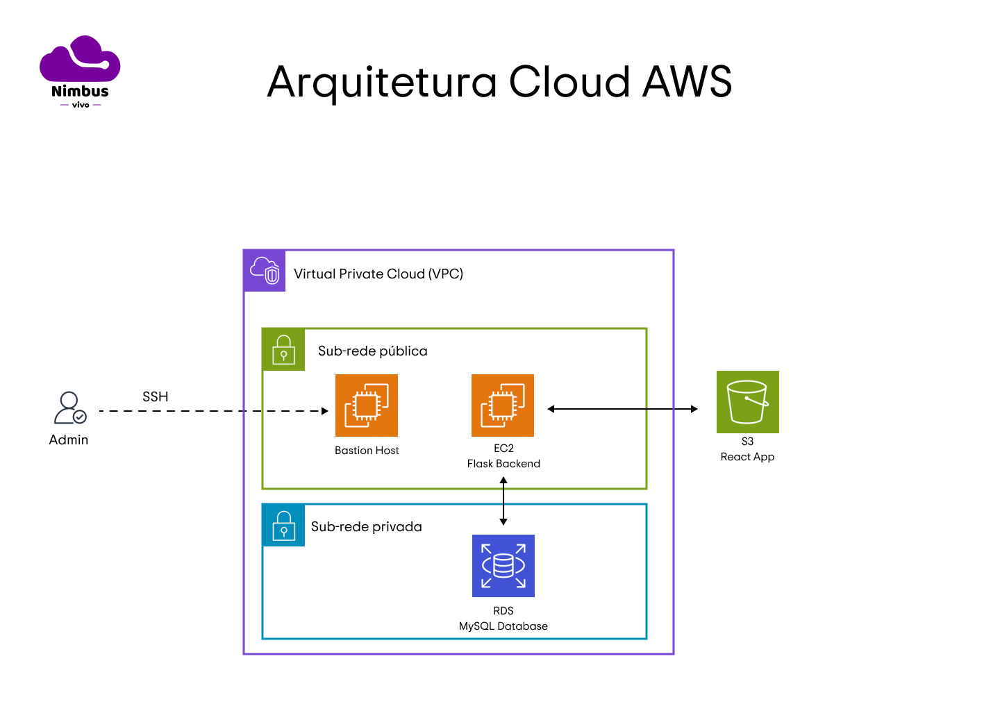

# Documentação UML / Sistema de estoques integrados Nimbus
## Introdução
&emsp;&emsp; O diagrama UML (Unified Modeling Language)<sup>1</sup> é uma ferramenta poderosa utilizada para modelar e visualizar a estrutura de sistemas complexos. Ele permite representar de maneira clara e concisa as classes, objetos, relacionamentos e interações dentro de um sistema, facilitando a comunicação entre desenvolvedores e outras partes interessadas. No contexto de bancos de dados, um diagrama UML pode ser utilizado para mapear as entidades e seus relacionamentos, ajudando a estruturar e entender melhor as conexões entre diferentes tabelas. A seguir, apresentamos o diagrama UML das principais tabelas do sistema distribuído para integração de estoques da Vivo, desenvolvido utilizando o banco de dados RDS da Amazon.

## Tabelas e relacionamentos
| Tabela        | Atributos | Descrição e Relacionamentos |
|---------------|-----------|-----------------------------|
| **stores**    | - `office_num` (char): Chave primária que identifica unicamente cada loja. <br> - `cep` (char(8)): Código postal da loja. <br> - `status`(text): Indica o status de funcioanamento da loja / centro de distribuição <br> - `service`(char(255)): Lista de cep's que essa loja atende. | Representa as lojas físicas onde os produtos estão armazenados. <br> **Relacionamentos:** <br> - Relacionamento 1:1 com a tabela `inventory`, indicando que uma loja pode ter apenas um registro de inventário associado. |
| **inventory** | - `inventory_id` (int): Chave primária que identifica unicamente cada registro de inventário. <br> - `office_num` (char): Chave estrangeira que referencia a loja (tabela `stores`) onde o inventário está localizado. <br> - `SKU` (char): Chave estrangeira que referencia o produto (tabela `products`) ao qual o inventário pertence. <br> - `quantity` (int): Quantidade do produto disponível na loja. | Armazena informações sobre a quantidade de produtos disponíveis em cada loja. <br> **Relacionamentos:** <br> - Relacionamento 1:1 com a tabela `stores`, indicando que cada registro de inventário pertence a uma única loja. <br> - Relacionamento N:1 com a tabela `products`, indicando que cada registro de inventário pertence a um único produto. |
| **products**  | - `SKU` (char): Chave primária que identifica unicamente cada produto. <br> - `product_name` (text): Nome descritivo do produto. | Contém as informações sobre os produtos disponíveis no sistema. <br> **Relacionamentos:** <br> - Relacionamento 1:N com a tabela `inventory`, indicando que um produto pode estar presente em múltiplos registros de inventário, distribuídos em diferentes lojas. |

<br>

&emsp;&emsp; Para melhor entendimento, também foi desenvolvida uma imagem representativa utilizando o software DeBeaver para representação das conexões entre tabelas:

<br>
<p align="center">
   <b>Figura 1 -</b> Diagrama de Entidades 
</p>
   <p align="center">
      </a>
   </p>
<p align="center">
   Fonte: Material desenvolvido pelos autores (2024)
</p>
<br>

&emsp;&emsp; Os números "123" representam que a chave é de tipo INT e "abc" indica que a chave é de tipo TEXT ou CHAR (no caso de SKU).

&emsp;&emsp; A tabela "alembic_version" apenas existe para definir a versão do Flask.

# Teste da aplicação do backend: Postman

## API Endpoints para tabela 'inventory'

&emsp;&emsp; Para assegurar o bom funcionamento do Sistema de Inventário Distribuído da Vivo, é essencial testar minuciosamente a API que gerencia o inventário e as lojas. Esses testes, feitos com a ferramenta Postman<sup>2</sup>, permitem verificar o comportamento de cada endpoint da API, garantindo que operações como a adição, atualização e exclusão de itens, além das operações relacionadas às lojas e produtos, ocorram de forma adequada. A realização desses testes é crucial para garantir que o sistema esteja preparado para atender à complexidade e à escala das operações da Vivo, especialmente em um ambiente de computação em nuvem distribuído pela AWS.

## 1. Get : retornar todos os itens do inventário
<br>
<p align="center">
   <b>Figura 2 -</b> Endpoint Get Invetário
</p>
   <p align="center">
      </a>
   </p>
<p align="center">
   Fonte: Material desenvolvido pelos autores (2024)
</p>
<br>

- **URL:** `/inventory`
- **Method:** `GET`

- **Success Response:**
  - **Code:** 200
  - **Content:** `[{ "inventory_id": 1, "store_id": 2, "SKU": "123ABC", "quantity": 50 }, ...]`

## 2. Add : Adicionar um item ao inventário
<br>
<p align="center">
   <b>Figura 3 -</b> Endpoint Post Invetário
</p>
   <p align="center">
      </a>
   </p>
<p align="center">
   Fonte: Material desenvolvido pelos autores (2024)
</p>
<br>

- **URL:** `/inventory`
- **Method:** `POST`
- **Data Params:**
  - `store_id`: ID da loja (obrigatório)
  - `SKU`: Código SKU do produto (obrigatório)
  - `quantity`: Quantidade do produto (obrigatório)

- **Success Response:**
  - **Code:** 201
  - **Content:** `{ "message": "Inventory item added" }`

- **Error Response:**
  - **Code:** 400 BAD REQUEST (se faltar algum dado necessário)

- **Example:**
  ```json
  {
    "store_id": 10,
    "SKU": "273",
    "quantity": 258132
  }

## 3. Update : Mudar um item do Inventário

<br>
<p align="center">
   <b>Figura 4 -</b> Endpoint UPTDATE Invetário
</p>
   <p align="center">
      </a>
   </p>
<p align="center">
   Fonte: Material desenvolvido pelos autores (2024)
</p>
<br>

- **URL:** `/inventory/<int:id>`
- **Method:** `PUT`
- **URL Params:**
  - **Required:** `id=[integer]`

- **Data Params:**
  - `store_id`: ID da loja
  - `SKU`: código SKU
  - `quantity`: Nova quantidade

- **Success Response:**
  - **Code:** 200
  - **Content:** `{ "message": "Inventory updated" }`

- **Error Response:**
  - **Code:** 404 NOT FOUND (se não encontrar o item de inventário)

## 4. Delete : Apagar um item do Inventário
<br>
<p align="center">
   <b>Figura 5 -</b> Endpoint Deletar Invetário
</p>
   <p align="center">
      </a>
   </p>
<p align="center">
   Fonte: Material desenvolvido pelos autores (2024)
</p>
<br>

- **URL:** `/inventory/<int:id>`
- **Method:** `DELETE`
- **URL Params:**
  - **Required:** `id=[integer]`

- **Success Response:**
  - **Code:** 200
  - **Content:** `{ "message": "Inventory deleted" }`

- **Error Response:**
  - **Code:** 404 NOT FOUND (se não encontrar o item de inventário)
  
## 5. Get : retornar inventário por SKU
<br>
<p align="center">
   <b>Figura 6 -</b> Endpoint Get Invetário por SKU
</p>
   <p align="center">
      </a>
   </p>
<p align="center">
   Fonte: Material desenvolvido pelos autores (2024)
</p>
<br>

- **URL:** `/inventory/sku/<string:sku>`
- **Method:** `GET`
- **URL Params:**
  - **Required:** `sku=[string]`

- **Success Response:**
  - **Code:** 200
  - **Content:** `[{ "inventory_id": 1, "store_id": 2, "SKU": "123ABC", "quantity": 50 }, ...]`

- **Error Response:**
  - **Code:** 404 NOT FOUND (se não encontrar o item de inventário com o SKU fornecido)


## API Endpoints para tabela 'stores'
## 1. Add: adicionar loja 
<br>
<p align="center">
   <b>Figura 7 -</b> Endpoint POST loja
</p>
   <p align="center">
      </a>
   </p>
<p align="center">
   Fonte: Material desenvolvido pelos autores (2024)
</p>
<br>

- **URL:** `/stores`
- **Method:** `POST`
- **Data Params:**
  - `store_cep`: CEP do loja (obrigatório)

- **Success Response:**
  - **Code:** 201
  - **Content:** `{ "message": "Store added" }`

- **Error Response:**
  - **Code:** 400 BAD REQUEST (se faltar algum dado necessário)

  - **Example:**
    ```json
    {
      "store_cep": "1234"
    }

## 2. Get : retornar todas as lojas
<br>
<p align="center">
   <b>Figura 8 -</b> Endpoint GET lojas
</p>
   <p align="center">
      </a>
   </p>
<p align="center">
   Fonte: Material desenvolvido pelos autores (2024)
</p>
<br>

- **URL:** `/stores` 
- **Method:** `GET` 
- **Success Response:** 
  -  **Code:** 200 
  -  **Content:** `[{ "store_id": 1, "store_cep": "12345-678" }, ...]`
  
## 3. Update : mudar uma loja

<br>
<p align="center">
   <b>Figura 9 -</b> Endpoint UPDATE Loja
</p>
   <p align="center">
      </a>
   </p>
<p align="center">
   Fonte: Material desenvolvido pelos autores (2024)
</p>
<br>

- **URL:** `/stores/<int:id>`
- **Method:** `PUT`
- **URL Params:**
  - **Required:** `id=[integer]`

- **Data Params:**
  - `store_cep`: Novo CEP da loja (obrigatório)

- **Success Response:**
  - **Code:** 200
  - **Content:** `{ "message": "Store updated" }`

- **Error Response:**
  - **Code:** 404 NOT FOU ND (se não encontrar a loja com o I D fornecido)

- **Example:**
  ```json
  {
    "store_cep": "1234523"
  }

## 4. Delete: apagar uma loja
<br>
<p align="center">
   <b>Figura 10 -</b> Endpoint DELETE loja
</p>
   <p align="center">
      </a>
   </p>
<p align="center">
   Fonte: Material desenvolvido pelos autores (2024)
</p>
<br>

- **URL:** `/stores/<int:id>`
- **Method:** `DELETE`
- **URL Params:**
  - **Required:** `id=[integer]`

- **Success Response:**
  - **Code:** 200
  - **Content:** `{ "message": "Store deleted" }`

- **Error Response:**
  - **Code:** 404 NOT FOUND (se não encontrar a loja com o ID fornecido)

## API Endpoints para tabela 'produtos'
## 1. Add : adicionar um produto
<br>
<p align="center">
   <b>Figura 11 -</b> Endpoint POST produto
</p>
   <p align="center">
      </a>
   </p>
<p align="center">
   Fonte: Material desenvolvido pelos autores (2024)
</p>
<br>

- **URL:** `/products`  
- **Method:** `POST`
- **Data Params:**
  - `SKU`: Código único do produto (obrigatório)
  - `product_name`: Nome do produto (obrigatório)

- **Success Response:**
  - **Code:** 201
  - **Content:** `{ "message": "Product added" }`

- **Error Response:**
  - **Code:** 400 BAD REQUEST (se faltar algum dado necessário)

- **Example:**
  ```json
  {
    "SKU": "1421",
    "product_name": "Iphone Beatriz"
  }

## 2. Get : retornar todos os produtos
<br>
<p align="center">
   <b>Figura 12 -</b> Endpoint GET produtos 
</p>
   <p align="center">
      </a>
   </p>
<p align="center">
   Fonte: Material desenvolvido pelos autores (2024)
</p>
<br>

- **URL:** `/products`
- **Method:** `GET`

- **Success Response:**
  - **Code:** 200
  - **Content:** `[{ "SKU": "123ABC", "product_name": "Notebook Pro" }, ...]`

## 3. Update : mudar um produto
<br>
<p align="center">
   <b>Figura 13 -</b> Endpoint UPDATE produto
</p>
   <p align="center">
      </a>
   </p>
<p align="center">
   Fonte: Material desenvolvido pelos autores (2024)
</p>
<br>

- **URL:** `/products/<int:SKU>`
- **Method:** `PUT`
- **URL Params:**
  - **Required:** `SKU=[integer]`

- **Data Params:**
  - `product_name`: Novo nome do produto (obrigatório)

- **Success Response:**
  - **Code:** 200
  - **Content:** `{ "message": "Product updated" }`

- **Error Response:**
  - **Code:** 404 NOT FOUND (se não encontrar o produto com o SKU fornecido)

- **Example:**
  ```json
  {
    "SKU": "1421"
    "product_name": "Iphone Giovana"
  }

## 4. Delete a Product
<br>
<p align="center">
   <b>Figura 14 -</b> Endpoint DELETE produto
</p>
   <p align="center">
      </a>
   </p>
<p align="center">
   Fonte: Material desenvolvido pelos autores (2024)
</p>
<br>

- **URL:** `/products/<int:SKU>`
- **Method:** `DELETE`
- **URL Params:**
  - **Required:** `SKU=[integer]`

- **Success Response:**
  - **Code:** 200
  - **Content:** `{ "message": "Product deleted" }`

- **Error Response:**
  - **Code:** 404 NOT FOUND (se não encontrar o produto com o SKU fornecido)

&emsp;&emsp; Os testes realizados com o Postman confirmam que os endpoints do Sistema de Inventário Distribuído da Vivo funcionam corretamente. Cada operação foi validada, desde a consulta até a modificação dos registros no inventário, para assegurar uma integração eficiente com a arquitetura cloud da AWS. Esse processo é fundamental para garantir que o sistema atenda às necessidades do usuário da Vivo, oferecendo uma experiência de consistente e atualizações em tempo real.

# Arquitetura Cloud

&emsp;&emsp;Uma parte fundamental para o funcionamento do Sistema de Inventário Distribuído da Vivo é a distribuição do serviço através da arquitetura cloud <sup>3</sup> disponibilizada pela AWS. Utilizando os recursos de computação em nuvem, a aplicação pode ser utilizada por qualquer lojista da Vivo no Brasil, além das requisições feitas por cada um dos funcionários serem instantaneamente atualizadas no banco de dados para todos os usuários da plataforma. Abaixo, segue um diagrama com os recursos da AWS que foram utilizados:

<br>
<p align="center">
   <b>Figura 15 -</b> Arquitetura Cloud AWS - Nimbus 
</p>
   <p align="center">
      </a>
   </p>
<p align="center">
   Fonte: Material desenvolvido pelos autores (2024)
</p>
<br>

&emsp;&emsp;A arquitetura cloud é composta por três elementos principais: um EC2 (Elastic Cloud Compute), que é essencialmente uma máquina virtual, um S3 (Simple Storage Service), que armazena conteúdo estático, e um RDS (Relational Database Service), que é um banco de dados. O EC2 é responsável pelo backend, desenvolvido com o framework Flask em Python. O S3 hospeda o frontend estático, feito com o framework React em JavaScript. O RDS utiliza o MySQL como banco de dados relacional. Tanto o EC2 quanto o RDS estão hospedados dentro de uma VPC (Virtual Private Cloud), que é uma rede virtual privada na AWS que isola logicamente os recursos, proporcionando controle sobre o ambiente de rede, segurança aprimorada com grupos de segurança e listas de controle de acesso, e permitindo a configuração de sub-redes e roteamento para gerenciar o tráfego de forma segura e eficiente. Para estabelecer uma conexão SSH segura entre um administrador da aplicação cloud com o EC2, é utilizado um bastion host, que age como uma ponte entre a rede pública e a rede privada. Dessa forma, o administrador consegue realizar as ações necessárias no EC2 sem que essa máquina virtual seja exposta. No caso da aplicação do projeto, o EC2 está localizado em uma sub-rede pública, acessível para qualquer endereço de IP, enquanto o RDS está em uma sub-rede privada, se comunicando apenas com a aplicação Flask. Além disso, a AWS por padrão providencia um backup para o banco de dados em outra zona de disponibilidade, o que aumenta a tolerância com falhas no sistema. 

## Especificações

&emsp;&emsp;Abaixo, segue uma lista com as especificações de cada uma das instâncias utilizadas na aplicação

### 1. EC2 
 - Sistema Operacional: Ubuntu 24.04 LTS (GNU/Linux 6.8.0-1013-aws x86_64)
 - Tipo de Instância: t2.micro
 - vCPUs: 1
 - RAM: 1 GiB
 - Armazenamento: 8 GiB (SSD)

### 2. S3 Standard
 - Armazenamento: Automaticamente escalável
 - Caso de uso: Dados acessados frequentemente
 - Durabilidade: 99.999999999% (11 9's)
 - Disponibilidade: 99.99% durante o ano

### 3. RDS
 - Banco de Dados: MySQL 8.0.35
 - Tipo de Instância: 
 - RAM: 1 GiB
 - Armazenamento: 20 GiB (SSD)
 - Armazenamento Backup: 20 GiB (SSD) 

&emsp;&emsp; Para mais detalhes do funcionamento do front e back end, veja o vídeo de demonstração do MVP disponível em: https://drive.google.com/drive/folders/1rkhCrpp6XFoQSnYQvivdGMoT6_TsBvID?usp=sharing

# Referências
1. Miro. O que é UML? Disponível em: https://miro.com/pt/diagrama/o-que-e-uml/. Acesso em: 18 ago. 2024.
   
2. Cielo Developer. Tutorial de uso do Postman. Disponível em: https://developercielo.github.io/tutorial/postman. Acesso em: 18 ago. 2024.
   
3. Google Cloud. O que é arquitetura de nuvem? Disponível em: https://cloud.google.com/learn/what-is-cloud-architecture?hl=pt-BR. Acesso em: 18 ago. 2024.


