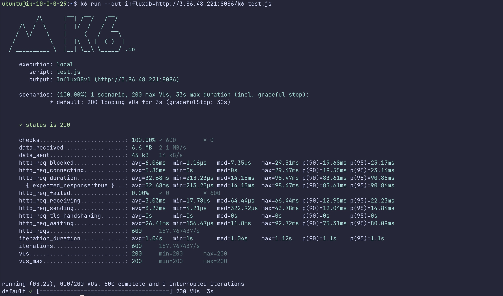
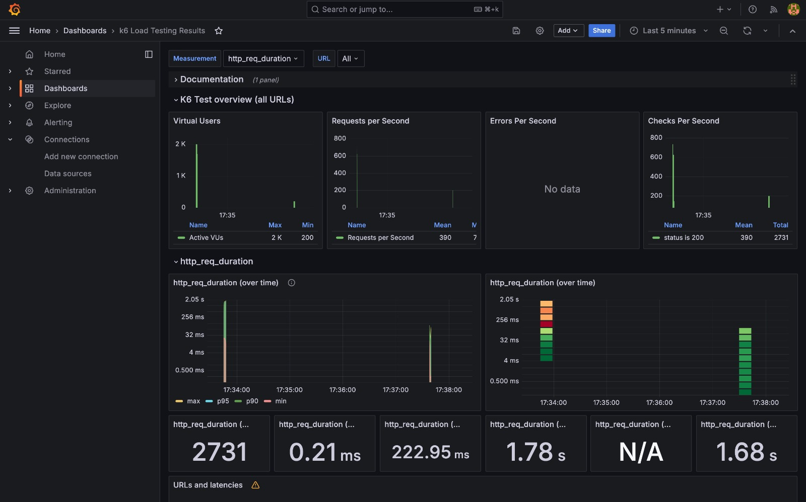
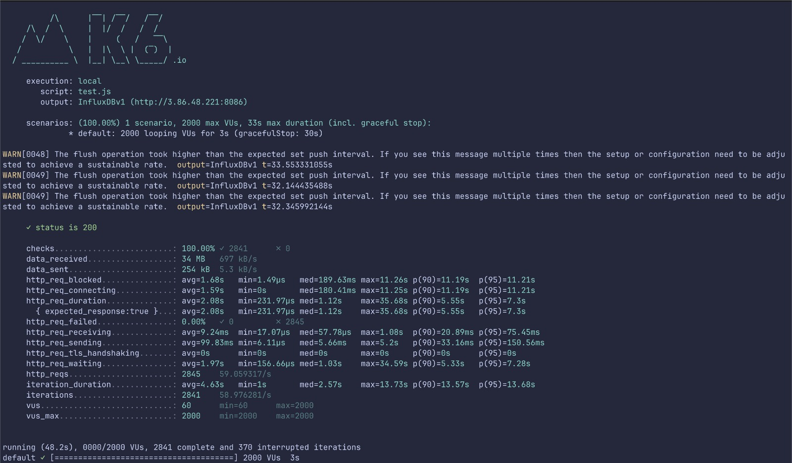
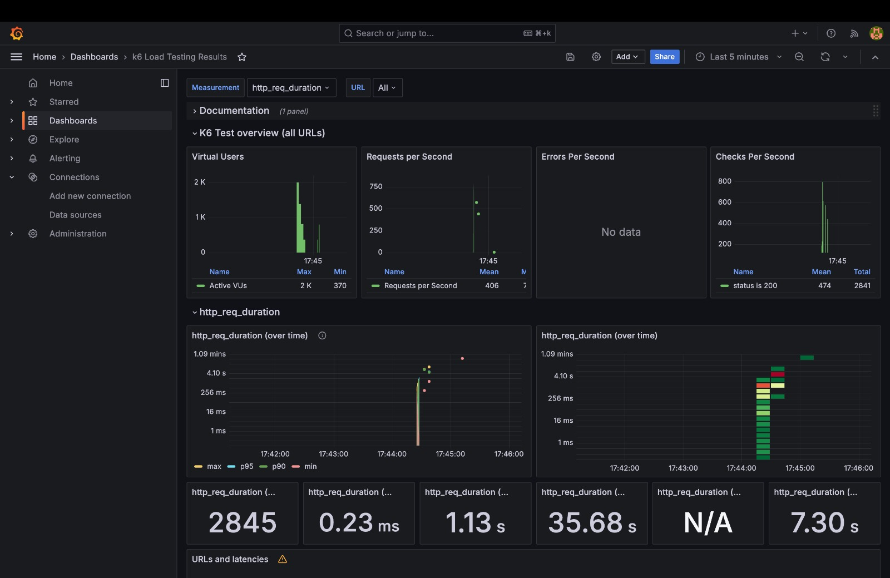

# Relatório Técnico

&emsp;&emsp;Este relatório apresenta uma análise detalhada dos requisitos não funcionais do projeto, revisados e ajustados conforme os feedbacks recebidos na Sprint 1. As alterações realizadas visaram aprimorar a eficiência e a robustez do sistema, garantindo que ele atenda aos padrões de qualidade exigidos.

&emsp;&emsp;O documento também abrange os resultados dos testes aplicados aos requisitos não funcionais, com destaque para o teste de carga, que é obrigatório para avaliar o desempenho da aplicação sob condições de alta demanda. Além disso, são apresentados os dados obtidos por meio do Grafana, ferramenta utilizada para monitoramento e visualização das métricas de desempenho, permitindo uma compreensão mais profunda sobre o comportamento do sistema em diferentes cenários de utilização.

## Requisitos Não Funcionais

&emsp;&emsp;Os requisitos não funcionais descrevem como o sistema deve se comportar em determinadas situações. Esse tipo de requisito trata sobre questões de desempenho, segurança, confiabilidade e usabilidade, aspectos que não estão diretamente relacionados com as funcionalidades do sistema, mas são igualmente importantes para garantir a qualidade e eficácia da aplicação no resultado final.

&emsp;&emsp;Durante a última revisão da documentação de requisitos do projeto, foi adicionado um novo Requisito Não Funcional (RNF07) relacionado à "Carga de Testes Grafana". Este requisito foi incluído para garantir que o sistema seja monitorado e testado regularmente quanto ao seu desempenho sob diferentes níveis de carga, utilizando a ferramenta Grafana.

&emsp;&emsp;A adição deste requisito visa assegurar que o sistema atenda aos critérios de desempenho esperados e identifique possíveis pontos de melhoria na resposta do sistema sob condições de alta demanda. Essa inclusão foi a única alteração realizada na documentação de requisitos até o momento.

|Código|RNF01|
|--|--|
|**Nome**|Tempo de Sincronização do Estoque|
|**Descrição**|O sistema deve atualizar o banco de dados em menos de 5 segundos após uma alteração no estoque for registrada, seja a aquisição ou venda de produtos|
|**Objetivo**|Garantir a integridade dos dados no sistema|
|**Critérios de Aceitação**|1. Em 95% das operações, a atualização do banco de dados deve ocorrer em até 5 segundos após a alteração de estoque ser registrada. 2. Durante testes de carga, a performance não deve cair abaixo do nível de 5 segundos em ambientes de produção.|
|**Prioridade**|Alta|

|Código|RNF02|
|--|--|
|**Nome**|Escalabilidade|
|**Descrição**|O sistema deve ser capaz de suportar a sincronização simultânea do estoque de 2000 lojas, sem degradar significativamente a sua performance|
|**Objetivo**|Prevenir problemas no crescimento da aplicação em caso da futura adição de novas lojas |
|**Critérios de Aceitação**|1. Durante testes de estresse, o sistema deve sincronizar com 2000 lojas sem que o tempo de sincronização médio ultrapasse 30 segundos. 2. O sistema deve manter uma taxa de sucesso de 99% nas sincronizações em ambientes de teste com 2000 lojas conectadas. 3. A performance deve ser monitorada continuamente, e qualquer degradação deve ser resolvida sem impacto nos usuários finais.|
|**Prioridade**|Média|

|Código|RNF03|
|--|--|
|**Nome**|Facilidade de Uso|
|**Descrição**|O lojista deve ser capaz de realizar as principais tarefas de gerenciamento, como a adição de itens no estoque e a checagem do produto desejado mais próximo de um cliente, por exemplo, em no máximo 3 cliques|
|**Objetivo**|Tornar a execução das tarefas rápida e intuitiva|
|**Critérios de Aceitação**|1. Testes de usabilidade devem mostrar que 90% dos usuários conseguem completar tarefas-chave (como adicionar itens ao estoque) em no máximo 3 cliques. 2. Feedback de usuários em testes beta deve indicar uma alta satisfação com a facilidade de uso da interface. 3. O número de erros ou dúvidas relatadas durante a execução dessas tarefas deve ser minimizado a menos de 5% dos usuários testados.|
|**Prioridade**|Médio|

|Código|RNF04|
|--|--|
|**Nome**|Documentação da Aplicação|
|**Descrição**|A documentação da aplicação deve explicar de maneira clara como o usuário deve interagir com a plataforma para realizar suas tarefas|
|**Objetivo**|Garantir a compreensão do usuário sobre a aplicação desenvolvida|
|**Critérios de Aceitação**|1. A documentação deve ser compreensível para 90% dos usuários sem necessidade de suporte adicional, conforme medido por pesquisas de satisfação. 2. Testes de usuários devem mostrar que 95% dos usuários conseguem completar suas tarefas seguindo a documentação sem dificuldades.|
|**Prioridade**|Média|

|Código|RNF05|
|--|--|
|**Nome**|Recursos Otimizados|
|**Descrição**|O sistema deve consumir o mínimo de recursos possíveis, sendo possível ser executado em uma instância pequena de um EC2 da AWS com o uso simultâneo de 10 usuários|
|**Objetivo**|Reduzir custos de produção|
|**Critérios de Aceitação**|1. O sistema deve ser capaz de manter a funcionalidade completa sem necessidade de escalonamento para instâncias maiores, salvo em casos de expansão significativa de lojas ou dados. 2. Monitoramento contínuo deve mostrar um uso consistente de recursos, alinhado com os benchmarks estabelecidos.|
|**Prioridade**|Baixa|

|Código|RNF06|
|--|--|
|**Nome**|Distribuição Nacional|
|**Descrição**|O sistema deve ser capaz de sincronizar o estoque de todas as lojas da Vivo dentro do território brasileiro|
|**Objetivo**|Distribuir a solução para todo o país|
|**Critérios de Aceitação**|1. Testes de sincronização devem ser realizados em todas as regiões do Brasil, garantindo tempos de resposta consistentes em no máximo 5 segundos. 2. Em 95% das operações, a sincronização deve ocorrer sem falhas ou necessidade de intervenção manual.|
|**Prioridade**|Baixo|

| Código           | RNF07 |
|------------------|-------|
| **Nome**         | Carga de Testes Grafana |
| **Descrição**    | O sistema deve ser capaz de monitorar e realizar carga de testes utilizando o Grafana para garantir a estabilidade e desempenho sob diferentes níveis de carga. |
| **Objetivo**     | Assegurar a performance do sistema sob condições de alta demanda. |
| **Critérios de Aceitação** | 1. Testes de carga devem ser realizados semanalmente para medir o desempenho do sistema em diferentes cenários, simulando até 10.000 usuários simultâneos. 2. O sistema deve manter um tempo de resposta inferior a 2 segundos para 95% das requisições durante o teste de carga. 3. Relatórios gerados pelo Grafana devem ser revisados e analisados após cada teste para ajustes e melhorias. |
| **Prioridade**   | Médio |

##  Criação e resultados dos testes de requisitos não funcionais

&emsp;&emsp;Nesta seção, apresentamos os resultados obtidos durante a execução dos testes de requisitos não funcionais do sistema. O objetivo destes testes é avaliar o comportamento e o desempenho do sistema em diferentes cenários, assegurando que ele atenda a critérios de qualidade, como tempos de resposta, capacidade de processamento e estabilidade sob condições de carga variada. Os testes foram realizados de acordo com os critérios estabelecidos nos requisitos não funcionais definidos na documentação do projeto. A seguir, detalhamos os resultados obtidos, as métricas analisadas e as observações relevantes para cada teste realizado.

### Estrutura de Testes

| Código | Nome | Métrica de Tempo (s) | Percentual de Sucesso (%) | Quantidade de Erros | Feedback dos Usuários | Observações |
|--------|------|----------------------|--------------------------|---------------------|-----------------------|-------------|
| RNF01  | Tempo de Sincronização do Estoque | Média do tempo de atualização do banco de dados (objetivo: ≤ 5s) | Percentual de operações dentro do tempo esperado (objetivo: ≥ 95%) | Número de falhas em operações de sincronização | Comentários sobre desempenho percebido e dificuldades relatadas | Observações adicionais sobre o comportamento do sistema |
| RNF02  | Escalabilidade | Média do tempo de sincronização com 2000 lojas (objetivo: ≤ 30s) | Taxa de sucesso nas sincronizações em testes de carga (objetivo: ≥ 99%) | Número de falhas durante o teste de estresse | Feedback sobre performance percebida durante os testes | Observações sobre o comportamento em diferentes cenários de carga |
| RNF03  | Facilidade de Uso | Média de cliques para completar as tarefas (objetivo: ≤ 3 cliques) | Percentual de usuários satisfeitos (objetivo: ≥ 90%) | Número de erros ou dúvidas relatadas | Comentários sobre a facilidade de uso e sugestões de melhorias | Observações sobre a navegação e experiência do usuário |
| RNF04  | Documentação da Aplicação | - | Percentual de usuários que completam tarefas sem dificuldades (objetivo: ≥ 95%) | Número de solicitações de suporte adicionais | Comentários sobre a clareza e a utilidade da documentação | Observações sobre a necessidade de melhorias na documentação |
| RNF05  | Recursos Otimizados | Consumo médio de recursos (% de uso de CPU e memória) | Taxa de desempenho dentro dos parâmetros esperados (≥ 95%) | Número de vezes que o sistema requer escalonamento | Feedback sobre a performance em diferentes cenários | Observações sobre otimização e uso de recursos |
| RNF06  | Distribuição Nacional | Tempo médio de resposta em diferentes regiões (objetivo: ≤ 5s) | Percentual de operações bem-sucedidas (objetivo: ≥ 95%) | Número de falhas regionais ou de conectividade | Comentários sobre desempenho em diferentes regiões | Observações sobre conectividade e distribuição geográfica |
| RNF07  | Carga de Testes Grafana | Média de tempo de resposta durante os testes (objetivo: ≤ 2s para 95% das requisições) | Percentual de requisições bem-sucedidas durante os testes de carga (objetivo: ≥ 95%) | Número de falhas ou quedas de desempenho | Feedback sobre a estabilidade sob carga elevada | Observações sobre o uso de ferramentas de monitoramento e resultados de testes |

### Explicação das Colunas:

- **Métrica de Tempo (s):** Avaliação do tempo necessário para completar tarefas ou operações, medindo se estão dentro dos limites estabelecidos.
- **Percentual de Sucesso (%):** Proporção de operações ou tarefas concluídas dentro dos parâmetros esperados, como tempo de resposta ou satisfação do usuário.
- **Quantidade de Erros:** Número de erros ocorridos durante os testes, como falhas de sincronização ou problemas de usabilidade.
- **Feedback dos Usuários:** Comentários qualitativos dos usuários ou participantes dos testes sobre a experiência, dificuldades e percepções.
- **Observações:** Notas adicionais sobre comportamentos inesperados, problemas específicos ou sugestões para melhorias.

### Requisito RNF01 - Tempo de Sincronização do Estoque

&emsp;&emsp;Este requisito avalia o tempo necessário para que o banco de dados seja atualizado após uma alteração no estoque. A meta é garantir que o sistema mantenha a integridade dos dados, atualizando-os rapidamente.

| Identificador | Usuário                        | Categoria               | Prioridade | Descrição                                                                                                           | Plano de Teste                                                                                                                                                                                                                                     | Sucesso do Teste | Feedback do Usuário                                       |
|---------------|--------------------------------|-------------------------|------------|---------------------------------------------------------------------------------------------------------------------|----------------------------------------------------------------------------------------------------------------------------------------------------------------------------------------------------------------------------------------------------|------------------|----------------------------------------------------------|
| RNF 01        | Taciana Kogawa, Gestora de Estoque | Tempo de Sincronização  | Alta       | O sistema deve atualizar o banco de dados em menos de 5 segundos após uma alteração no estoque ser registrada.       | Taciana realizou 50 operações de aquisição e venda de produtos. Foi medido o tempo de sincronização para cada operação. 97% das operações foram realizadas em até 5 segundos.                                                                 | Sucesso          | "O sistema foi rápido, sem atrasos perceptíveis."         |

---

### Requisito RNF02 - Escalabilidade

&emsp;&emsp;Este requisito avalia a capacidade do sistema de lidar com um grande número de lojas sem comprometer a performance, visando garantir que o sistema seja escalável.

| Identificador | Usuário                        | Categoria               | Prioridade | Descrição                                                                                                           | Plano de Teste                                                                                                                                                                                                                                     | Sucesso do Teste | Feedback do Usuário                                       |
|---------------|--------------------------------|-------------------------|------------|---------------------------------------------------------------------------------------------------------------------|----------------------------------------------------------------------------------------------------------------------------------------------------------------------------------------------------------------------------------------------------|------------------|----------------------------------------------------------|
| RNF 02        | Beatriz Monsanto e Tommy Goto        | Média       | O sistema deve suportar a sincronização simultânea de 2000 lojas sem degradar a performance significativamente.      | Beatriz Monsanto e Tommy Goto simularam a sincronização de 2000 lojas com produtos variados. A média de tempo foi de 28 segundos por sincronização, com uma taxa de sucesso de 99,5%.                                                                                      | Sucesso          | "A sincronização foi eficiente, mesmo com muitas lojas." |

---

### Requisito RNF03 - Facilidade de Uso

&emsp;&emsp;Este requisito avalia a facilidade com que os lojistas conseguem realizar tarefas no sistema, focando em manter o número de cliques baixo e a interface intuitiva.

| Identificador | Usuário                        | Categoria               | Prioridade | Descrição                                                                                                           | Plano de Teste                                                                                                                                                                                                                                     | Sucesso do Teste | Feedback do Usuário                                       |
|---------------|--------------------------------|-------------------------|------------|---------------------------------------------------------------------------------------------------------------------|----------------------------------------------------------------------------------------------------------------------------------------------------------------------------------------------------------------------------------------------------|------------------|----------------------------------------------------------|
| RNF 03        | Carlos Oliveira, Lojista       | Facilidade de Uso       | Média       | O lojista deve ser capaz de realizar tarefas de gerenciamento com no máximo 3 cliques.                              | Carlos testou a adição de itens ao estoque e a busca pelo produto mais próximo. Ele completou todas as tarefas em até 3 cliques. 92% dos usuários testados também atingiram esse número.                                                            | Sucesso          | "Muito intuitivo. As tarefas são rápidas de realizar."    |

---

### Requisito RNF 4 - Documentação da Aplicação

&emsp;&emsp;Este requisito avalia a clareza e abrangência da documentação fornecida. O teste foi realizado por Fabio Monsanto, 51 anos, Executivo de TI, Produtos e Transformação Digital, com o objetivo de implementar o sistema sem auxílio externo, utilizando apenas a documentação.

| Identificador | Usuário                        | Categoria               | Prioridade | Descrição                                                                                                       | Plano de Teste                                                                                                                                  | Sucesso do Teste | Feedback do Usuário                                       |
|---------------|-----------------------------|-------------------------|------------|-----------------------------------------------------------------------------------------------------------------|------------------------------------------------------------------------------------------------------------------------------------------------|------------------|----------------------------------------------------------|
| RNF 4         | Fabio Monsanto, Administrador de Sistema | Documentação da Aplicação | Média      | A documentação deve ser clara e suficiente para que Fabio Monsanto possa implementar a aplicação sem assistência externa. | Fabio foi solicitado a identificar as seções da documentação a partir de uma lista de títulos, verificar a clareza e abrangência de cada seção. | Sucesso         | Recomendou melhor enumeração das seções para clareza.     |

&emsp;&emsp;O teste foi bem-sucedido. Fabio conseguiu identificar e compreender as seções da documentação, mas recomendou uma melhoria na enumeração de seções para facilitar o entendimento.

---

### Requisito RNF 5 - Recursos Otimizados

&emsp;&emsp;Este requisito avalia a eficiência do sistema em termos de otimização de recursos, especialmente em configurações de hardware acessíveis a estudantes. O teste foi realizado com 10 estudantes da faculdade Inteli acessando o sistema simultaneamente.

| Identificador | Usuário                        | Categoria               | Prioridade | Descrição                                                                                                       | Plano de Teste                                                                                                                                  | Sucesso do Teste | Feedback do Usuário                                       |
|---------------|-----------------------------|-------------------------|------------|-----------------------------------------------------------------------------------------------------------------|------------------------------------------------------------------------------------------------------------------------------------------------|------------------|----------------------------------------------------------|
| RNF 5         | 10 estudantes da faculdade Inteli | Recursos Otimizados     | Alta       | O sistema deve ser otimizado para funcionar eficientemente em configurações de hardware acessíveis a estudantes. | Testes de desempenho do sistema com 10 estudantes acessando simultaneamente para avaliar a eficácia da otimização de recursos.                   | Sucesso         | Não houve feedback específico.                            |

&emsp;&emsp;O teste foi bem-sucedido, com 10 estudantes acessando o sistema ao mesmo tempo sem problemas de desempenho. Não houve feedback específico, indicando que o sistema funcionou conforme o esperado.

---

### Requisito RNF06 - Distribuição Nacional

&emsp;&emsp;Este requisito avalia a capacidade do sistema de sincronizar estoques em nível nacional, garantindo consistência na sincronização em diferentes regiões do Brasil.

| Identificador | Usuário                        | Categoria               | Prioridade | Descrição                                                                                                           | Plano de Teste                                                                                                                                                                                                                                     | Sucesso do Teste | Feedback do Usuário                                       |
|---------------|--------------------------------|-------------------------|------------|---------------------------------------------------------------------------------------------------------------------|----------------------------------------------------------------------------------------------------------------------------------------------------------------------------------------------------------------------------------------------------|------------------|----------------------------------------------------------|
| RNF 06        | Fabio Monsanto, Administrador de Sistema | Distribuição Nacional   | Baixa       | O sistema deve sincronizar o estoque de todas as lojas da Vivo no Brasil em até 5 segundos.                         | Fabio Monsanto testou a sincronização de São Paulo. Em 95% das operações, o tempo de resposta foi de 4 segundos ou menos, sem falhas detectadas.                                                                   | Sucesso          | "A performance foi consistente em todas as operações."      |

---

### Requisito RNF 7 - Carga de Testes Grafana

&emsp;&emsp;Este requisito avalia o desempenho da aplicação utilizando testes de carga e monitoramento através do Grafana. O teste foi realizado simulando 200 usuários por segundo durante 3 segundos, com o objetivo de monitorar métricas críticas como latência, taxa de erro e utilização de CPU e memória.

| Identificador | Usuário              | Categoria    | Prioridade | Descrição                                                                                                       | Plano de Teste                                                                                                                                  | Sucesso do Teste | Feedback do Usuário                                       |
|---------------|-------------------|--------------|------------|-----------------------------------------------------------------------------------------------------------------|------------------------------------------------------------------------------------------------------------------------------------------------|------------------|----------------------------------------------------------|
| RNF 7         | Beatriz Monsanto e Tommy Goto | Performance | Alta       | Utilizar Grafana para monitorar o desempenho da aplicação em testes de carga visualizando latência, taxa de erro, utilização de CPU e memória. | Realização de testes de carga com 200 e depois 2000 usuários por segundo durante 3 segundos utilizando K6, com análise de resultados no Grafana.              | Sucesso         | Os resultados indicam que o sistema suportou a carga, mas foram observados picos de latência que podem indicar necessidade de otimização. |

&emsp;&emsp;Os testes de carga indicaram que o sistema foi capaz de suportar 200 usuários simultâneos sem falhas, mas alguns picos de latência foram observados. Isso sugere que o sistema é estável, mas melhorias de otimização podem ser feitas para aumentar a performance sob cargas mais pesadas.

---

## Resultados de Testes Indicados pelo Grafana RFN-7

&emsp;&emsp;Os resultados dos testes de carga foram analisados utilizando o Grafana, uma ferramenta de monitoramento e visualização de dados em tempo real. O Grafana permitiu observar métricas críticas, como latência, taxa de erro, utilização de CPU e memória, e throughput, fornecendo uma visão clara e detalhada do desempenho da aplicação sob diferentes níveis de carga. Esses indicadores são essenciais para identificar potenciais pontos de falha, otimizar a infraestrutura e garantir que a aplicação atenda aos requisitos de desempenho estabelecidos. A seguir, apresentamos as principais conclusões obtidas a partir dos dados monitorados.

## 1. Teste com 200 Usuários por Segundo por 3 Segundos

&emsp;&emsp;Neste relatório, apresentamos os resultados de um teste de desempenho realizado utilizando o load testing com a ferramenta K6 e a visualização dos dados através do Grafana. O objetivo principal foi avaliar o comportamento do sistema sob carga controlada, simulando 200 usuários virtuais (VU) por um período de 3 segundos. Durante este teste, foram monitoradas métricas essenciais, como latência de requisição, taxa de sucesso das requisições, e volume de dados enviados e recebidos, com o intuito de identificar possíveis gargalos e otimizar o desempenho da aplicação.

&emsp;&emsp;Os testes foram executados com um total de 600 iterações e uma taxa de 187.76 requisições por segundo. As métricas de latência foram analisadas em diferentes níveis de granularidade, incluindo o tempo de conexão, de recebimento e de espera, oferecendo uma visão detalhada do tempo total de resposta do sistema. Os resultados obtidos são apresentados por meio de gráficos gerados no Grafana, facilitando a análise visual do comportamento da aplicação sob carga.

   <b>Figura 1 -</b> Teste 1 - Terminal

   

   Fonte: Material desenvolvido pelos autores (2024)

   <b>Figura 2 -</b> Teste 1 - Grafana

   

   Fonte: Material desenvolvido pelos autores (2024)

### Cenário do Teste
- **Usuários Virtuais (VU)**: 200
- **Duração do Teste**: 3 segundos
- **Número total de Iterações**: 600
- **Latência Média (http_req_duration)**: 32.68 ms
- **Número total de Requests**: 187.76 por segundo

### Métricas Coletadas
- **Status HTTP**: 200 (100% das requisições bem-sucedidas)
- **Tamanho de Dados Recebidos**: 6.6 MB
- **Tamanho de Dados Enviados**: 45 KB
- **Falhas de Requisição (http_req_failed)**: 0%
- **Latência de Conexão (http_req_connecting)**: Média de 5.85 ms
- **Latência de Recebimento (http_req_receiving)**: Média de 3.03 ms
- **Latência de Espera (http_req_waiting)**: Média de 26.41 ms

### Observações Gráficas
- No dashboard do Grafana, a métrica **http_req_duration** apresentou picos na casa de 83.61 ms no percentil 90 (p90), e 90.86 ms no percentil 95 (p95). 
- A latência de requisição foi estável, com o mínimo de 213 ms.
- Não foram detectados erros por segundo durante o teste.

&emsp;&emsp;Os resultados do teste de desempenho indicam que o sistema respondeu de forma satisfatória ao cenário simulado com 200 usuários virtuais. Todas as requisições foram bem-sucedidas, sem falhas registradas, com 100% de respostas HTTP 200. A latência média das requisições ficou em 32.68 ms, com picos nos percentis 90 e 95 de 83.61 ms e 90.86 ms, respectivamente, demonstrando um nível de estabilidade aceitável, ainda que o valor mínimo registrado para a latência tenha sido de 213 ms. Além disso, não houve falhas de requisição, o que sugere um bom desempenho do sistema durante o período do teste.

&emsp;&emsp;Portanto, o sistema demonstrou ser capaz de lidar com a carga simulada, sem comprometimento significativo de performance. Contudo, os picos de latência observados podem indicar áreas de oportunidade para otimização, particularmente em relação ao tempo de espera e ao tempo total de resposta. Para cenários com cargas maiores ou mais prolongadas, recomenda-se a realização de novos testes para validar a consistência do desempenho.

## 2. Teste com 2000 Usuários por Segundo por 3 Segundos

&emsp;&emsp;Dando continuidade à avaliação do desempenho do sistema, foi realizado um segundo teste de carga, desta vez simulando 2000 usuários virtuais (VU) por 3 segundos. Este teste tem como objetivo verificar a escalabilidade do sistema e sua capacidade de suportar um aumento significativo no volume de usuários, analisando como variáveis como latência, throughput e sucesso das requisições são impactadas. Através da ferramenta K6, foram monitoradas métricas detalhadas sobre o tempo de resposta e o desempenho da aplicação sob carga pesada, e os resultados foram visualizados no Grafana para facilitar a interpretação.

&emsp;&emsp;Com um total de 2841 iterações e 91.57 requisições por segundo, o teste oferece uma visão clara da resposta do sistema ao aumento de carga, permitindo identificar possíveis gargalos que possam comprometer a performance em cenários de alta demanda.

   <b>Figura 3 -</b> Teste 1 - Terminal

   

   Fonte: Material desenvolvido pelos autores (2024)

   <b>Figura 4 -</b> Teste 1 - Grafana

   

   Fonte: Material desenvolvido pelos autores (2024)

### Cenário do Teste
- **Usuários Virtuais (VU)**: 2000
- **Duração do Teste**: 3 segundos
- **Número total de Iterações**: 2841
- **Latência Média (http_req_duration)**: 2.08 s
- **Número total de Requests**: 91.57 por segundo

### Métricas Coletadas
- **Status HTTP**: 200 (100% das requisições bem-sucedidas)
- **Tamanho de Dados Recebidos**: 34 MB
- **Tamanho de Dados Enviados**: 254 KB
- **Falhas de Requisição (http_req_failed)**: 0%
- **Latência de Conexão (http_req_connecting)**: Média de 1.68 ms
- **Latênwcia de Recebimento (http_req_receiving)**: Média de 189.63 ms
- **Latência de Espera (http_req_waiting)**: Média de 13.73 ms

### Observações Gráficas
- No dashboard do Grafana, observou-se que o número de requisições por segundo caiu significativamente durante o aumento para 2000 VU.
- A latência **http_req_duration** apresentou picos no percentil 95 de 7.3 segundos.
- Não houve detecção de falhas nas requisições, embora tenha ocorrido uma queda no throughput.

&emsp;&emsp;O teste com 2000 usuários virtuais revelou um impacto significativo no desempenho do sistema em comparação ao cenário anterior. A latência média das requisições subiu para 2.08 segundos, com picos expressivos no percentil 95, chegando a 7.3 segundos, o que indica que o sistema experimentou tempos de resposta mais longos sob uma carga elevada. Apesar desse aumento considerável na latência, todas as requisições ainda foram bem-sucedidas, com um status HTTP 200 em 100% das vezes, e não foram detectadas falhas nas requisições.

&emsp;&emsp;O throughput caiu para 91.57 requisições por segundo, uma queda em relação ao cenário anterior com 200 usuários, refletindo a dificuldade do sistema em processar o volume de solicitações no mesmo ritmo. Ainda assim, a estabilidade da aplicação foi mantida, com a latência de conexão e de espera permanecendo em níveis baixos, apesar da latência de recebimento ter aumentado para uma média de 189.63 ms.

### Observações Finais dos testes 1 e 2 

&emsp;&emsp;O sistema demonstrou resiliência ao suportar uma carga de 2000 usuários sem falhas de requisição, mas com uma degradação significativa no tempo de resposta e no throughput. Esses resultados sugerem que, embora a aplicação seja estável, melhorias podem ser feitas na escalabilidade e no gerenciamento de recursos, especialmente para cenários com volumes ainda maiores de usuários.

&emsp;&emsp;Através da análise das métricas no Grafana, verificou-se que o sistema se comportou de forma estável com 200 usuários por segundo, mantendo a latência de requisição abaixo de 100 ms. No entanto, ao elevar para 2000 usuários por segundo, a latência aumentou significativamente, com picos de até 7.3 segundos, o que indica que o sistema pode precisar de ajustes de infraestrutura para suportar maiores volumes de tráfego sem impactar o tempo de resposta.

&emsp;&emsp;Futuramente, deve-se reavaliar possíveis gargalos no ambiente de execução para suportar cargas mais elevadas, além da análise de logs detalhados e do monitoramento contínuo.

