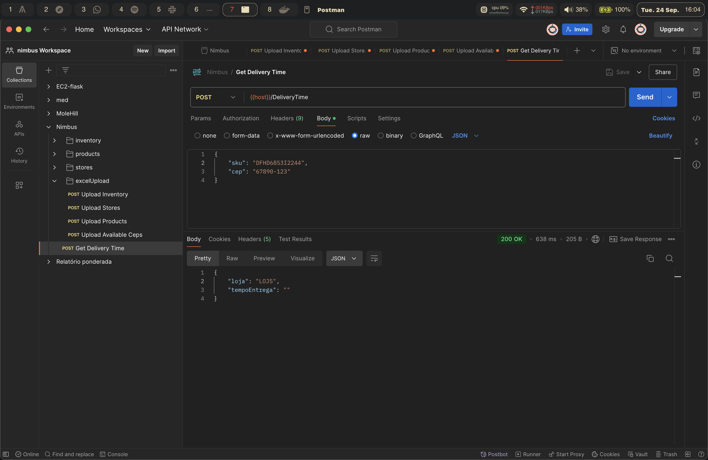
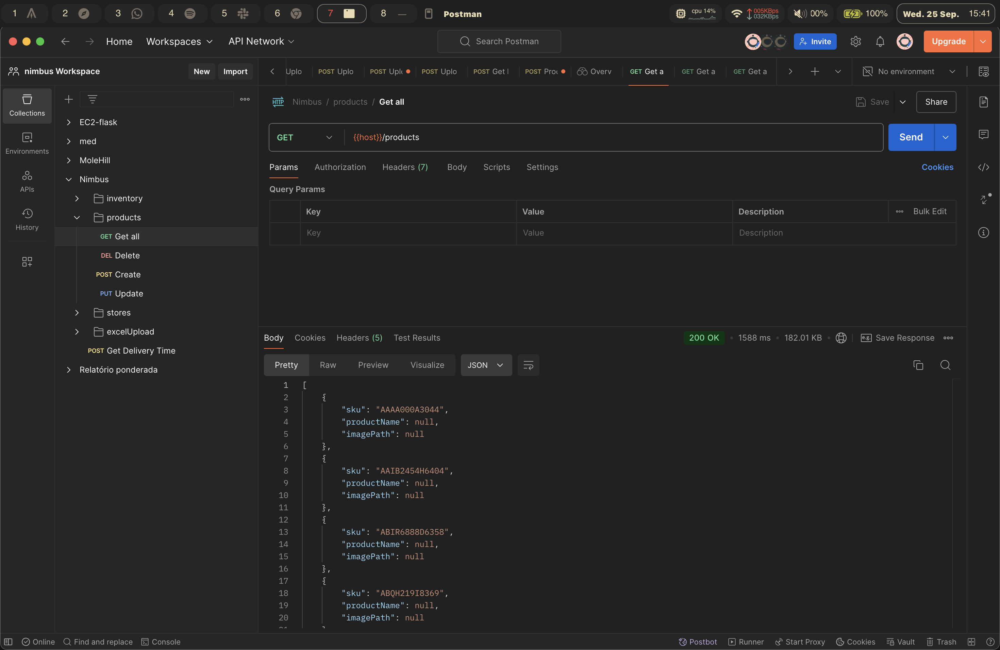
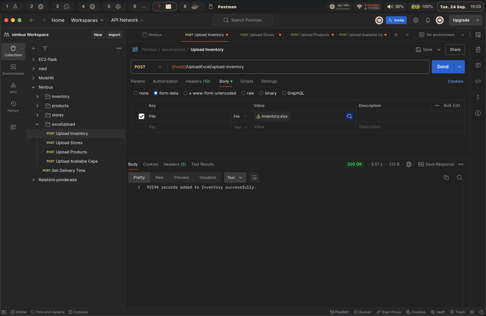
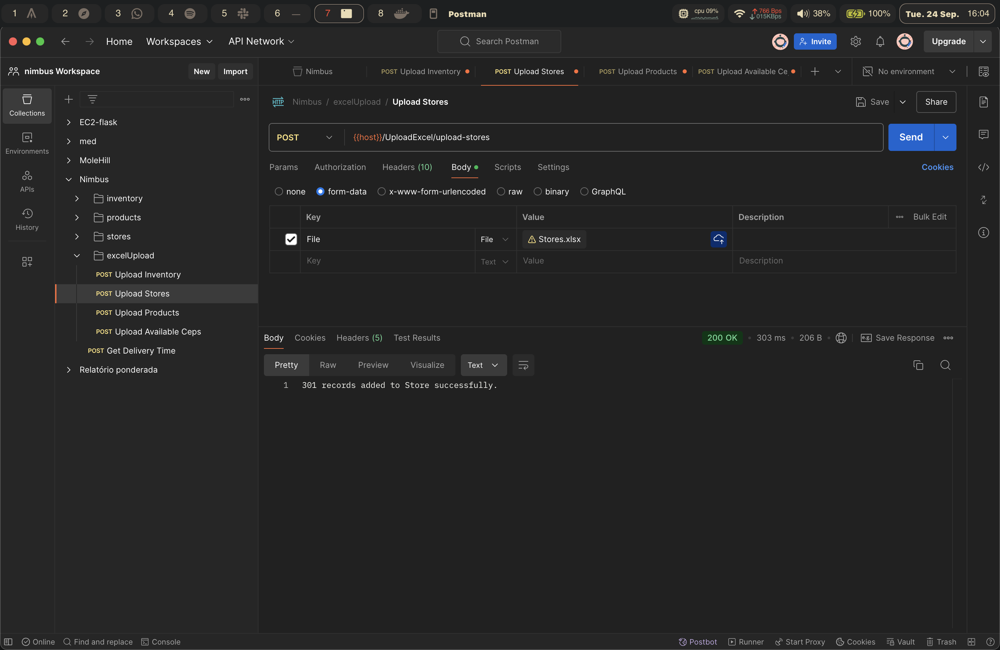
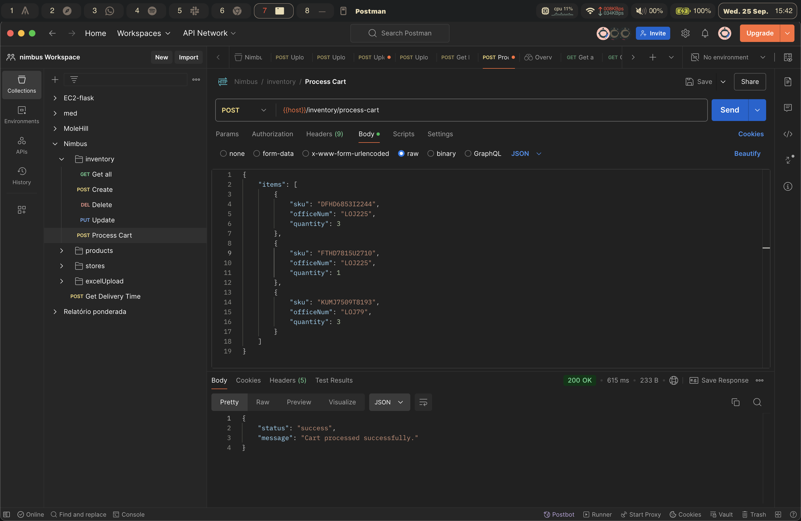
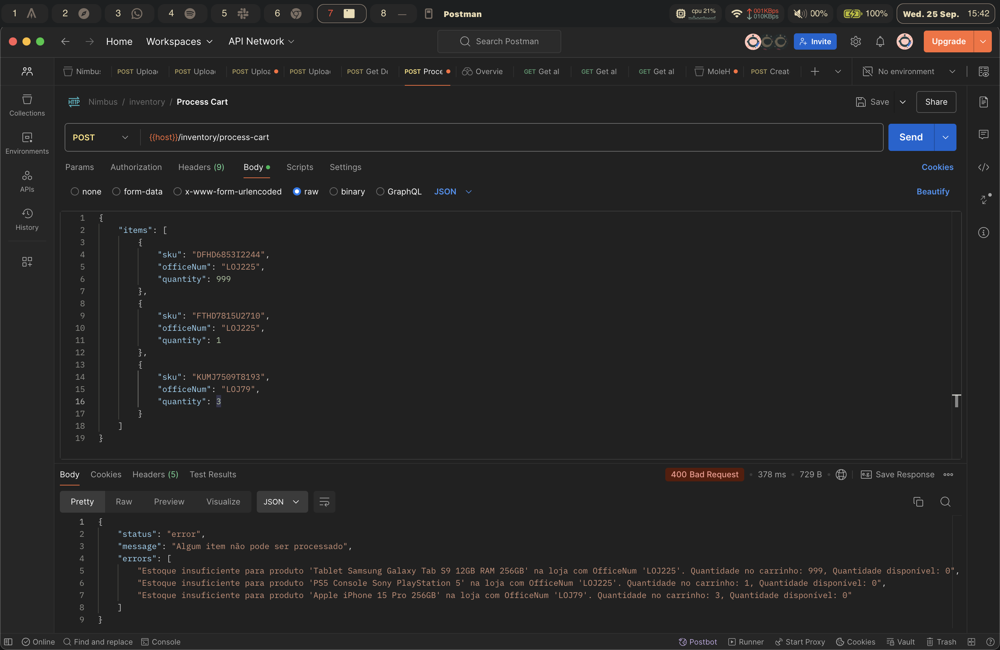

## Testes Unitários

### Introdução
&emsp;&emsp; Esta seção descreve uma série de testes unitários desenvolvidos para o backend da aplicação web construida. Foram testados componentes e funções do backend *dotnet*. Em sua maioria, elas incluem a manipulação e verificações de informações que saem e entram no banco de dados, como envio e arquivos excel de cadastramento e retorno de informaçõs de produtos ou tempos de entrega.

### Pré-requisitos
&emsp;&emsp; Estejam instalados na máquina:
- .NET Core 3.1 (<a>https://dotnet.microsoft.com/pt-br/download/dotnet/3.1</a>)
- .NET 8.0.8 (<a>https://dotnet.microsoft.com/pt-br/download/dotnet/thank-you/sdk-8.0.401-windows-x64-installer</a>)
- Node.js (<a>https://nodejs.org/download/</a>)

&emsp;&emsp; Navegar até o diretório "src-dotnet" com o comando no terminal:
```
cd codigo/backend/src-dotnet
```

&emsp;&emsp; Após isso, execute os comandos:
```
dotnet clean
dotnet build
```

&emsp;&emsp; Por fim, para executar os testes, execute o comando no terminal:
```
dotnet test
```

&emsp;&emsp; Caso todos os testes sejam concluídos com êxito, deve ser exibido no terminal (tempo pode variar):
```
Resumo do teste: total: 12; falhou: 0; bem-sucedido: 12; ignorado: 0; duração: 1,4s
```

### Descrição dos testes:

#### Teste de DeliveryTimeController:
| Nº  | Nome do Teste                                                                                  | Descrição                                                                                                      | Retorno Esperado                                                                                               |
| --- | ------------------------------------------------------------------------------------------------| ----------------------------------------------------------------------------------------------------------------| ---------------------------------------------------------------------------------------------------------------|
| 1   | `GetDeliveryTime_ReturnsBadRequest_WhenSkuOrCepIsMissing`                                        | Verifica se o método retorna erro 400 quando o SKU ou o CEP estão faltando.                                     | `BadRequestObjectResult` com a mensagem "Sku e CEP são obrigatórios!"                                           |
| 2   | `GetDeliveryTime_ReturnsBadRequest_WhenCepIsInvalid`                                             | Verifica se o método retorna erro 400 quando o CEP fornecido está em formato inválido.                          | `BadRequestObjectResult` com a mensagem "Erro de formatação no CEP: CEP inválido, deve conter 8 dígitos numéricos" |
| 3   | `GetDeliveryTime_ReturnsNotFound_WhenNoStoreForSku`                                              | Verifica se o método retorna erro 404 quando o SKU fornecido não existe no banco de dados.                      | `NotFoundObjectResult` com a mensagem "Nenhuma loja encontrada para o Sku fornecido."                           |
| 4   | `GetDeliveryTime_ReturnsNotFound_WhenNoStoreWithCepAvailable`                                    | Verifica se o método retorna erro 404 quando o CEP fornecido não está associado a nenhuma loja.                 | `NotFoundObjectResult` com a mensagem "Nenhuma loja encontrada com o Sku e CEP fornecidos."                     |
| 5   | `GetDeliveryTime_ReturnsOk_WhenStoreWithCepIsFound`                                              | Verifica se o método retorna sucesso 200 quando uma loja com o SKU e CEP fornecidos é encontrada.               | `OkObjectResult` com `Loja: "OFF001"` e `TempoEntrega: "30"`                                                    |
| 6   | `GetDeliveryTime_ReturnsStoreWithLowestDeliveryTime_WhenMultipleStoresHaveSameSkuAndCepInAvailableCeps` | Verifica se o método retorna a loja com o menor tempo de entrega quando existem múltiplas lojas com o mesmo SKU e CEP. | `OkObjectResult` com `Loja: "OFF001"` e `TempoEntrega: "30"`                                                    |

#### Teste de StoresController:
| Nº  | Nome do Teste                                                | Descrição                                                                                  | Retorno Esperado                                                                                               |
| --- | -------------------------------------------------------------| ------------------------------------------------------------------------------------------ | ------------------------------------------------------------------------------------------------------------- |
| 1   | `GetStores_ReturnsStoresList`                                 | Verifica se o método retorna uma lista de lojas.                                            | `ActionResult<IEnumerable<Stores>>` contendo duas lojas (contagem de 2).                                       |
| 2   | `GetStore_ReturnsNotFound_WhenStoreDoesNotExist`              | Verifica se o método retorna 404 (Not Found) quando a loja solicitada não existe.           | `NotFoundResult` quando a loja com o `OfficeNum` fornecido não é encontrada.                                   |
| 3   | `GetStore_ReturnsStore_WhenStoreExists`                       | Verifica se o método retorna os dados da loja corretamente quando a loja existe.            | `ActionResult<Stores>` contendo a loja com `OfficeNum = "1"`.                                                  |
| 4   | `PostStore_AddsStoreSuccessfully`                             | Verifica se o método adiciona uma nova loja com sucesso.                                    | `ActionResult<Stores>` com `CreatedAtActionResult`, retornando a loja adicionada com `OfficeNum = "3"`.        |
| 5   | `DeleteStore_RemovesStoreSuccessfully`                        | Verifica se o método remove uma loja existente com sucesso.                                 | `NoContentResult` e a loja com `OfficeNum = "1"` deve ser removida (não mais encontrada no banco de dados).     |


#### Teste de UploadExcelController:
| Nº  | Nome do Teste                                             | Descrição                                                                                  | Retorno Esperado                                                                                               |
| --- | ----------------------------------------------------------| ------------------------------------------------------------------------------------------ | ------------------------------------------------------------------------------------------------------------- |
| 1   | `UploadStoresExcelFile_SuccessfullyUploadsStores`          | Verifica se o upload de um arquivo Excel contendo informações de lojas é processado com sucesso e os dados são inseridos no banco. | `OkObjectResult` com código de status 200 (OK) e a mensagem "2 records added to Store successfully." Verifica que 2 registros foram inseridos no banco de dados. |
| 2   | `UploadInventoryExcelFile_SuccessfullyUploadsInventory`       | Verifica se o método faz o upload de um arquivo Excel de inventário e insere os dados corretamente no banco de dados. | `OkObjectResult` com código de status 200 e mensagem `"2 records added to Inventory successfully."`. Verificar também que dois registros foram inseridos na tabela `Inventory`, incluindo `Sku = "SKU001"` e `Quantity = 100`. |
| 3   | `GenerateExcelFileForInventory`                               | Gera um arquivo Excel em memória com dados de inventário para testes.                       | Um arquivo Excel com cabeçalhos "Sku", "OfficeNum", "Quantity" e dois registros de exemplo (`SKU001`, `SKU002`).|


#### Teste de ProductsController:

| Nº  | Nome do Teste                                                | Descrição                                                                                  | Retorno Esperado                                                                                               |
| --- | -------------------------------------------------------------| ------------------------------------------------------------------------------------------ | ------------------------------------------------------------------------------------------------------------- |
| 1   | `GetProducts_ReturnsProductList`                              | Verifica se o método retorna uma lista de produtos.                                         | `ActionResult<IEnumerable<Products>>` contendo dois produtos (contagem de 2).                                  |
| 2   | `GetProductById_ReturnsProduct_WhenProductExists`             | Verifica se o método retorna os dados do produto corretamente quando ele existe.            | `ActionResult<Products>` contendo o produto com `Sku = "A123"`.                                                |
| 3   | `GetProductById_ReturnsNotFound_WhenProductDoesNotExist`      | Verifica se o método retorna 404 (Not Found) quando o produto solicitado não existe.        | `NotFoundResult` quando o produto com o `Sku = "999"` não é encontrado.                                        |
| 4   | `PostProduct_AddsProductSuccessfully`                         | Verifica se o método adiciona um novo produto com sucesso.                                  | `ActionResult<Products>` com `CreatedAtActionResult`, retornando o produto adicionado com `Sku = "A123"`.       |
| 5   | `PutProduct_UpdatesProductSuccessfully`                       | Verifica se o método atualiza os dados do produto com sucesso.                              | `NoContentResult` e o produto atualizado deve refletir o novo nome "Updated Product A".                        |
| 6   | `PutProduct_ReturnsBadRequest_WhenIdsDoNotMatch`              | Verifica se o método retorna 400 (Bad Request) quando os IDs não coincidem.                 | `BadRequestResult` quando o `Sku` fornecido não coincide com o ID do produto a ser atualizado.                 |
| 7   | `DeleteProduct_RemovesProductSuccessfully`                    | Verifica se o método remove um produto com sucesso.                                         | `NoContentResult` e o produto removido não deve mais estar presente no banco de dados.                         |
| 8   | `DeleteProduct_ReturnsNotFound_WhenProductDoesNotExist`       | Verifica se o método retorna 404 (Not Found) quando o produto a ser removido não existe.    | `NotFoundResult` quando o produto com o `Sku = "999"` não é encontrado.                                        |

#### Testes de InventoryController:
| Nº  | Nome do Teste                                                | Descrição                                                                                  | Retorno Esperado                                                                                               |
| --- | -------------------------------------------------------------| ------------------------------------------------------------------------------------------ | ------------------------------------------------------------------------------------------------------------- |
| 1   | `GetInventory_ReturnsInventoryList`                           | Verifica se o método retorna uma lista de inventário.                                       | `ActionResult<IEnumerable<Inventory>>` contendo duas entradas de inventário.                                   |
| 2   | `GetInventoryById_ReturnsInventory_WhenInventoryExists`       | Verifica se o método retorna os dados de inventário corretamente quando ele existe.         | `ActionResult<Inventory>` contendo o item de inventário com `InventoryId = 1`.                                 |
| 3   | `GetInventoryById_ReturnsNotFound_WhenInventoryDoesNotExist`  | Verifica se o método retorna 404 (Not Found) quando o inventário solicitado não existe.     | `NotFoundResult` quando o item de inventário com o `InventoryId = 999` não é encontrado.                       |
| 4   | `PostInventory_AddsInventorySuccessfully`                     | Verifica se o método adiciona um novo item de inventário com sucesso.                       | `ActionResult<Inventory>` com `CreatedAtActionResult`, retornando o item de inventário adicionado.              |
| 5   | `PutInventory_UpdatesInventorySuccessfully`                   | Verifica se o método atualiza os dados de inventário com sucesso.                           | `NoContentResult` e o item de inventário atualizado deve refletir a nova quantidade.                           |
| 6   | `PutInventory_ReturnsBadRequest_WhenIdsDoNotMatch`            | Verifica se o método retorna 400 (Bad Request) quando os IDs não coincidem.                 | `BadRequestResult` quando o `InventoryId` fornecido não coincide com o ID do inventário a ser atualizado.       |
| 7   | `DeleteInventory_RemovesInventorySuccessfully`                | Verifica se o método remove um item de inventário com sucesso.                              | `NoContentResult` e o item de inventário removido não deve mais estar presente no banco de dados.              |
| 8   | `ProcessCart_ReturnsSuccess_WhenInventoryIsSufficient`        | Verifica se o método retorna sucesso quando há inventário suficiente para o processamento do carrinho. | `OkObjectResult` com status "success" e a quantidade de inventário atualizada corretamente.                     |


&emsp;&emsp;A implementação de testes unitários desempenha um papel crucial na garantia da confiabilidade e robustez do backend da aplicação, especialmente ao lidar com dados sensíveis como informações de lojas, inventário e produtos. Esses testes cobrem uma ampla gama de cenários, desde verificações básicas, como a existência de SKU e CEP válidos, até operações mais complexas, como o upload de arquivos Excel e cálculos de tempos de entrega. Ao testar exaustivamente os controladores, como o `DeliveryTimeController` e o `ProductsController`, o desenvolvedor garante que a aplicação responde corretamente tanto em condições normais quanto em casos de erro, prevenindo comportamentos inesperados e erros de produção.

&emsp;&emsp;Além de garantir a funcionalidade correta, os testes também ajudam a documentar formalmente o comportamento esperado da aplicação, facilitando a manutenção e evolução do código. Eles oferecem um nível adicional de segurança, permitindo que futuras alterações no código sejam feitas com confiança, sabendo que os testes cobrem os cenários críticos. Dessa forma, a implementação contínua desses testes unitários promove uma base de código sustentável e confiável, capaz de suportar mudanças sem comprometer a integridade do sistema.

# Testes na Plataforma

## Introdução

&emsp;&emsp;Os testes de plataforma desempenham um papel fundamental no processo de desenvolvimento de software, sendo responsáveis por garantir que o sistema funcione corretamente e atenda a todos os requisitos especificados. Durante o ciclo de desenvolvimento, é essencial realizar testes para verificar se os casos de uso foram implementados adequadamente, validando se as funcionalidades descritas estão operando como esperado. Além disso, os testes ajudam a identificar erros de forma antecipada, promovendo a correção de problemas antes da entrega final do produto.

&emsp;&emsp;Nesta fase do projeto, os testes têm um papel crucial em assegurar a qualidade do sistema, desde a validação das unidades individuais até a integração dos diferentes componentes e microsserviços. Este documento detalha a especificação de cenários de testes, o planejamento e a execução de testes unitários, de integração e de microsserviços, abordando a importância de cada etapa e os resultados obtidos.


## Cenários de Teste

### Introdução

Os cenários de testes são essenciais para verificar se todos os casos de uso estão implementados de forma que o sistema contemple todos os requisitos funcionais descritos. Através destes cenários, será possível validar se o sistema atende às necessidades dos usuários e se todos os requisitos funcionais estão sendo cumpridos adequadamente.

### Mapeamento entre Casos de Uso e Requisitos Funcionais

| Caso de Uso                                     | Requisitos Funcionais Relacionados |
|-------------------------------------------------|------------------------------------|
| **Caso de Uso 1: Enviar Arquivos Excel**        | RF01, RF04, RF06                         |
| **Caso de Uso 2: Buscar um Produto do Catálogo**| RF02                               |
| **Caso de Uso 3: Gerenciar Carrinho de Compras**| RF05                               |
| **Caso de Uso 4: Comprar Produto**              |  RF02, RF03, RF04, RF05       |

---


| Código | Descrição                                                                                                                                       |
|--------|------------------------------------------------------------------------------------------------------------------------------------------------------|
| RF01   | O sistema deve permitir que o usuário realize o login na plataforma.                                                                                |
| RF02   | O sistema deve exibir ao usuário todos os produtos disponíveis na loja Vivo.                                                                        |
| RF03   | O sistema deve calcular a menor distância de uma loja com o produto disponível até a residência do cliente.                                         |
| RF04   | O sistema deve atualizar o banco de dados ao lojista dar baixa na venda de um produto.                                                              |
| RF05   | O sistema deve proibir a venda de produtos em falta no estoque.                                                                                     |
| RF06   | O sistema deve permitir que o lojista atualize o banco de dados de acordo com a venda/aquisição de produtos na loja física.                         |

### Cenários de Teste Detalhados

#### **Caso de Uso 1: Enviar Arquivos Excel**

**Requisitos Funcionais Relacionados**: RF01, RF04, RF06

##### Cenário de Teste 1: Upload bem-sucedido de arquivo Excel para atualização do inventário

- **Objetivo**: Verificar se o administrador pode fazer upload de um arquivo Excel válido para atualizar o inventário e as lojas.
- **Pré-condições**:
  - O administrador está autenticado no sistema.
  - O arquivo Excel está no formato XLSX e possui dados válidos.
- **Passos do Teste**:
  1. O administrador acessa a página de upload de arquivos no sistema.
  2. Seleciona o arquivo Excel válido para upload.
  3. Clica no botão "Enviar" para iniciar o upload.
- **Resultados Esperados**:
  - O sistema valida o formato e o conteúdo do arquivo.
  - O sistema processa o arquivo e atualiza o inventário e as informações das lojas no banco de dados.
  - Uma mensagem de confirmação é exibida ao administrador indicando que os dados foram atualizados com sucesso.

##### Cenário de Teste 2: Tentativa de upload de arquivo em formato inválido

- **Objetivo**: Verificar se o sistema impede o upload de arquivos em formatos não suportados e informa adequadamente o administrador.
- **Pré-condições**:
  - O administrador está autenticado no sistema.
  - O arquivo selecionado está em um formato não suportado (ex: PDF).
- **Passos do Teste**:
  1. O administrador acessa a página de upload de arquivos no sistema.
  2. Seleciona o arquivo em formato inválido.
  3. Clica no botão "Enviar" para iniciar o upload.
- **Resultados Esperados**:
  - O sistema identifica que o formato do arquivo não é suportado.
  - Uma mensagem de erro é exibida informando que apenas arquivos XLSX são permitidos.
  - O upload não é realizado e nenhuma atualização é feita no inventário.

##### Cenário de Teste 3: Interrupção na conexão durante o upload do arquivo

- **Objetivo**: Verificar como o sistema lida com falhas de conexão durante o processo de upload.
- **Pré-condições**:
  - O administrador está autenticado no sistema.
  - Possui um arquivo Excel válido para upload.
- **Passos do Teste**:
  1. O administrador inicia o upload do arquivo Excel.
  2. Durante o upload, ocorre uma interrupção na conexão com a internet.
- **Resultados Esperados**:
  - O sistema detecta a falha na conexão.
  - Uma mensagem de erro é exibida informando que o upload não pôde ser concluído devido a problemas de conexão.
  - O administrador é orientado a tentar novamente quando a conexão for restabelecida.
  - O inventário não é atualizado com dados incompletos.

---

#### **Caso de Uso 2: Buscar um Produto do Catálogo**

**Requisitos Funcionais Relacionados**: RF02

##### Cenário de Teste 1: Exibição da lista de produtos após o login

- **Objetivo**: Verificar se o sistema exibe ao usuário todos os produtos disponíveis.
- **Pré-condições**:
  - O usuário está na página de acesso para a aplicação.
- **Passos do Teste**:
  1. O usuário acessa a home page da plataforma.
  2. Acessa a página de produtos.
- **Resultados Esperados**:
  - O sistema exibe uma lista atualizada de produtos disponíveis.
  - Cada produto exibe seu nome, descrição, imagem e preço.

##### Cenário de Teste 2: Busca por produto específico utilizando a barra de pesquisa

- **Objetivo**: Verificar se o usuário pode buscar um produto específico usando a barra de pesquisa.
- **Pré-condições**:
  - Existem produtos correspondentes ao termo de busca.
- **Passos do Teste**:
  1. O usuário acessa a página de produtos.
  2. Digita o nome do produto desejado na barra de pesquisa.
- **Resultados Esperados**:
  - O sistema exibe de maneira dinâmica os produtos que correspondem ao termo pesquisado conforme o usuário digita o seu nome.
  - O usuário pode visualizar as informações dos produtos encontrados.

##### Cenário de Teste 3: Falha na comunicação com o backend durante a busca de produtos

- **Objetivo**: Verificar como o sistema lida com erros de comunicação com o backend ao buscar produtos.
- **Pré-condições**:
  - O backend está indisponível ou apresenta falhas.
- **Passos do Teste**:
  1. O usuário acessa a página de produtos.
- **Resultados Esperados**:
  - O sistema exibe uma mensagem de erro informando que não foi possível carregar os produtos.
  - O usuário é orientado a tentar novamente mais tarde.
  - Nenhuma informação desatualizada ou incompleta é exibida.

---

#### **Caso de Uso 3: Gerenciar Carrinho de Compras**

**Requisitos Funcionais Relacionados**: RF05

##### Cenário de Teste 1: Adicionar produto disponível ao carrinho com sucesso

- **Objetivo**: Verificar se o usuário pode adicionar um produto disponível em estoque ao carrinho.
- **Pré-condições**:
  - O produto está disponível em estoque.
- **Passos do Teste**:
  1. O usuário navega até a página de detalhes do produto.
  2. Clica em "Adicionar ao carrinho".
- **Resultados Esperados**:
  - O produto é adicionado ao carrinho do usuário.
  - Uma confirmação é exibida informando que o produto foi adicionado com sucesso.

##### Cenário de Teste 2: Tentativa de comprar produto indisponível no estoque

- **Objetivo**: Verificar se o sistema proíbe a compra de produtos em falta no estoque.
- **Pré-condições**:
  - O produto está indisponível em estoque.
- **Passos do Teste**:
  1. O usuário navega até a página de detalhes do produto.
  2. Clica em "Adicionar ao carrinho".
  3. Finaliza a compra
- **Resultados Esperados**:
  - O sistema impede a compra do produto.
  - Uma mensagem é exibida informando que o produto está indisponível.

##### Cenário de Teste 3: Remover produto do carrinho

- **Objetivo**: Verificar se o usuário pode remover um produto do carrinho.
- **Pré-condições**:
  - O usuário possui pelo menos um produto no carrinho.
- **Passos do Teste**:
  1. O usuário acessa a página do carrinho.
  2. Seleciona a opção para remover o produto desejado.
- **Resultados Esperados**:
  - O produto é removido do carrinho.
  - O total do carrinho é atualizado corretamente.

---

#### **Caso de Uso 4: Comprar Produto**

**Requisitos Funcionais Relacionados**: RF02, RF03, RF04, RF05

##### Cenário de Teste 1: Fluxo completo de compra com sucesso

- **Objetivo**: Verificar se o usuário pode realizar a compra de um produto, desde a seleção até a finalização, incluindo o cálculo da menor distância para entrega.
- **Pré-condições**:
  - Existem produtos disponíveis no catálogo (RF02).
  - O produto escolhido está disponível em estoque (RF05).
- **Passos do Teste**:
  1. Navega até a página de produtos.
  2. Seleciona um produto e visualiza seus detalhes.
  3. Adiciona o produto ao carrinho.
  4. Acessa o carrinho e revisa os produtos selecionados.
  5. Fornece o CEP para cálculo do tempo de entrega (RF03).
  6. O sistema calcula e exibe o tempo estimado de entrega.
  7. O usuário confirma a compra.
- **Resultados Esperados**:
  - O sistema atualiza o banco de dados, diminuindo a quantidade do produto vendido (RF04).
  - Uma confirmação da compra é exibida ao usuário.
  - O usuário recebe detalhes da compra, incluindo informações de entrega.

##### Cenário de Teste 2: Tentativa de compra de produto indisponível

- **Objetivo**: Verificar se o sistema proíbe a compra de produtos em falta no estoque.
- **Pré-condições**:
  - O produto escolhido está indisponível em estoque.
- **Passos do Teste**:
  1. O usuário tenta comprar um produto indisponível.
- **Resultados Esperados**:
  - O sistema impede que a compra seja realizada.
  - Uma mensagem informa que o produto está indisponível (RF05).


---

### Conclusão

Os cenários de teste apresentados acima foram elaborados para garantir que todos os casos de uso estão implementados de maneira que o sistema atenda a todos os requisitos funcionais definidos. Através desses testes, será possível validar o funcionamento correto do sistema, identificar possíveis falhas e assegurar a qualidade da plataforma.

---


## Testes de Integração

#### Vídeo de demonstração dos testes: https://drive.google.com/file/d/17Bz_FlTsDhlgW8WXKrSKEIFSS-cZkiNj/view?usp=sharing 

&emsp;&emsp;Os testes de integração foram realizados para garantir que as diferentes funcionalidades da plataforma estivessem corretamente implementadas e funcionando de forma integrada. Como a plataforma é dividida entre o acesso do usuário comum e o administrador, os testes abrangeram endpoints acessíveis a ambos os perfis, validando a integridade dos processos tanto para os usuários comuns quanto para os administradores.

&emsp;&emsp;Para conseguir executar os testes é necessário executar:

`cd codigo/frontend`

`npm install cypress --save-dev`

`npx cypress open`

#### Testes: `api_tests`

1. **GET /products (acessível a todos)**  
   Este teste verifica se a listagem de produtos está funcionando corretamente para todos os usuários.
   - Requisição: `GET /products`
   - Código de resposta esperado: **200 OK**
   - Verificações:
     - O código de resposta retornado foi 200.
     - O cabeçalho do conteúdo foi validado como `application/json`.
     - A resposta contém uma lista de produtos, que é validada como um array de tamanho esperado.

2. **POST /DeliveryTime (acessível a todos)**  
   O teste avalia o funcionamento da API para registro do tempo de entrega de uma loja.
   - Requisição: `POST /DeliveryTime`
   - Código de resposta esperado: **200 OK**
   - Verificações:
     - O código de resposta retornado foi 200.
     - A resposta contém as propriedades `loja` e `tempoEntrega`, confirmando que as informações enviadas foram processadas corretamente.

3. **POST /inventory/process-cart (acessível a todos)**  
   Este teste verifica se o processamento de um carrinho de compras afeta corretamente o estoque, tanto nos casos de sucesso quanto de falha.

   - **Requisição:** `POST /inventory/process-cart`
   - **Código de resposta esperado em caso de sucesso:** **200 OK**
   - **Código de resposta em caso de falha:** **400 Bad Request** ou outro código de erro

   #### Verificações:

   - **Caso de sucesso:**
     - O código de resposta retornado é **200 OK**.
     - A resposta contém as propriedades `status` e `message`, indicando que a operação foi bem-sucedida.
     ```json
     {
       "status": "success",
       "message": "Carrinho processado com sucesso."
     }
     ```
   
   - **Caso de falha (produto indisponível):**
     - O código de resposta não será 200. Pode ser retornado um **400 Bad Request** ou outro código de erro apropriado.
     - A resposta contém uma mensagem detalhando o motivo da falha, como a indisponibilidade de estoque.
     ```json
     {
       "status": "error",
       "message": "Produto indisponível, quantidade no carrinho: 1, quantidade em estoque: 0"
     }
     ```

&emsp;&emsp;Esse teste cobre tanto os cenários de sucesso, onde o carrinho é processado e o estoque atualizado corretamente, quanto os cenários de falha, onde a operação não é completada devido à falta de estoque.

4. **POST /UploadExcel/upload-inventory (acessível apenas para administradores)**  
   Este teste garante que o administrador pode fazer upload de arquivos de inventário em massa via Excel.
   - Requisição: `POST /UploadExcel/upload-inventory`
   - Código de resposta esperado: **200 OK**
   - Verificações:
     - O código de resposta retornado foi 200.
     - A mensagem de sucesso indicou que **93194 registros foram adicionados ao inventário** com êxito.

5. **POST /UploadExcel/upload-stores (acessível apenas para administradores)**  
   Este teste verifica o upload de dados das lojas via arquivo Excel para administradores.
   - Requisição: `POST /UploadExcel/upload-stores`
   - Código de resposta esperado: **200 OK**
   - Verificações:
     - O código de resposta retornado foi 200.
     - A resposta indicou que **301 registros foram adicionados às lojas** com sucesso.
    
**Código do Teste:**

```js
// Grupo de testes que verifica o funcionamento dos endpoints da API
describe('Testes Integração dos Endpoints da API com o Front-end', () => {
    const baseUrl = 'http://lb-519e665-154492853.us-east-1.elb.amazonaws.com:80'; // URL base da API
  
    // Teste para o endpoint GET /products
    it('Teste GET /products', () => {
        // Faz uma requisição GET para o endpoint de produtos
        cy.request(`${baseUrl}/products`)
          .then((response) => {
            // Verifica se a resposta tem o status 200 (sucesso)
            expect(response.status).to.eq(200);
      
            // Verifica se a resposta é um objeto JSON válido
            expect(response.headers['content-type']).to.include('application/json');
            
            // Verifica se o corpo da resposta é um array ou objeto JSON
            expect(response.body).to.be.an('array'); // ou 'array' se for uma lista de produtos
          });
      });
      
  
    // Teste para o endpoint POST /DeliveryTime
    it('Teste POST /DeliveryTime', () => {
      // Faz uma requisição POST enviando o SKU do produto e o CEP
      cy.request({
        method: 'POST',
        url: `${baseUrl}/DeliveryTime`,
        body: { sku: 'DFHD6853I2244', cep: '34567-890' }, // Dados enviados na requisição
      }).then((response) => {
        // Verifica se a resposta tem o status 200 (sucesso)
        expect(response.status).to.eq(200);
        // Verifica se a resposta contém as propriedades esperadas ('tempoEntrega' e 'loja')
        expect(response.body).to.have.property('tempoEntrega');
        expect(response.body).to.have.property('loja');
      });
    });
  
    // Teste para o endpoint POST /inventory/process-cart
    it('Teste POST /inventory/process-cart', () => {
      // Define os itens do carrinho que serão enviados no corpo da requisição
      const cart = [
        {
          sku: 'DFHD6853I2244',
          loja: 'LOJ225',
          quantity: 1,
        },
      ];
  
      // Faz uma requisição POST com os itens do carrinho
      cy.request({
        method: 'POST',
        url: `${baseUrl}/inventory/process-cart`,
        body: {
          // Mapeia os itens do carrinho para o formato esperado pela API
          items: cart.map((item) => ({
            sku: item.sku,
            officeNum: item.loja,
            quantity: item.quantity,
          })),
        },
        headers: {
          'Content-Type': 'application/json', // Define o tipo de conteúdo como JSON
        },
      }).then((response) => {
        // Verifica se a resposta tem o status 200 (sucesso)
        expect(response.status).to.eq(200);
        // Verifica se a resposta contém as propriedades esperadas ('status' e 'message')
        expect(response.body).to.have.property('status');
        expect(response.body).to.have.property('message');
      });
    });
  
    // Teste para o upload de um arquivo Excel de inventário
    it('Teste POST /UploadExcel/upload-inventory', () => {
      const filePath = 'inventory.xlsx'; // Nome do arquivo na pasta cypress/fixtures
  
      // Carrega o arquivo Excel como conteúdo binário
      cy.fixture(filePath, 'binary').then((fileContent) => {
        // Converte o conteúdo binário em um Blob
        const blob = Cypress.Blob.binaryStringToBlob(
          fileContent,
          'application/vnd.openxmlformats-officedocument.spreadsheetml.sheet'
        );
  
        // Cria um FormData e adiciona o arquivo
        const formData = new FormData();
        formData.append('file', blob, filePath); // Adiciona o arquivo como parte do form-data
  
        // Faz a requisição POST enviando o arquivo Excel
        cy.request({
          method: 'POST',
          url: `${baseUrl}/UploadExcel/upload-inventory`,
          headers: {
            'Content-Type': 'multipart/form-data', // Define o tipo de conteúdo como multipart/form-data
          },
          body: formData, // Envia o arquivo como parte do corpo da requisição
          encoding: 'binary', // Configuração adicional para manipular o upload de binário corretamente
        }).then((response) => {
          // Verifica se a resposta tem o status 200 (sucesso)
          expect(response.status).to.eq(200);

          // Converte o ArrayBuffer para string antes de verificar o conteúdo
          const decoder = new TextDecoder('utf-8');
          const responseBody = decoder.decode(response.body);

          // Verifica se a resposta contém a mensagem 'added to Inventory'
          expect(responseBody).to.contain('added to Inventory');
        });
      });
    });
  
    // Teste para o upload de um arquivo Excel de lojas
    it('Teste POST /UploadExcel/upload-stores', () => {
      const filePath = 'stores.xlsx'; // Nome do arquivo na pasta cypress/fixtures
  
      // Carrega o arquivo Excel como conteúdo binário
      cy.fixture(filePath, 'binary').then((fileContent) => {
        // Converte o conteúdo binário em um Blob
        const blob = Cypress.Blob.binaryStringToBlob(
          fileContent,
          'application/vnd.openxmlformats-officedocument.spreadsheetml.sheet'
        );
  
        // Cria um FormData e adiciona o arquivo
        const formData = new FormData();
        formData.append('file', blob, filePath); // Adiciona o arquivo como parte do form-data
  
        // Faz a requisição POST enviando o arquivo Excel
        cy.request({
          method: 'POST',
          url: `${baseUrl}/UploadExcel/upload-stores`,
          headers: {
            'Content-Type': 'multipart/form-data', // Define o tipo de conteúdo como multipart/form-data
          },
          body: formData, // Envia o arquivo como parte do corpo da requisição
          encoding: 'binary', // Configuração adicional para manipular o upload de binário corretamente
        }).then((response) => {
          // Verifica se a resposta tem o status 200 (sucesso)
          expect(response.status).to.eq(200);
          
          // Converte o ArrayBuffer para string antes de verificar o conteúdo
          const decoder = new TextDecoder('utf-8');
          const responseBody = decoder.decode(response.body);

          // Verifica se a resposta contém a mensagem 'added to Inventory'
          expect(responseBody).to.contain('added to Store');
        });
      });
    });

});
  
```

#### Testes: `estoque_tests`

1. **GET /inventory**  
   O teste inicial verifica o estado do inventário antes de processar uma compra.
   - Requisição: `GET /inventory`
   - Código de resposta esperado: **200 OK**
   - Verificações:
     - A resposta contém as propriedades relevantes do inventário, como `inventoryId` e `officeNum`.
     - Log: **Quantidade inicial do produto: 1 na loja: LOJ5**.

2. **POST /inventory/process-cart**  
   Este teste confirma que, ao processar um carrinho de compras, o sistema diminui corretamente o estoque.
   - Requisição: `POST /inventory/process-cart`
   - Código de resposta esperado: **200 OK**
   - Verificações:
     - A resposta contém as propriedades `status` e `message`, confirmando o sucesso do processamento do carrinho.

3. **GET /inventory (após a compra)**  
   Após processar a compra, o teste verifica novamente o inventário para garantir que a quantidade do produto foi ajustada corretamente.
   - Requisição: `GET /inventory`
   - Código de resposta esperado: **200 OK**
   - Verificações:
     - A resposta mostra que a quantidade do produto foi reduzida conforme esperado.
     - Log: **Quantidade após a compra: 0 na loja: LOJ5**.

**Código do Teste:**

```js
describe('Testes de Estoque após Compra', () => {
  const baseUrl = 'http://lb-519e665-154492853.us-east-1.elb.amazonaws.com:80';
  const skuToBuy = 'DFHD6853I2244';
  let initialQuantity;

  // Primeiro, obtenha a quantidade inicial do produto no endpoint /inventory
  it('Teste GET /inventory - Verifica quantidade inicial e loja', () => {
    cy.request(`${baseUrl}/inventory`).then((response) => {
      // Verifica se a resposta tem o status 200 (sucesso)
      expect(response.status).to.eq(200);

      // Encontre o produto específico e armazene a quantidade inicial
      const product = response.body.find((product) => product.sku === skuToBuy);
      expect(product).to.exist;

      initialQuantity = product.quantity;
      const officeNum = product.officeNum; // Armazena o número da loja (officeNum)

      // Exibe a loja e a quantidade inicial
      cy.log(`Quantidade inicial do produto: ${initialQuantity} na loja: ${officeNum}`);
    });
  });

  // Depois, realize a compra (POST /inventory/process-cart)
  it('Teste POST /inventory/process-cart - Realiza a compra', () => {
    const cart = [
      {
        sku: skuToBuy,
        loja: 'LOJ5',
        quantity: 1, // Comprando 1 unidade do produto
      },
    ];

    cy.request({
      method: 'POST',
      url: `${baseUrl}/inventory/process-cart`,
      body: {
        items: cart.map((item) => ({
          sku: item.sku,
          officeNum: item.loja,
          quantity: item.quantity,
        })),
      },
      headers: {
        'Content-Type': 'application/json',
      },
    }).then((response) => {
      expect(response.status).to.eq(200);
      expect(response.body).to.have.property('status');
      expect(response.body).to.have.property('message');
    });
  });

  // Verifique se a quantidade do produto foi diminuída após a compra no endpoint /inventory
  it('Teste GET /inventory - Verifica quantidade e loja após compra', () => {
    cy.request(`${baseUrl}/inventory`).then((response) => {
      expect(response.status).to.eq(200);

      // Encontre o produto específico após a compra
      const productAfterPurchase = response.body.find((product) => product.sku === skuToBuy);
      expect(productAfterPurchase).to.exist;

      // Verifique se a quantidade foi reduzida
      expect(productAfterPurchase.quantity).to.be.lessThan(initialQuantity);

      const officeNum = productAfterPurchase.officeNum; // Armazena o número da loja (officeNum)
      cy.log(`Quantidade após a compra: ${productAfterPurchase.quantity} na loja: ${officeNum}`);
    });
  });
});
```

## Testes de Microsserviços

&emsp;&emsp;O projeto é uma aplicação monolítica contenerizada, com um gateway e um load balancer, que distribui as requisições para os diferentes serviços da aplicação. Os testes dos microserviços foram realizados utilizando o Postman, com endpoints que utilizam a URL do load balancer. Os testes foram realizados para garantir que as funcionalidades de cálculo de tempo de entrega, busca de produtos, processamento do carrinho e uploads de inventários e lojas estejam funcionando corretamente.

#### 1. Cálculo de Tempo de Entrega

<p align="center">
   <b>Figura 1 -</b> Teste no Postman - Tempo de Entrega 
</p>
<p align="center">
   
</p>
<p align="center">
   Fonte: Material desenvolvido pelos autores (2024)
</p>

- **Endpoint**: `http://lb-9aee083-586275106.us-east-1.elb.amazonaws.com:80/DeliveryTime`
- **Método**: `POST`
- **Descrição**: Verifica o tempo de entrega para um SKU específico, enviando o CEP do cliente.

- **Preparação**: Configurar o Postman com a URL do endpoint e preparar o corpo da requisição com os seguintes dados:
  
  **Body**:
  ```json
  {
    "sku": "DFHD6853I2244",
    "cep": "67890-123"
  }

- **Passos para Execução**:
1. Abrir o Postman.
2. Inserir o endpoint acima na URL.
3. Selecionar o método `POST`.
4. Inserir o corpo da requisição com o SKU e CEP.
5. Executar a requisição.

- **Resultado Esperado**: Um JSON contendo a loja que realizará a entrega do produto, o tempo estimado de entrega e um status 200 OK.

   ```json
  {
    "loja": "LOJ5",
    "tempoEntrega": "1"
  }

- **Resultado Obtido**: A resposta foi um JSON com os dados da loja e tempo de entrega esperados, além do status 200 OK:

   ```json
  {
    "loja": "LOJ5",
    "tempoEntrega": "1"
  }
  
#### 2. Listagem dos Produtos Disponíveis

<p align="center">
   <b>Figura 2 -</b> Teste no Postman - GET dos produtos
</p>
<p align="center">
   
</p>
<p align="center">
   Fonte: Material desenvolvido pelos autores (2024)
</p>

- **Endpoint**: `http://lb-9aee083-586275106.us-east-1.elb.amazonaws.com:80/products`
- **Método**: `GET`
- **Descrição**: Recebe uma lista com os produtos disponíveis em estoque.

- **Preparação**: Não é necessário preparar um corpo de requisição, pois trata-se de um método `GET`.

- **Passos para Execução**:
1. Abrir o Postman.
2. Inserir o endpoint acima na URL.
3. Selecionar o método `GET`.
4. Executar a requisição.

- **Resultado Esperado**: Retornar um JSON com a lista de produtos disponíveis, contendo seus SKUs, nome do produto e uma imagem associada. É esperado que a maioria dos produtos tenha o nome e a imagem como nulos, visto que esses parâmetros foram adicionados manualmente apenas para teste no frontend em alguns produtos específicos.

  ```json
  [
     {
       "sku": "AAAA000A3044",
       "productName": null,
       "imagePath": null
     },
     {
       "sku": "AAIB2454H6404",
       "productName": null,
       "imagePath": null
     }
  ]
  ```

- **Resultado Obtido**: A resposta foi um JSON com os produtos disponíveis contendo sku, nome do produto e o caminho da imagem.

  ```json
  [
     {
       "sku": "AAAA000A3044",
       "productName": null,
       "imagePath": null
     },
     {
       "sku": "AAIB2454H6404",
       "productName": null,
       "imagePath": null
     }
  ]
  ```

#### 3. Upload de Inventário (Excel)

<p align="center">
   <b>Figura 3 -</b> Teste no Postman - Upload de Inventário 
</p>
<p align="center">
   
</p>
<p align="center">
   Fonte: Material desenvolvido pelos autores (2024)
</p>

- **Endpoint**: `http://lb-9aee083-586275106.us-east-1.elb.amazonaws.com:80/UploadExcel/upload-inventory`
- **Método**: `POST`
- **Descrição**: Realiza o upload de um arquivo excel de inventário.

- **Preparação**: Selecionar o arquivo Excel de inventário para upload.

- **Passos para Execução**:
1. Abrir o Postman.
2. Inserir o endpoint acima na URL.
3. Selecionar o método `POST`.
4. Adicionar o arquivo Excel na aba "Body" > "form-data".
5. Executar a requisição.

- **Resultado Esperado**: O inventário deve ser atualizado com base no arquivo enviado, com uma mensagem de sucesso indicando quantos produtos foram adicionados.

- **Exemplo**:
   ```
   93194 records added to Inventory successfully
   ```

- **Resultado Obtido**: O upload foi realizado com sucesso, e a mensagem de confirmação foi recebida:
   ```
   93194 records added to Inventory successfully
   ```

#### 4. Upload de Lojas (Excel)

<p align="center">
   <b>Figura 3 -</b> Teste no Postman - Upload de Lojas
</p>
<p align="center">
   
</p>
<p align="center">
   Fonte: Material desenvolvido pelos autores (2024)
</p>

- **Endpoint**: `http://lb-9aee083-586275106.us-east-1.elb.amazonaws.com:80/UploadExcel/upload-stores`
- **Método**: `POST`
- **Descrição**: Realiza o upload de um arquivo excel de lojas.

- **Preparação**: Selecionar o arquivo Excel com os dados das lojas para upload.

- **Passos para Execução**:
1. Abrir o Postman.
2. Inserir o endpoint acima na URL.
3. Selecionar o método `POST`.
4. Adicionar o arquivo Excel na aba "Body" > "form-data".
5. Executar a requisição.

- **Resultado Esperado**: As lojas devem ser adicionadas ao sistema, com uma mensagem de sucesso informando quantas foram adicionadas.

- **Exemplo**:
   ```
   301 records added to Store successfully
   ```

- **Resultado Obtido**: O upload foi realizado com sucesso, e a mensagem de confirmação foi recebida:
   ```
   301 records added to Store successfully
   ```

#### 5. Processamento do carrinho

<p align="center">
   <b>Figura 5 -</b> Teste no Postman - Processamento do carrinho (Sucesso)
</p>
<p align="center">
   
</p>
<p align="center">
   Fonte: Material desenvolvido pelos autores (2024)
</p>

- **Endpoint**: `http://lb-9aee083-586275106.us-east-1.elb.amazonaws.com:80/inventory/process-cart`
- **Método**: `POST`
- **Descrição**: Realiza a compra do carrinho com os produtos selecionados pelo cliente.

- **Preparação**: Preparar o corpo da requisição com os SKUs dos produtos, a loja e as quantidades a serem processadas.
  
  **Body**:
  ```json
      {
     "items": [
       {
         "sku": "DFHD6853I2244",
         "officeNum": "LOJ225",
         "quantity": 3
       },
       {
         "sku": "FTHD7815U2710",
         "officeNum": "LOJ225",
         "quantity": 1
       },
       {
         "sku": "KUMJ7509T8193",
         "officeNum": "LOJ79",
         "quantity": 3
       }
     ]
   }
   ```

- **Passos para Execução**:
1. Abrir o Postman.
2. Inserir o endpoint acima na URL.
3. Selecionar o método `POST`.
4. Inserir o corpo da requisição com os itens do carrinho.
5. Executar a requisição.

#### Caso de Sucesso:

- **Resultado Esperado**: Reduzir as quantidades no inventário de acordo com o carrinho. Retornar uma mensagem de sucesso:

   ```json
   {
      "status": "success",
      "message": "Cart processed successfully"
   }
   ```

- **Resultado Obtido**: O inventário foi atualizado corretamente e a seguinte mensagem de sucesso foi retornada:

   ```json
   {
      "status": "success",
      "message": "Cart processed successfully"
   }
   ```
   
#### Caso de Erro:

<p align="center">
   <b>Figura 6 -</b> Teste no Postman - Processamento do carrinho (Erro)
</p>
<p align="center">
   
</p>
<p align="center">
   Fonte: Material desenvolvido pelos autores (2024)
</p>

- **Resultado Esperado**: Se algum produto estiver indisponível, retornar a seguinte mensagem de erro:
   
 ```json
   {
    "status": "error",
    "message": "Algum item não pode ser processado",
    "errors": [
        "Estoque insuficiente para produto 'Tablet Samsung Galaxy Tab S9 12GB RAM 256GB' na loja com OfficeNum 'LOJ225'. Quantidade no carrinho: 999, Quantidade disponível: 0",
        "Estoque insuficiente para produto 'PS5 Console Sony PlayStation 5' na loja com OfficeNum 'LOJ225'. Quantidade no carrinho: 1, Quantidade disponível: 0",
        "Estoque insuficiente para produto 'Apple iPhone 15 Pro 256GB' na loja com OfficeNum 'LOJ79'. Quantidade no carrinho: 3, Quantidade disponível: 0"
    ]
   }
   ```

- **Resultado Obtido**: Ao tentar comprar um produto indisponível, a mensagem de erro retornada é:
   
 ```json
   {
    "status": "error",
    "message": "Algum item não pode ser processado",
    "errors": [
        "Estoque insuficiente para produto 'Tablet Samsung Galaxy Tab S9 12GB RAM 256GB' na loja com OfficeNum 'LOJ225'. Quantidade no carrinho: 999, Quantidade disponível: 0",
        "Estoque insuficiente para produto 'PS5 Console Sony PlayStation 5' na loja com OfficeNum 'LOJ225'. Quantidade no carrinho: 1, Quantidade disponível: 0",
        "Estoque insuficiente para produto 'Apple iPhone 15 Pro 256GB' na loja com OfficeNum 'LOJ79'. Quantidade no carrinho: 3, Quantidade disponível: 0"
    ]
   }
   ```
